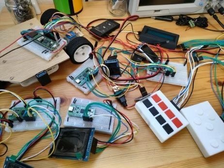
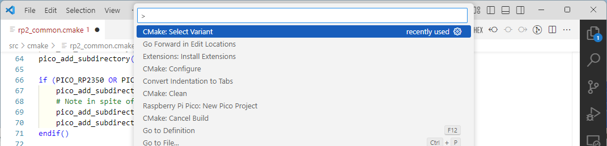
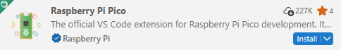
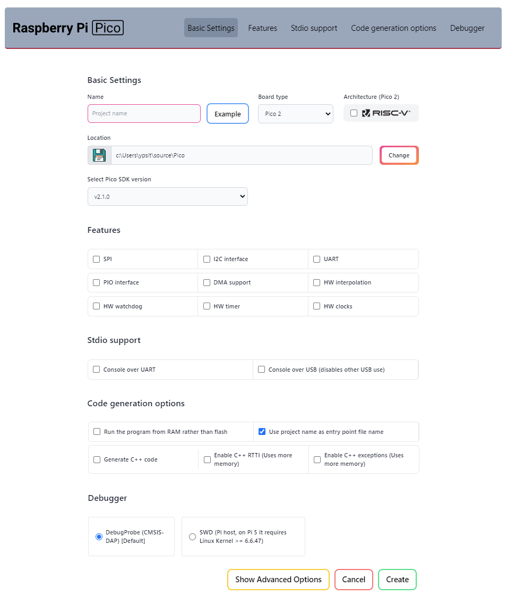
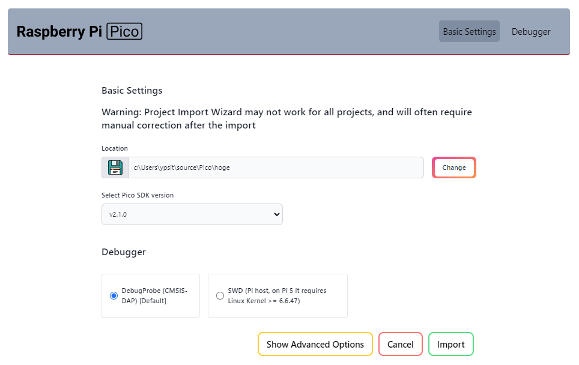
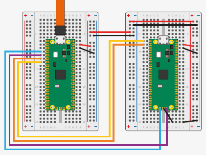
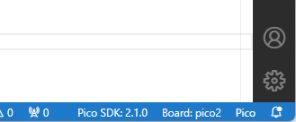

# Getting Started with Pico SDK

The single-board microcontroller Raspberry Pi Pico and its development environment, Pico SDK, are truly amazing. I enjoy working with them every day, but compared to other libraries and platforms, there is less information available for Pico SDK, making it a bit challenging to learn how to use it.

## Why Use Pico SDK?

Despite the name, Raspberry Pi Pico is completely different from the Linux-based Raspberry Pi. Both are provided by Raspberry Pi Ltd., but Pico is a board specialized for hardware control without an OS[^about-os].

As of 2026, there are two main Pico boards: the original with RP2040 and the Pico2 released in summer 2024 with RP2350.

[^about-os]: While you can run a real-time OS for task management, running a full OS like Windows or Linux is quite rare.


*Original Pico and Pico2*

These boards may not have the features of a full Raspberry Pi, but their performance is impressive. The original Pico has a 125MHz 32-bit dual-core ARM, 264KByte SRAM, and 2MByte flash. Pico2 has a 150MHz dual-core CPU, 520KByte SRAM, 4MByte flash, and hardware floating-point, outperforming many old PCs. And you can buy one for about $5! Having a handful of these on your desk is truly inspiring.



So, what should you use for Pico software development?

MicroPython is the most popular. As an interpreted language, it requires no compilation and has a large user base, so information is plentiful. However, as with all interpreters, execution performance is sacrificed, and you can't fully utilize Pico's capabilities. The interpreter also consumes SRAM and other resources.

Arduino is another common choice. Installing the Arduino IDE gives you a full development environment and access to many libraries. However, Arduino prioritizes a unified API across many CPUs and boards, making it harder to use unique CPU features[^arduino-and-picosdk]. Performance is also not optimal.

[^arduino-and-picosdk]: Arduino uses Pico SDK internally for Pico support, so you can use Pico SDK features directly in Arduino as well.

**Pico SDK** is a C library dedicated to Pico/Pico2. Developed by Raspberry Pi Ltd., it is designed to fully utilize the CPU's features. Many optimizations are included to maximize performance, and the code is impressively professional. For example, the following code:

```c
int dma_channel = 3;
dma_channel_config config = dma_get_default_channel_config(dma_channel);
channel_config_set_read_increment(&config, true);
channel_config_set_write_increment(&config, true);
channel_config_set_dreq(&config, DREQ_SPI0_RX);
channel_config_set_transfer_data_size(&config, DMA_SIZE_8);
dma_set_config(dma_channel, &config, false);
```

is inlined to:

```c
*(volatile uint32_t *)(DMA_BASE + DMA_CH3_AL1_CTRL_OFFSET) = 0x00089831;
```

To toggle a GPIO at maximum speed:

```c
#include "pico/stdlib.h"

int main()
{
    gpio_init(15);
    gpio_set_dir(15, GPIO_OUT);
    while (true) {
        gpio_put(15, true);
        gpio_put(15, false);
    }
}
```

The loop generates instructions like:

```
loop:   str r2, [r3, #20]
        str r2, [r3, #24]
        b loop
```

On a 125MHz Pico, you can observe a 31.25MHz signal (125MHz / (1 + 1 + 2 clocks)).

However, there is not much information on how to actually use it. The documentation is detailed and generally friendly, but sometimes lacks crucial explanations or assumes a certain level of knowledge.

This article introduces how to set up Pico SDK with practical use cases in mind.

## Must-Have Documents

The following documents from Raspberry Pi Ltd. are worth reading repeatedly:

- [Getting started with Raspberry Pi Pico-series](https://datasheets.raspberrypi.com/pico/getting-started-with-pico.pdf): How to set up the development environment and debug board wiring.
- [Raspberry Pi Pico-series C/C++ SDK](https://datasheets.raspberrypi.com/pico/raspberry-pi-pico-c-sdk.pdf): Documentation for functions provided by Pico SDK.
- [RP2040 Datasheet](https://datasheets.raspberrypi.com/rp2040/rp2040-datasheet.pdf), [RP2350 Datasheet](https://datasheets.raspberrypi.com/rp2350/rp2350-datasheet.pdf): For details on hardware behavior and SDK function implementation. PIO usage is covered in both the SDK docs and these datasheets, but the datasheets are more detailed.

## Development Environment

### Visual Studio Code

Embedded development usually involves installing compilers, libraries, header files, setting paths, and debugging tools, which can be daunting. Until recently, this was true for Pico SDK as well, but the release of the Raspberry Pi Pico extension for Microsoft Visual Studio Code (VSCode) has made it surprisingly easy.

First, download and install VSCode from https://code.visualstudio.com/download.

For those new to VSCode, here are some basics:

You typically launch VSCode from a shell (Command Prompt, PowerShell, or bash) in the directory where your project is stored (or an empty directory for a new project):

```
code .
```

This creates a `.vscode` directory, making it a VSCode workspace. The workspace stores build/debug settings and open file states, so you can resume work exactly as you left it.

Most VSCode features are accessed via the "Command Palette". Press `F1` or `Ctrl+Shift+P` to open it:



This textbox is also used for file switching and cursor movement. If it starts with `>`, it functions as the command palette.

In this guide, VSCode operations are described mainly by command palette command names. Keyboard shortcuts and GUI do not cover all commands, and using command names is more concise than describing GUI navigation.

Even if you don't remember the exact command name, typing part of it will show a list of matching commands. For Pico-related commands, type `Raspberry Pi Pico:`, for CMake, type `CMake:`, etc.

### Installing the Raspberry Pi Pico Extension

From the VSCode command palette, run `>Extensions: Install Extensions`. Search for `Pico` and install `Raspberry Pi Pico` from the list.



At this point, the Pico SDK tools and libraries are not yet installed. They will be installed when you create a Pico SDK project (see below).

Other useful extensions include `CMake`, `C/C++`, and `C/C++ Extension Pack`. VSCode will often suggest installing relevant extensions when you open or create code/config files, so install as needed.

That's all you need to install Pico SDK. Easy!

## Creating and Editing Projects

### Creating a Project

To create a Pico SDK project, run `>Raspberry Pi Pico: New Pico Project` from the VSCode command palette. When prompted for a language, select `C/C++`. The following screen will appear:



Settings are as follows (required fields are in **bold**; most can be changed later):

- Basic Settings
  - **Name**: Enter the project name
  - **Board type**: Select the board type
  - Architecture (Pico2): Pico2 supports Risc-V as well as ARM. Leave unchecked unless needed
  - **Location**: Select the parent directory for the project
  - Select Pico SDK version: Leave as default
- Features: Select libraries to use (leave unchecked)
- Stdio support
  - Console over UART: Use default UART pins (GPIO0, GPIO1) for stdio (`printf()`, `getchar()`). Leave unchecked
  - Console over USB (disables other USB use): Use USB for stdio. Leave unchecked
- Code generation options
  - Run the program from RAM rather than flash: Normally, programs are written to flash and copied to SRAM as needed. If checked, the entire program is copied to SRAM at startup. Leave unchecked
  - Use project name as entry point file name: If unchecked, the main source file is `main.c` or `main.cpp`. Leave checked
  - **Generate C++ code**: Output the template source file in C++ (`.cpp`). Leave unchecked for C; check for C++ (e.g., when using pico-jxglib)
  - Enable C++ RTTI (Uses more memory): Enable C++ RTTI. Leave unchecked
  - Enable C++ exception (Uses more memory): Enable C++ exceptions. Leave unchecked
- Debugger
  - DebugProbe (CMSIS-DAP) [Default]: Use Debug Probe for debugging. Leave checked
  - SWD (Pi host, on Pi5Pi 5 it requires Linux Kernel >= 6.6.47): Use Raspberry Pi for debugging. Leave unchecked

Click `[Create]` to create the project.

When you create your first project after installing the Pico extension, a `Downloading and installing toolchain` message appears in the lower right of VSCode. This means the Pico SDK files are being downloaded and installed. The download is large (1.4 GByte) and may take about 20 minutes, but this only happens once. Progress is shown by a thin bar below the message.

When the project is created, a new VSCode window opens with the project directory as the workspace. To build, run `>CMake: Build` from the command palette or press `F7`. On the first build, select `Pico Using compilers: ...` when prompted.

If there are no errors, executables, MAP files, and disassembly files are generated in the `build` directory.

### Pico SDK Directory

The Pico SDK is stored in `C:\Users\username\.pico-sdk` on Windows or `$HOME/.pico-sdk` on Linux.

You usually don't need to worry about the path, but it may be convenient to add `C:\Users\username\.pico-sdk\picotool\x.x.x\picotool` (where `x.x.x` is the version, e.g., `2.1.0`) to your PATH.

### GitHub

Pico SDK is distributed via GitHub (https://github.com/raspberrypi). Download and install Git from https://git-scm.com/downloads.

GitHub contains many useful resources for understanding Pico SDK. Clone the following repositories to your working directory:

- `pico-examples`: Sample programs using Pico SDK. See these for API usage examples:
   ```
   git clone https://github.com/raspberrypi/pico-examples
   ```
- `pico-sdk`: The Pico SDK source code. Refer to this to investigate API implementation. The same code is in your `.pico-sdk` directory, but it's convenient to have a separate copy for reference:
   ```
   git clone https://github.com/raspberrypi/pico-sdk
   ```

### Project File Structure

If you create a Pico SDK project named `your-project`, the following files and directories are created:

- `.vscode` ... VSCode workspace information
- `build` ... Build output directory
- `.gitignore` ... Files/directories to exclude from Git version control[^gitignore]
- `pico_sdk_import.cmake` ... Pico SDK config file, included from CMakeLists.txt
- `CMakeLists.txt` ... CMake build configuration
- `your-project.c` ... Main source file

[^gitignore]: By default, `build` is listed. You may want to add `.vscode` as well.

`pico_sdk_import.cmake` tells VSCode this is a Pico SDK project. You don't need to edit this file.

`.vscode` and `build` are auto-generated and can be deleted[^dir-delete]. If you open a directory without these as a workspace, VSCode will prompt `Do you want to import this project as Raspberry Pi Pico project?`. Click `Yes` and the following screen appears:



Click `[Import]` to generate `.vscode` and `build`, making the directory usable as a Pico SDK project.

[^dir-delete]: Sometimes you may delete them for troubleshooting.

### Writing Program Code

The template program code looks like this:

```c title="your-project.c" linenums="1"
#include <stdio.h>
#include "pico/stdlib.h"

int main()
{
    stdio_init_all();
    while (true) {
        printf("Hello, world!\n");
        sleep_ms(1000);
    }
}
```

If you're running your first program on a new Pico board, you may wonder where `printf()` outputs text. The answer depends on `CMakeLists.txt` settings: either UART communication using GPIO0 (TX) and GPIO1 (RX), or serial communication via the USB port as a Communication Device Class.

For UART, you need a USB-serial converter or level shifter to connect to a PC (or use a debug probe as described later). USB serial only requires a USB cable, but the setup may be unclear at first (it's actually easy). You also need a serial terminal, and may wonder about baud rate and other settings. There are many uncertainties for a first program.

For your first program, it's best to start with the classic "blinky". Let's set aside Hello, World! for now and replace the source file with this minimal code:

```c title="your-project.c" linenums="1"
#include "pico/stdlib.h"

int main()
{
    gpio_init(15);
    gpio_set_dir(15, GPIO_OUT);
    while (true) {
        gpio_put(15, true);
        sleep_ms(500);
        gpio_put(15, false);
        sleep_ms(500);
    }
}
```

Connect an LED and a resistor (about 100Ω) to GPIO15 at the edge of the Pico board. In my tests, even if you short GPIO to GND, the current is limited to about 30mA[^max-current], so you probably won't damage the CPU or LED even without a resistor.

[^max-current]: You can change the max output current with `gpio_set_drive_strength()`. Setting it to max allows about 60mA output.

### Building the Program

Run `>CMake: Build` from the command palette or press `F7` to build. On the first build, select `Pico Using compilers: ...` when prompted. The build outputs a UF2 file (`your-project.uf2`) and an ELF file (`your-project.elf`) in the `build` directory. These are written to the target board in different ways.

#### Writing UF2 Files

With a USB cable, you can write to the target Pico board. Hold down the `BOOTSEL` button while connecting the board to the PC via USB. The Pico boots in BOOTSEL mode and appears as a storage device (often `D:` on Windows, but this may vary). Check with Explorer, etc.

Copy the UF2 file to this storage to write it to the board's flash and start the program automatically.

To avoid frequent USB cable plugging (which can damage the connector), use a reset button. The Pico board has a `RUN` pin (pin 30); grounding it resets the CPU. If you add a tact switch here, you can enter BOOTSEL mode by holding `BOOTSEL` and pressing the switch connected to `RUN`.

#### Writing ELF Files

To write ELF files, you need a debug probe for Pico. You can buy one for about $15, or use another Pico board as a debug probe. Here's how:

1. Download `debugprobe_on_pico.uf2` (for Pico) or `debugprobe_on_pico2.uf2` (for Pico2) from https://github.com/raspberrypi/debugprobe/releases and write it to the Pico as described above.
1. Connect the debug probe Pico (left) and the target Pico (right) as shown below. Connect the debug probe's USB to the PC.

   

   The minimum required connections are power and the blue/purple DEBUG port wires. The middle GND on the DEBUG port is optional. The yellow/orange wires are for UART stdio (`printf()`, etc.).
1. Open the Pico SDK project in VSCode. Run `>Debug: Start Debugging` or press `F5` to build, connect to the debug probe, write the ELF file to the target Pico's flash, and start the debugger. The program will break at `main()`. Press `F5` again to run.
1. The status bar turns orange during debugging. To stop, run `>Debug: Stop` or press `Shift+F5`.

The ELF file is written to flash, so you can disconnect the debug probe and run the Pico standalone.

If you get errors when connecting the debug probe, check your wiring, especially power to the target board.

Another possible cause is selecting the wrong board type. Switch as described below.

For Pico2, be careful when switching between ARM and Risc-V architectures. If the program on the board and the debug probe's architecture don't match, connection fails. **After switching architectures, write a UF2 file built for the current architecture to the board and run it.**

### Changing Settings

By default, executables are built in Debug mode. The SDK version, board type, and language are set when you create the project, but you can change them later as follows:

- **Switch between Debug and Release**: Run `>CMake: Select Variant` to choose Debug, Release, or other build options. After selecting, run `>CMake: Configure` to apply changes.
- **Switch Pico SDK version**: Run `>Raspberry Pi Pico: Switch Pico SDK`. Multiple versions may be installed. If the version used differs from the one at project creation, compilation errors may occur. Select the correct version here.
- **Switch board type**: Run `>Raspberry Pi Pico: Switch Board`. Switch frequently if you have both Pico and Pico2.
- **Switch CPU architecture**: Pico2 supports Risc-V. Run `>Raspberry Pi Pico: Switch Board`, select Pico2 or Pico2_w, and choose `Yes` when asked `Use Risc-V?` to build Risc-V binaries.
- **Switch language**: Use `.c` or `.cpp` file extensions for C or C++. Rename the source file and update `CMakeLists.txt` accordingly.

You can also switch Pico SDK version and board type by clicking the VSCode status bar.



### About Stdio

Pico's stdio can be connected to two ports:

- UART using GPIO0 (TX) and GPIO1 (RX). To connect to a PC, use a USB-serial adapter. The debug probe described above supports this. If using a simple adapter, make sure it supports **3.3V signal levels**.
- USB port as a Communication Device Class. Connect to a PC via USB cable and it appears as a serial device. Note: you can't use the USB port for other purposes at the same time.

When creating a Pico SDK project, check the following under **Stdio support** to connect stdio to each port:

- `Console over UART`
- `Console over USB (disables other USB use)`

You can also edit `CMakeLists.txt` to change stdio settings. Set the value to `1` for the desired port:

```cmake title="CMakeLists.txt" linenums="1"
pico_enable_stdio_uart(your-project 0)
pico_enable_stdio_usb(your-project 0)
```

Serial console settings on the PC are: 115200bps, 8 data bits, no parity, 1 stop bit.

If both ports are connected, output functions like `printf()` and `putchar()` send data to both UART and USB. Input functions like `getchar()` accept input from both. You can verify this by running the following program on Pico and connecting serial consoles to both the UART and USB ports:

```c title="serial-test.c" linenums="1"
#include <stdio.h>
#include "pico/stdlib.h"

int main()
{
    stdio_init_all();
    while (true) {
        putchar(getchar());
    }
}
```

In practice, you'll use one port or the other, depending on whether you write programs using UF2 or ELF files.

If you use UF2 files, you write programs via the USB port, so it's convenient to connect stdio to USB.

If you use ELF files, you write programs via the debug probe, which can relay UART via GPIO (yellow/orange wires in the diagram above), so it's convenient to connect stdio to UART.
