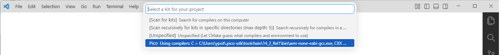

??? note "Build and Flash"
    The simplest way to build and flash the program is to use the UF2 file generated by the build process. Pico board, a USB cable, and a computer are all you need to get started. Here are the steps to build and flash the program:

    1. Pressing `F7` on VSCode will build the project. If this is the first time you build the project, you will see the dialog shown below. Select `Pico Using compilers: ...` and the build process will start.

         { width="70%" }

    2. After building, you can find the generated UF2 file in the `build` directory.
    3. Connect your Pico to the computer using a USB cable while holding the BOOTSEL button, and it will appear as a mass storage device. Copy the generated UF2 file to this device to flash it. No need to mind the destination directory, just copy it to the root directory of the device.

    If you have a debug probe like [this](../development/pico-sdk/index.md#writing-elf-files), you can also flash the program using OpenOCD and GDB. This is the recommended method for development, as it allows you to debug the program while running it on the board!
