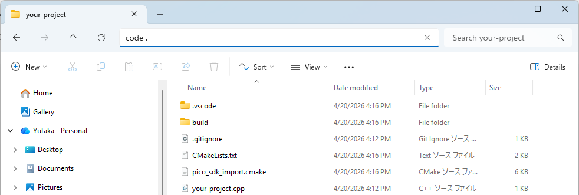
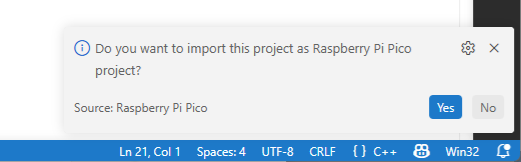
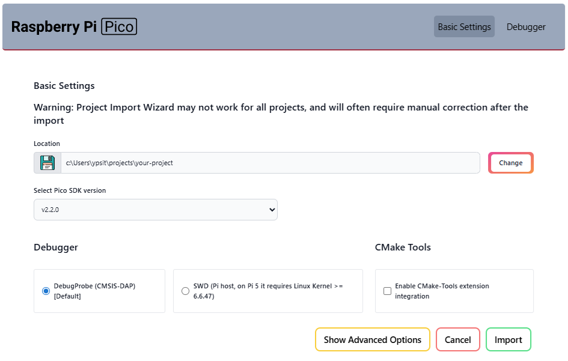

??? note "Create Pico SDK Project"

    1. In VSCode, run `>Raspberry Pi Pico: New Pico Project` in the command palette.
    2. In the dialog below, select `C/C++`.
       { width=70% }

    3. Create a project with the following settings:
         - **Name** ... Enter the project name.
         - **Board type** ... Select your board type.
         - **Location** ... Select the parent directory where the project directory will be created.
         - **Stdio support** ... Leave `Console over USB` **unchecked** when you use LABOPlatform or other USB features because they conflict with each other. You can enable it by editing the `CMakeLists.txt` file later.
         - **Code generation options** ... Check `Generate C++ code`.

    

??? note "Open Existing Pico SDK Project"

    Open the project folder in VSCode using one of the following methods:

    - In a command prompt, change the current directory to the project folder and execute `code .`.
    - In a Explorer, choose the project folder, push `Alt+D` to focus the address bar, and execute `code .`.

        { width=50% }
    
    If the folder is already prepared as a Pico SDK project, just proceed with editing and building the project.

    If not, you will see the following message at the bottom right corner of VSCode.

      { width=50% }

    Click `Yes` and you will see the following window.

      { width=50% }

    Click `Import` and the project will be prepared as a Pico SDK project.

    When the `Do you want to import this project as Raspberry Pi Pico project?` message disappears before you click `Yes`, you can reveal it by clicking the icon  at the bottom right corner of VSCode.
