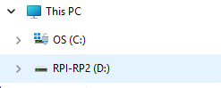
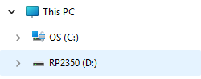

??? note "Flash UF2 Binary File to Pico Board"
    Connect a Pico board to a host PC using a USB cable while holding BOOTSEL button, and you will see a drive like follows:

    

    -   **Pico (RP2040)**

        

    -   **Pico2 (RP2350)**

        

    

    
    Copy a UF2 file to this drive. No need to care about the destination directory.
