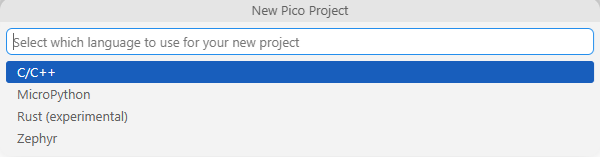
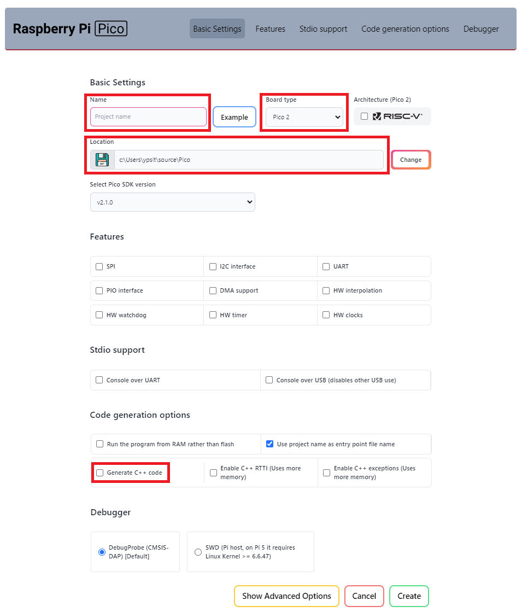

??? note "Create Pico SDK Project"

    1. In VSCode, run `>Raspberry Pi Pico: New Pico Project` in the command palette.
    2. In the dialog below, select `C/C++`.
       { width=70% }

    3. Create a project with the following settings:
         - **Name** ... Enter the project name.
         - **Board type** ... Select your board type.
         - **Location** ... Select the parent directory where the project directory will be created.
         - **Code generation options** ... **Check `Generate C++ code`**.

    
