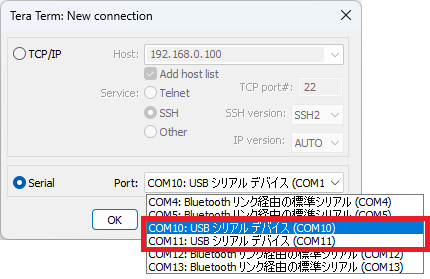

??? note "Setup Tera Term for LABOPlatform"
    From the menu bar, select `[File]` - `[New Connection...]` to open the dialog below:

    

    pico-jxgLABO or a firmware based on LABOPlatform provides two USB serial ports: one for terminal use and the other for applications such as logic analyzers and plotters. Select one of the ports and press `Enter` key in the terminal. When successfully connected, you will see a prompt in the terminal.
