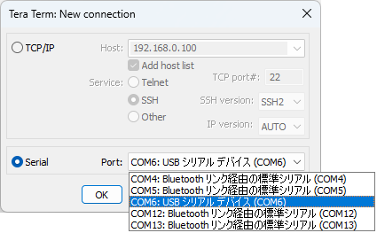

??? note "Setup Tera Term for stdio"
    From the menu bar, select `[File]` - `[New Connection...]` to open the dialog below:

    

    Select the appropriate serial port for your Pico board and press `Enter` key in the terminal. When successfully connected, you will see a prompt in the terminal.
