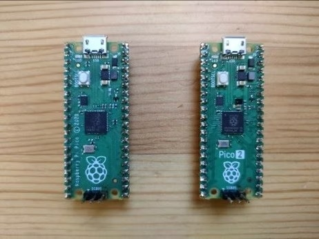

# pico-jxglib

A collection of libraries and tools for Raspberry Pi Pico, including a powerful shell and various utilities like built-in logic analyzer to enhance your development experience.



## Motivation

Why firmware platforms have no interactive shell? When you want to modify the behavior of the firmware, you have to edit the source code, compile it, and flash it to the device. This process can be time-consuming and inefficient, especially for small changes or debugging purposes. An interactive shell allows developers to interact with the firmware in real-time, making it easier to test and modify behavior without the need for recompilation.

Yes, I know there are some interactive shells for microcontrollers, but most of them come with OS like FreeRTOS, and they are not designed for bare-metal firmware. I love bare-metal programming, and I want my programs to run as fast as possible without the overhead of an OS.

pico-jxglib aims to provide a simple but powerful interactive shell with just four lines of additional code.

## Actual Code

Let's see what the program looks like:

```cpp hl_lines="2 4 9 12" linenums="1"
#include "pico/stdlib.h"
#include "jxglib/LABOPlatform.h"

using namespace jxglib;

int main(void)
{
	::stdio_init_all();
	LABOPlatform::Instance.Initialize();
	for (;;) {
        // Your code here
        Tickable::Tick();
    }
}
```

Just adding these four lines makes your firmware interactive through USB's serial connection, providing a bash-like interface to execute commands.

## Ready-to-Use UF2 Binary

If you want to try it out without setting up the development environment, you can download the ready-to-use UF2 binary files.

|Target Board|UF2 Binary File|
|---|---|
|Raspberry Pi Pico|[pico-jxgLABO.uf2](https://github.com/ypsitau/pico-jxgLABO/releases/latest/download/pico-jxgLABO.uf2)|
|Raspberry Pi Pico W|[pico-w-jxgLABO.uf2](https://github.com/ypsitau/pico-jxgLABO/releases/latest/download/pico-w-jxgLABO.uf2)|
|Raspberry Pi Pico2|[pico2-jxgLABO.uf2](https://github.com/ypsitau/pico-jxgLABO/releases/latest/download/pico2-jxgLABO.uf2)|
|Raspberry Pi Pico2 W|[pico2-w-jxgLABO.uf2](https://github.com/ypsitau/pico-jxgLABO/releases/latest/download/pico2-w-jxgLABO.uf2)|

## Built-in Logic Analyzer

While the library also comes with a rich set of built-in commands for various purposes, the most exciting feature is the built-in logic analyzer, which allows you to capture, visualize, and analyze digital signals directly from your Pico. No need to prepare and connect a logic analyzer. The Pico that runs your firmware works as a logic analyzer! This can be incredibly useful for debugging and analyzing the behavior of your circuits and peripherals.
