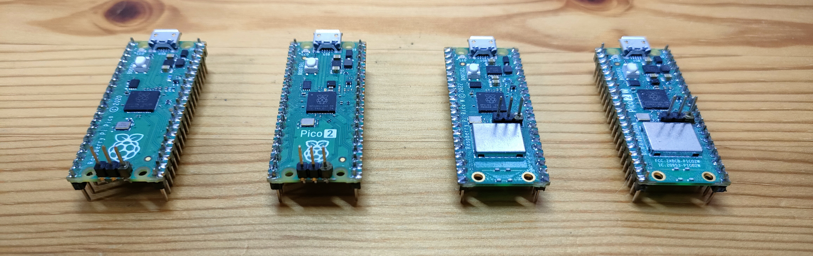

# pico-jxglib - A "Pseudo" Operating System for Raspberry Pi Pico

Unleash the full potential of your Raspberry Pi Pico with pico-jxglib! It is a "pseudo" operating system that offers multitask capabilities without complicated context management. Just keep your bare-metal programming style as you do!

It comes with a powerful interactive shell, flexible file system, network capabilities, USB device and host capabilities, device drivers, and various utilities, including a built-in logic analyzer with sampling rates of up to 50MHz.



## Motivation

Why firmware platforms have no interactive shell? When you want to modify the behavior of the firmware, you have to edit the source code, compile it, and flash it to the device. This process can be time-consuming and inefficient, especially for small changes or debugging purposes. An interactive shell allows developers to interact with the firmware in real-time, making it easier to test and modify behavior without the need for recompilation.

Yes, I know there are some interactive shells for microcontrollers, but most of them come with OS like FreeRTOS, and they are not designed for bare-metal firmware. I love bare-metal programming, and I want to keep my program simple and free from complicated OS concepts.

pico-jxglib aims to provide a simple but powerful interactive shell with just a few lines of additional code.

## Sample Programs

pico-jxglib is implemented in C++, but it also provides C APIs for those who prefer C. The following sample programs show how to use the library in both C++ and C.

=== "C++"
    ```cpp hl_lines="2 4 9 12" linenums="1"
    #include "pico/stdlib.h"
    #include "jxglib/LABOPlatform.h"
    
    using namespace jxglib;
    
    int main(void)
    {
    	::stdio_init_all();
    	LABOPlatform::Instance.Initialize();
    	for (;;) {
            // Your code here
            Tickable::Tick();
        }
    }
    ```
=== "C"
    ```c hl_lines="2 7 10" linenums="1"
    #include "pico/stdlib.h"
    #include "jxglib/LABOPlatform.h"
    
    int main(void)
    {
        stdio_init_all();
        jxglib_labo_init(true);
        for (;;) {
            /* Your code here */
            jxglib_tick();
        }
    }
    ```

Just adding the highlighted lines makes your firmware interactive through USB's serial connection, providing a bash-like interface to execute many powerful built-in commands for various purposes. [:octicons-arrow-right-24: Learn More](library/index.md#__tabbed_1_2)

Of course, you can also add your own custom commands to the shell. It's that simple! [:octicons-arrow-right-24: Learn More](library/shell/customcmd.md)

## pico-jxgLABO: Ready-to-Flash UF2 Binary

If you want to try it out without setting up the development environment, you can download the ready-to-flash UF2 binary files.

<!-- mkdocs-start:uf2-list -->
|Target Board|UF2 Binary File|
|---|---|
|Raspberry Pi Pico|[pico-jxgLABO.uf2](https://github.com/ypsitau/pico-jxgLABO/releases/latest/download/pico-jxgLABO.uf2)|
|Raspberry Pi Pico W|[pico-w-jxgLABO.uf2](https://github.com/ypsitau/pico-jxgLABO/releases/latest/download/pico-w-jxgLABO.uf2)|
|Raspberry Pi Pico2|[pico2-jxgLABO.uf2](https://github.com/ypsitau/pico-jxgLABO/releases/latest/download/pico2-jxgLABO.uf2)|
|Raspberry Pi Pico2 W|[pico2-w-jxgLABO.uf2](https://github.com/ypsitau/pico-jxgLABO/releases/latest/download/pico2-w-jxgLABO.uf2)|
<!-- mkdocs-end:uf2-list -->

These UF2 files are pre-compiled with the latest version of pico-jxglib and can be flashed to your Pico board using the standard UF2 flashing method.



## Built-in Logic Analyzer

While pico-jxglib comes with a rich set of built-in commands for various purposes, the most exciting feature is the built-in logic analyzer. No need to prepare and connect a logic analyzer. The Pico board that runs your firmware works as a logic analyzer!

The wave form can be visualized by two methods:

- Print it as text in the shell. This is a simple and quick way to visualize the data without needing any additional tools. [:octicons-arrow-right-24: Learn More](shell/logic-analyzer/text/data-sampling.md)

- Visualize it using [PulseView](https://sigrok.org/wiki/PulseView), a powerful waveform viewer. This allows you to see the captured data in a more detailed and interactive way, making it easier to analyze complex signals and timing relationships. [:octicons-arrow-right-24: Learn More](shell/logic-analyzer/pulseview/setup-pulseview.md)

Below is a demo of the logic analyzer working on the shell, capturing the I2C signals that issue READ requests for scanning devices. Please note that all the commands executed in the prompt `L:/>` are processed by the Pico firmware without the involvement of the host computer.

<div class="video-container">
  <iframe 
    src="https://www.youtube.com/embed/jMSZNx5nsew?rel=0&modestbranding=1" 
    title="pico-jxgLABO Logic Analyzer Demo"
    frameborder="0" 
    allow="accelerometer; autoplay; clipboard-write; encrypted-media; gyroscope; picture-in-picture; web-share" 
    allowfullscreen>
  </iframe>
</div>

## Other Key Features

In addition to the interactive shell and built-in logic analyzer, pico-jxglib also provides a variety of other features, including:

<div class="grid cards" markdown>

-   :material-ip-network:{ .lg .middle } **Wi-Fi Configuration by Shell**

    ---

    If you're using a Pico W or Pico2 W, you can configure the network settings, like SSID and password, easily from the shell. No program needed!

    [:octicons-arrow-right-24: Learn More](shell/network/wifi/index.md)

-   :octicons-command-palette-16:{ .lg .middle } **Remote Shell**

    ---

    You can remotely access the shell over the Wi-Fi network using Telnet protocol, allowing you to interact with your Pico from anywhere without needing a physical connection.

    [:octicons-arrow-right-24: Learn More](shell/network/telnet-server/index.md)

-   :fontawesome-solid-display:{ .lg .middle } **Display Support**

    ---

    The library provides support for various displays such as OLED and TFT displays. You can use the shell to configure the display and draw images on the screen. WS2812 RGB LEDs can also be used as a display, allowing you to create colorful lighting effects and visualizations directly from your firmware and the shell.

    [:octicons-arrow-right-24: Learn More](library/display/index.md)

-   :material-folder-multiple-image:{ .lg .middle } **File Operations**

    ---

    You can use the flash memory of the Pico as a file system to store and manage files. This allows you to read and write files directly from your firmware, making it easier to manage data and configurations. File operating commands, such as `ls`, `cp`, `mv`, `rm`, `mkdir`, and `cat`, are built into the shell, allowing you to manage files directly from the command line interface. 

    [:octicons-arrow-right-24: Learn More](shell/filesystem/file-operating-commands/index.md)

-   :material-usb-flash-drive:{ .lg .middle } **Pico as USB Mass Storage Device**

    ---

    The file system is also accessible as a USB mass storage device when the Pico is connected to a computer. This means you can easily transfer files between your computer and the Pico without needing additional software or tools.

    [:octicons-arrow-right-24: Learn More](shell/filesystem/file-operating-commands/index.md)

-   :fontawesome-solid-keyboard:{ .lg .middle } **USB Keyboard and Mouse Support**

    ---

    You can also connect a USB keyboard and mouse to your Pico, allowing you to interact with the shell and control the display directly from the connected peripherals.

    [:octicons-arrow-right-24: Learn More](library/usbhost/index.md)

-   :fontawesome-solid-sd-card:{ .lg .middle } **SD Card Support**

    ---

    You can also use an SD card with your Pico. The library provides support for SD cards, allowing you to read and write files on the SD card from your firmware.

    [:octicons-arrow-right-24: Learn More](shell/filesystem/sdcard/index.md)

-   :material-usb-flash-drive:{ .lg .middle } **External USB Storage Device Support**

    ---

    In addition to the built-in flash memory and SD card support, pico-jxglib also allows you to connect external USB storage devices to your Pico. This means you can use a USB flash drive or an external hard drive to store and manage files directly from your firmware.

    [:octicons-arrow-right-24: Learn More](library/usbhost/index.md)

-   :octicons-command-palette-16:{ .lg .middle } **Standalone Shell**

    ---

    The shell can also use an OLED or TFT display as an output device and a USB keyboard as an input device, allowing you to use the shell without needing a computer connection. This can be useful for standalone applications where you want to interact with the firmware directly from the device itself.

    [:octicons-arrow-right-24: Learn More](library/shell/input-and-output.md)

-   :material-camera:{ .lg .middle } **Camera Support**

    ---

    The library provides support for the OV7670 camera module, allowing you to capture images and video directly from your Pico. You can use the shell to configure the camera settings and capture images, which can then be saved to the file system or displayed on a connected display.

    [:octicons-arrow-right-24: Learn More](shell/camera/ov7670/index.md)

-   :material-clock:{ .lg .middle } **Real-Time Clock (RTC)**

    ---

    The library also provides support for a real-time clock, allowing you to keep track of time and date in your firmware. You can use the shell to set and read the RTC, which can be useful for applications that require timekeeping or scheduling.

    [:octicons-arrow-right-24: Learn More](shell/device/rtc/index.md)

-   :material-brain:{ .lg .middle } **TFLite Micro Support**

    ---

    The library also provides support for TensorFlow Lite Micro, allowing you to run machine learning models directly on your Pico. A C macro that includes tflite files allow you to easily integrate TFLite Micro models into your firmware.

-   :simple-lvgl:{ .lg .middle } **LVGL Support**

    ---

    The library also provides support for LVGL, a powerful graphics library for embedded systems.

    [:octicons-arrow-right-24: Learn More](library/toolkit/lvgl/index.md)

-   :material-transit-connection-variant:{ .lg .middle } **PIO Assembler**

    ---

    You can write PIO assembly code directly in the C++ code and use it in your firmware, allowing you to take advantage of the powerful PIO capabilities of the Pico without needing to write separate assembly files.

-   :material-connection:{ .lg .middle } **GPIO Control**

    ---

    You can control the GPIO pins of the Pico directly from the shell, allowing you to easily toggle pins and read their states.

    [:octicons-arrow-right-24: Learn More](shell/peripheral/gpio/index.md)

-   :fontawesome-solid-wave-square:{ .lg .middle } **PWM Control**

    ---

    The library also provides support for PWM (Pulse Width Modulation), allowing you to control the brightness of LEDs, the speed of motors, and other devices that can be controlled with PWM signals directly from the shell.

    [:octicons-arrow-right-24: Learn More](shell/peripheral/pwm/index.md)

-   :material-network-outline:{ .lg .middle } **I2C and SPI Communication**

    ---

    The library provides built-in commands for I2C and SPI communication, making it easy to interact with a wide range of sensors and peripherals without needing to write complex code.

-   :material-usb-port:{ .lg .middle } **USB Device Support**

    ---

    No more bothering about USB descriptors of the TinyUSB! You can easily make your Pico act as a USB device, such as serial device, mass storage device, video, keyboard, or mouse. Combining these functions is also easy!

    [:octicons-arrow-right-24: Learn More](library/usbdev/index.md)

-   :fontawesome-brands-usb:{ .lg .middle } **USB Host Support**

    ---

    The library provides wrapper APIs for the TinyUSB host stack, allowing you to easily connect and interact with USB devices such as keyboards, mice, and storage devices directly from your Pico firmware.

    [:octicons-arrow-right-24: Learn More](library/usbhost/index.md)

</div>

**And much more!**

The library is continuously being developed and new features are added regularly. Be sure to check the documentation and release notes for the latest updates and features.

## License

pico-jxglib is licensed under the MIT License.
