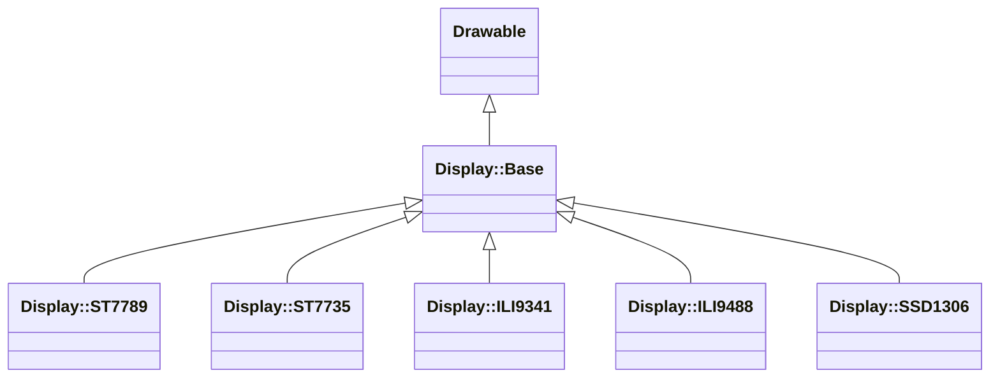

```mermaid
classDiagram
  class Drawable
  class Display_Base["Display::Base"]
  class Display_ST7789["Display::ST7789"]
  class Display_ST7735["Display::ST7735"]
  class Display_ILI9341["Display::ILI9341"]
  class Display_ILI9488["Display::ILI9488"]
  class Display_SSD1306["Display::SSD1306"]
  Drawable <|-- Display_Base
  Display_Base <|-- Display_ST7789
  Display_Base <|-- Display_ST7735
  Display_Base <|-- Display_ILI9341
  Display_Base <|-- Display_ILI9488
  Display_Base <|-- Display_SSD1306
```
