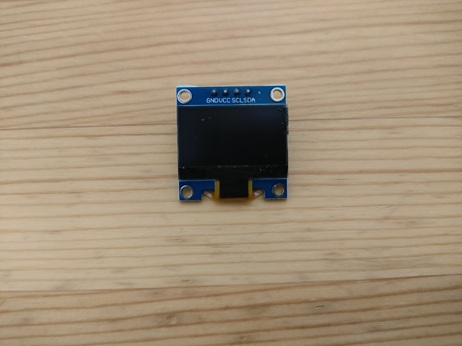

# OLED

OLED (organic EL display) devices often seen in embedded applications are controlled via I2C using the SSD1306 chip[^ssd1306]. The screen size is 0.96 inches, 128x64 pixels, white monochrome only, but since it's self-emissive, it's very clear. They're also attractive for their low price—about 500 yen each.

[^ssd1306]: Some devices have SPI as a control interface or different pixel counts, but the device described here is the most readily available.

Since the interface is I2C, you only need two signal lines. Communication speed is slower than SPI, but the data per pixel for SSD1306 is 1/16 that of RGB565 TFT LCD, and the total screen data is 128 * 64 / 8 = 1024 bytes. With I2C at 400kHz, refreshing the whole screen takes about 26 ms ([program](https://github.com/ypsitau/pico-jxglib/blob/main/Display/test-RefreshRate/test-RefreshRate.cpp)), which is fast enough for most uses.

Because it's monochrome and has few pixels, it's not suitable for complex graphics, but it's perfect for text output. For this Terminal, we'll support both TFT LCD and this OLED as output devices.
