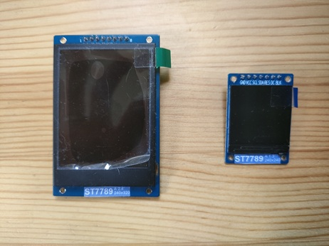
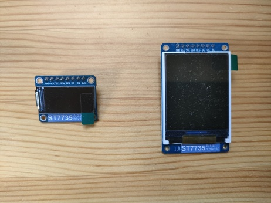
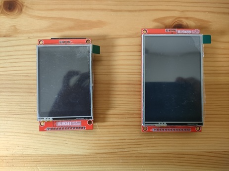

# Display - TFT LCD

When it comes to peripherals connected to a CPU, display-related devices are perhaps the most fun to play with. From a practical standpoint, the amount of information you can convey to users through text and graphics is outstanding. Among the many types of displays, TFT LCDs that can be connected to single-board microcontrollers via SPI interface are especially attractive due to their compact size and affordable price.

## About TFT LCD

The library supports various TFT LCDs, including ST7789, ST7735, ILI9341, and ILI9488. These are commonly used in electronics projects and can be easily procured from online shops.

!!! abstract "ST7789"
    The device on the left is 1.8 inches with 240x320 pixels, and the one on the right is 1.3 inches with 240x240 pixels. Both can be purchased for around 1,000 yen.

    

!!! abstract "ST7735"
    The device on the left is 0.96 inches with 80x160 pixels, and the one on the right is 1.8 inches with 128x160 pixels. Both can be purchased for less than 1,000 yen.

    

!!! abstract "ILI9341/ILI9488"
    These are devices with touch screens. The left one is ILI9341, 2.8 inches with 240x320 pixels, and the right one is ILI9488, 3.5 inches with 320x480 pixels. The prices are about 1,500 yen and 2,500 yen, respectively.

    

The devices listed above have slight differences in initialization procedures, VRAM drawing direction, and pixel format, but their commands are almost the same. In this article, we will use **pico-jxglib** to draw image data and text on these devices.

