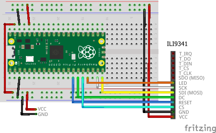
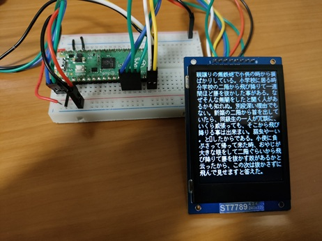
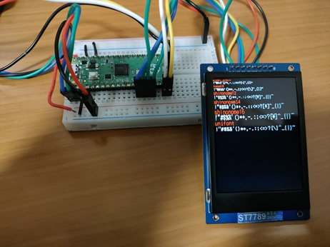

# Sample Program - Drawing

Let's connect a TFT LCD and perform drawing operations.

From the VSCode command palette, run `>Raspberry Pi Pico: New Pico Project` and create a project with the following settings. For details on creating a Pico SDK project, building, and writing to the board, see ["Getting Started with Pico SDK"](../../../development/pico-sdk/index.md).

- **Name** ... Enter the project name. In this example, enter `lcdtest`.
- **Board type** ... Select the board type.
- **Location** ... Select the parent directory where the project directory will be created.
- **Stdio support** ... Select the port (UART or USB) to connect Stdio.
- **Code generation options** ... **Check `Generate C++ code`**

Assume the project directory and `pico-jxglib` are arranged as follows:

```text
├── pico-jxglib/
└── lcdtest/
    ├── CMakeLists.txt
    ├── lcdtest.cpp
    └── ...
```

=== "ST77789 (240x320)"
    The breadboard wiring image is as follows:

    

    Add the following lines to the end of `CMakeLists.txt`:

    ```cmake title="CMakeLists.txt"
    target_link_libraries(lcdtest jxglib_Display_ST7789 jxglib_DrawableTest)
    add_subdirectory(${CMAKE_CURRENT_LIST_DIR}/../pico-jxglib pico-jxglib)
    ```

    Edit the source file as follows:

    ```cpp title="lcdtest.cpp"
    #include <stdio.h>
    #include "pico/stdlib.h"
    #include "jxglib/Display/ST7789.h"
    #include "jxglib/DrawableTest.h"

    using namespace jxglib;

    int main()
    {
        ::stdio_init_all();
        ::spi_init(spi1, 125 * 1000 * 1000);
        GPIO14.set_function_SPI1_SCK();
        GPIO15.set_function_SPI1_TX();
        Display::ST7789 display(spi1, 240, 320, {RST: GPIO10, DC: GPIO11, CS: GPIO12, BL: GPIO13});
        display.Initialize(Display::Dir::Rotate0);
        DrawableTest::RotateImage(display);
        //DrawableTest::DrawString(display);
        //DrawableTest::DrawFonts(display);
    }
    ```
=== "ST77789 (240x240)"
    The breadboard wiring image is as follows:

    

    Add the following lines to the end of `CMakeLists.txt`:

    ```cmake title="CMakeLists.txt"
    target_link_libraries(lcdtest jxglib_Display_ST7789 jxglib_DrawableTest)
    add_subdirectory(${CMAKE_CURRENT_LIST_DIR}/../pico-jxglib pico-jxglib)
    ```

    Edit the source file as follows:

    ```cpp title="lcdtest.cpp"
    #include <stdio.h>
    #include "pico/stdlib.h"
    #include "jxglib/Display/ST7789.h"
    #include "jxglib/DrawableTest.h"

    using namespace jxglib;

    int main()
    {
        ::stdio_init_all();
        ::spi_init(spi1, 125 * 1000 * 1000);
        GPIO14.set_function_SPI1_SCK();
        GPIO15.set_function_SPI1_TX();
        Display::ST7789 display(spi1, 240, 240, {RST: GPIO10, DC: GPIO11, BL: GPIO13});
        display.Initialize(Display::Dir::Rotate0);
        DrawableTest::RotateImage(display);
        //DrawableTest::DrawString(display);
        //DrawableTest::DrawFonts(display);
    }
    ```
=== "ST7735 (80x160)"
    The breadboard wiring image is as follows:

    

    Add the following lines to the end of `CMakeLists.txt`:

    ```cmake title="CMakeLists.txt"
    target_link_libraries(lcdtest jxglib_Display_ST7735 jxglib_DrawableTest)
    add_subdirectory(${CMAKE_CURRENT_LIST_DIR}/../pico-jxglib pico-jxglib)
    ```

    Edit the source file as follows:

    ```cpp title="lcdtest.cpp"
    #include <stdio.h>
    #include "pico/stdlib.h"
    #include "jxglib/Display/ST7735.h"
    #include "jxglib/DrawableTest.h"

    using namespace jxglib;

    int main()
    {
        ::stdio_init_all();
        ::spi_init(spi1, 125 * 1000 * 1000);
        GPIO14.set_function_SPI1_SCK();
        GPIO15.set_function_SPI1_TX();
        Display::ST7735 display(spi1, 80, 160, {RST: GPIO10, DC: GPIO11, CS: GPIO12, BL: GPIO13});
        display.Initialize(Display::Dir::Rotate0);
        DrawableTest::RotateImage(display);
        //DrawableTest::DrawString(display);
        //DrawableTest::DrawFonts(display);
    }
    ```
=== "ST7735 (128x160)"
    The breadboard wiring image is as follows:

    

    Add the following lines to the end of `CMakeLists.txt`:

    ```cmake title="CMakeLists.txt"
    target_link_libraries(lcdtest jxglib_Display_ST7735 jxglib_DrawableTest)
    add_subdirectory(${CMAKE_CURRENT_LIST_DIR}/../pico-jxglib pico-jxglib)
    ```

    Edit the source file as follows:

    ```cpp title="lcdtest.cpp"
    #include <stdio.h>
    #include "pico/stdlib.h"
    #include "jxglib/Display/ST7735.h"
    #include "jxglib/DrawableTest.h"

    using namespace jxglib;

    int main()
    {
        ::stdio_init_all();
        ::spi_init(spi1, 125 * 1000 * 1000);
        GPIO14.set_function_SPI1_SCK();
        GPIO15.set_function_SPI1_TX();
        Display::ST7735::TypeB display(spi1, 128, 160, {RST: GPIO10, DC: GPIO11, CS: GPIO12, BL: GPIO13});
        display.Initialize(Display::Dir::Rotate0);
        DrawableTest::RotateImage(display);
        //DrawableTest::DrawString(display);
        //DrawableTest::DrawFonts(display);
    }
    ```

=== "ILI9341"
    The breadboard wiring image is as follows:

    

    Add the following lines to the end of `CMakeLists.txt`:

    ```cmake title="CMakeLists.txt"
    target_link_libraries(lcdtest jxglib_Display_ILI9341 jxglib_DrawableTest)
    add_subdirectory(${CMAKE_CURRENT_LIST_DIR}/../pico-jxglib pico-jxglib)
    ```

    Edit the source file as follows:

    ```cpp title="lcdtest.cpp"
    #include <stdio.h>
    #include "pico/stdlib.h"
    #include "jxglib/Display/ILI9341.h"
    #include "jxglib/DrawableTest.h"

    using namespace jxglib;

    int main()
    {
        ::stdio_init_all();
        ::spi_init(spi1, 125 * 1000 * 1000);
        GPIO14.set_function_SPI1_SCK();
        GPIO15.set_function_SPI1_TX();
        Display::ILI9341 display(spi1, 240, 320, {RST: GPIO10, DC: GPIO11, CS: GPIO12, BL: GPIO13});
        display.Initialize(Display::Dir::Rotate0);
        DrawableTest::RotateImage(display);
        //DrawableTest::DrawString(display);
        //DrawableTest::DrawFonts(display);
    }
    ```

=== "ILI9488"
    The breadboard wiring image is as follows:

    

    Add the following lines to the end of `CMakeLists.txt`:

    ```cmake title="CMakeLists.txt"
    target_link_libraries(lcdtest jxglib_Display_ILI9488 jxglib_DrawableTest)
    add_subdirectory(${CMAKE_CURRENT_LIST_DIR}/../pico-jxglib pico-jxglib)
    ```

    Edit the source file as follows:

    ```cpp title="lcdtest.cpp"
    #include <stdio.h>
    #include "pico/stdlib.h"
    #include "jxglib/Display/ILI9488.h"
    #include "jxglib/DrawableTest.h"

    using namespace jxglib;

    int main()
    {
        ::stdio_init_all();
        ::spi_init(spi1, 125 * 1000 * 1000);
        GPIO14.set_function_SPI1_SCK();
        GPIO15.set_function_SPI1_TX();
        Display::ILI9488 display(spi1, 320, 480, {RST: GPIO10, DC: GPIO11, CS: GPIO12, BL: GPIO13});
        display.Initialize(Display::Dir::Rotate0);
        DrawableTest::RotateImage(display);
        //DrawableTest::DrawString(display);
        //DrawableTest::DrawFonts(display);
    }
    ```

Uncomment the functions starting with `DrawableTest::` and [build, write, and run the program](https://zenn.dev/ypsitau/articles/2025-01-17-picosdk#%E3%83%97%E3%83%AD%E3%82%B0%E3%83%A9%E3%83%A0%E3%81%AE%E3%83%93%E3%83%AB%E3%83%89). The following will be displayed:

- `DrawableTest::RotateImage()` is a test function that rotates and displays image data on the LCD. If you enter any key from a serial terminal connected via UART, the image will be rotated by 90 degrees and redrawn.

  

- `DrawablTest::DrawString()` is a test function that displays Japanese text across the entire LCD screen. By operating from a serial terminal connected via UART, you can change the font type, font scaling, and line spacing.

  

- `DrawablTest::DrawFonts()` is a test function that displays strings in different fonts on the LCD.

  


## Program Explanation

In the [previous sample](https://zenn.dev/ypsitau/articles/2025-01-27-tft-lcd#tft-lcd-%E3%81%AE%E6%8F%8F%E7%94%BB), we used test functions for demonstration, but this time let's use the raw API to see how each operation works. Rewrite the source file `lcdtest.cpp` as follows:


```cpp title="lcdtest.cpp"
#include <stdio.h>
#include "pico/stdlib.h"
#include "jxglib/Display/ST7789.h"
#include "jxglib/sample/cat-240x320.h"
#include "jxglib/Font/shinonome16-japanese-level1.h"

using namespace jxglib;

int main()
{
  // Initialize devices
  ::stdio_init_all();
  ::spi_init(spi1, 125 * 1000 * 1000);
  GPIO14.set_function_SPI1_SCK();
  GPIO15.set_function_SPI1_TX();
  Display::ST7789 display(spi1, 240, 320, {RST: GPIO10, DC: GPIO11, CS: GPIO12, BL: GPIO13});
  display.Initialize(Display::Dir::Rotate0);
  // Display items
  display.DrawImage(20, 20, image_cat_240x320, {20, 20, 200, 200});
  display.SetFont(Font::shinonome16);
  const char* str = "I am a cat";
  Size sizeStr = display.CalcStringSize(str);
  int x = (display.GetWidth() - sizeStr.width) / 2, y = 230;
  display.DrawString(x, y, str);
  display.DrawRect(x - 8, y - 4, sizeStr.width + 8 * 2, sizeStr.height + 4 * 2, Color::white);
  display.DrawRectFill(0, 260, 55, 60, Color::red);
  display.DrawRectFill(60, 260, 55, 60, Color::green);
  display.DrawRectFill(120, 260, 55, 60, Color::blue);
  display.DrawRectFill(180, 260, 55, 60, Color::aqua);
}
```


The first half of the source file initializes the device.

```cpp
::spi_init(spi1, 125 * 1000 * 1000);
```

This is a Pico SDK function. It initializes SPI1 with a clock of 125MHz.

```cpp
GPIO14.set_function_SPI1_SCK();
GPIO15.set_function_SPI1_TX();
```

Sets GPIO14 and GPIO15 to SPI1 SCK and TX (MOSI), respectively.

```cpp
Display::ST7789 display(spi1, 240, 320, {RST: GPIO10, DC: GPIO11, CS: GPIO12, BL: GPIO13});
```

Creates an instance to operate the ST7789. Specify the SPI to connect, display size, and GPIOs to connect (RST: Reset, DC: Data/Command, CS: Chip Select, BL: Backlight).

```cpp
display.Initialize(Display::Dir::Rotate0);
```


Initializes the LCD and makes it ready for drawing. The argument specifies the LCD drawing direction as follows:

- `Display::Dir::Rotate0` or `Display::Dir::Normal` ... Draws in the normal direction
- `Display::Dir::Rotate90` ... Rotates 90 degrees
- `Display::Dir::Rotate180` ... Rotates 180 degrees
- `Display::Dir::Rotate270` ... Rotates 270 degrees
- `Display::Dir::MirrorHorz` ... Mirrors horizontally
- `Display::Dir::MirrorVert` ... Mirrors vertically

After this, you can perform drawing operations on the `display` instance.

```cpp
display.DrawImage(20, 20, image_cat_240x320, {20, 20, 200, 200});
```

Draws an image at the specified coordinates. The fourth argument specifies the clipping region within the image.

```cpp
display.SetFont(Font::shinonome16);
```

Specifies the font data `Font::shinonome16` defined in the include file `jxglib/Font/shinonome16-japanese-level1.h`.

```cpp
Size sizeStr = display.CalcStringSize(str);
```

Calculates the size when drawing the string with the specified font.

```cpp
display.DrawString(x, y, str);
```

Draws the string at the specified coordinates.

```cpp
display.DrawRect(x - 8, y - 4, sizeStr.width + 8 * 2, sizeStr.height + 4 * 2, Color::white);
```

Draws a rectangle with specified coordinates, size, and color.

```cpp
display.DrawRectFill(0, 260, 55, 60, Color::red);
display.DrawRectFill(60, 260, 55, 60, Color::green);
display.DrawRectFill(120, 260, 55, 60, Color::blue);
display.DrawRectFill(180, 260, 55, 60, Color::aqua);
```

Draws filled rectangles with specified coordinates, size, and color.

---

These are almost all the drawing functions provided by **pico-jxglib**. You might wonder about drawing circles or lines, but the requirements for graphic drawing are very high, and even if you struggle to make them yourself, they often end up being incomplete and not practical. Therefore, the policy is to leave such advanced drawing to specialized libraries. For example, if you need a Windows-like GUI with buttons or list boxes, there is an excellent library called [LVGL](https://lvgl.io/). **pico-jxglib** provides adapters to bridge to such libraries.
