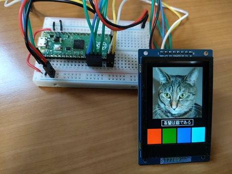

# Drawing APIs

## Building and Flashing the Program

Create a new Pico SDK project named `tftlcd-apis`.



Clone the pico-jxglib repository from GitHub so the direcory structure looks like this:

```text
├── pico-jxglib/
└── tftlcd-apis/
    ├── CMakeLists.txt
    ├── tftlcd-apis.cpp
    └── ...
```



Add the following lines to the end of `CMakeLists.txt`:

```cmake title="CMakeLists.txt" linenums="1"

```

Edit the source file as follows:

```cpp title="tftlcd-apis.cpp" linenums="1"

```

## Running the Program



## Program Explanation

The first half of the source file initializes the device.

```cpp linenums="18"
::spi_init(spi1, 125 * 1000 * 1000);
```

This is a Pico SDK function. It initializes SPI1 with a clock of 125MHz.

```cpp linenums="19"
GPIO14.set_function_SPI1_SCK();
GPIO15.set_function_SPI1_TX();
```

Sets GPIO14 and GPIO15 to SPI1 SCK and TX (MOSI), respectively.

```cpp linenums="21"
Display::ST7789 display(spi1, 240, 320, {RST: GPIO10, DC: GPIO11, CS: GPIO12, BL: GPIO13});
```

Creates an instance to operate the ST7789. Specify the SPI to connect, display size, and GPIOs to connect (RST: Reset, DC: Data/Command, CS: Chip Select, BL: Backlight).

```cpp linenums="22"
display.Initialize(Display::Dir::Rotate0);
```


Initializes the LCD and makes it ready for drawing. The argument specifies the LCD drawing direction as follows:

- `Display::Dir::Rotate0` or `Display::Dir::Normal` ... Draws in the normal direction
- `Display::Dir::Rotate90` ... Rotates 90 degrees
- `Display::Dir::Rotate180` ... Rotates 180 degrees
- `Display::Dir::Rotate270` ... Rotates 270 degrees
- `Display::Dir::MirrorHorz` ... Mirrors horizontally
- `Display::Dir::MirrorVert` ... Mirrors vertically

After this, you can perform drawing operations on the `display` instance.

```cpp linenums="23"
display.DrawImage(20, 20, image_cat_240x320, {20, 20, 200, 200});
```

Draws an image at the specified coordinates. The fourth argument specifies the clipping region within the image.

```cpp linenums="24"
display.SetFont(Font::shinonome16);
```

Specifies the font data `Font::shinonome16` defined in the include file `jxglib/Font/shinonome16-japanese-level1.h`.

```cpp linenums="26"
Size sizeStr = display.CalcStringSize(str);
```

Calculates the size when drawing the string with the specified font.

```cpp linenums="28"
display.DrawString(x, y, str);
```

Draws the string at the specified coordinates.

```cpp linenums="29"
display.DrawRect(x - 8, y - 4, sizeStr.width + 8 * 2, sizeStr.height + 4 * 2, Color::white);
```

Draws a rectangle with specified coordinates, size, and color.

```cpp linenums="30"
display.DrawRectFill(0, 260, 55, 60, Color::red);
display.DrawRectFill(60, 260, 55, 60, Color::green);
display.DrawRectFill(120, 260, 55, 60, Color::blue);
display.DrawRectFill(180, 260, 55, 60, Color::aqua);
```

Draws filled rectangles with specified coordinates, size, and color.
