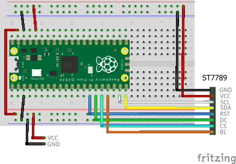
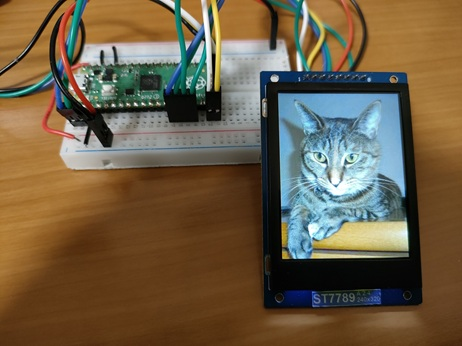

# Create Display in Program

## Building and Flashing the Program

Let's connect a TFT LCD and perform drawing operations.

Here, we will create a sample program that implements a custom command named `argtest`. It displays the contents of the arguments passed to it.

Create a new Pico SDK project named `tftlcd-hardcoded`.



Clone the pico-jxglib repository from GitHub so the direcory structure looks like this:

```text
├── pico-jxglib/
└── tftlcd-hardcoded/
    ├── CMakeLists.txt
    ├── tftlcd-hardcoded.cpp
    └── ...
```



=== "ST77789 (240x320)"
    The breadboard wiring image is as follows:

    

    Add the following lines to the end of `CMakeLists.txt`:

    ```cmake title="CMakeLists.txt" linenums="1"
    
    ```

    Edit the source file as follows:

    ```cpp title="tftlcd-hardcoded.cpp" linenums="1"
    
    ```
=== "ST77789 (240x240)"
    The breadboard wiring image is as follows:

    

    Add the following lines to the end of `CMakeLists.txt`:

    ```cmake title="CMakeLists.txt" linenums="1"
    target_link_libraries(tftlcd-hardcoded jxglib_Display_ST7789 jxglib_DrawableTest)
    add_subdirectory(${CMAKE_CURRENT_LIST_DIR}/../pico-jxglib pico-jxglib)
    ```

    Edit the source file as follows:

    ```cpp title="tftlcd-hardcoded.cpp" linenums="1"
    
    ```
=== "ST7735 (80x160)"
    The breadboard wiring image is as follows:

    

    Add the following lines to the end of `CMakeLists.txt`:

    ```cmake title="CMakeLists.txt" linenums="1"
    target_link_libraries(tftlcd-hardcoded jxglib_Display_ST7735 jxglib_DrawableTest)
    add_subdirectory(${CMAKE_CURRENT_LIST_DIR}/../pico-jxglib pico-jxglib)
    ```

    Edit the source file as follows:

    ```cpp title="tftlcd-hardcoded.cpp" linenums="1"
    
    ```
=== "ST7735 (128x160)"
    The breadboard wiring image is as follows:

    

    Add the following lines to the end of `CMakeLists.txt`:

    ```cmake title="CMakeLists.txt" linenums="1"
    target_link_libraries(tftlcd-hardcoded jxglib_Display_ST7735 jxglib_DrawableTest)
    add_subdirectory(${CMAKE_CURRENT_LIST_DIR}/../pico-jxglib pico-jxglib)
    ```

    Edit the source file as follows:

    ```cpp title="tftlcd-hardcoded.cpp" linenums="1"
    
    ```

=== "ILI9341"
    The breadboard wiring image is as follows:

    

    Add the following lines to the end of `CMakeLists.txt`:

    ```cmake title="CMakeLists.txt" linenums="1"
    target_link_libraries(tftlcd-hardcoded jxglib_Display_ILI9341 jxglib_DrawableTest)
    add_subdirectory(${CMAKE_CURRENT_LIST_DIR}/../pico-jxglib pico-jxglib)
    ```

    Edit the source file as follows:

    ```cpp title="tftlcd-hardcoded.cpp" linenums="1"
    
    ```

=== "ILI9488"
    The breadboard wiring image is as follows:

    

    Add the following lines to the end of `CMakeLists.txt`:

    ```cmake title="CMakeLists.txt" linenums="1"
    target_link_libraries(tftlcd-hardcoded jxglib_Display_ILI9488 jxglib_DrawableTest)
    add_subdirectory(${CMAKE_CURRENT_LIST_DIR}/../pico-jxglib pico-jxglib)
    ```

    Edit the source file as follows:

    ```cpp title="tftlcd-hardcoded.cpp" linenums="1"
    
    ```

## Running the Program

- Running `draw-rotate` displays an image on the LCD. If you enter any key the image will be rotated by 90 degrees and redrawn.

  

- Running `draw-string` displays Japanese text across the entire LCD screen. You can change the font type, font scaling, and line spacing in the serial terminal.

  

- Running `draw-fonts` displays strings in different fonts on the LCD. You can change the font type and scaling in the serial terminal.

  
