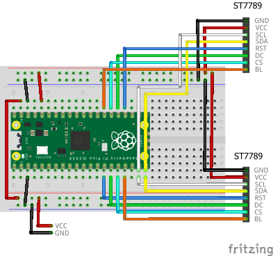

# Connecting Multiple LCDs

If the LCD device has a CS (Chip Select) pin, you can connect multiple devices in parallel to the same SPI interface.

## Wiring

Here, let's try connecting two ST7789s. The breadboard wiring image is as follows:



## Building and Flashing the Program

Create a new Pico SDK project named `tftlcd-multi`.



Clone the pico-jxglib repository from GitHub so the direcory structure looks like this:

```text
├── pico-jxglib/
└── tftlcd-multi/
    ├── CMakeLists.txt
    ├── tftlcd-multi.cpp
    └── ...
```



Add the following lines to the end of `CMakeLists.txt`:

```cmake title="CMakeLists.txt" linenums="1"

```

Edit the source file as follows:

```cpp title="tftlcd-multi.cpp" linenums="1"

```

## About Program

As long as you have enough GPIOs, you can connect as many LCDs as you want to the same SPI interface... or so you'd like to think, but if you connect too many, the signal waveform seems to deteriorate. I confirmed that you can connect up to four LCDs to the same SPI[^multi-connect], but if one of them is an ILI9341, it does not display.

[^multi-connect]: At that time, I ran out of GPIOs, so I connected the BL (backlight) pin directly to VCC (3.3V).
