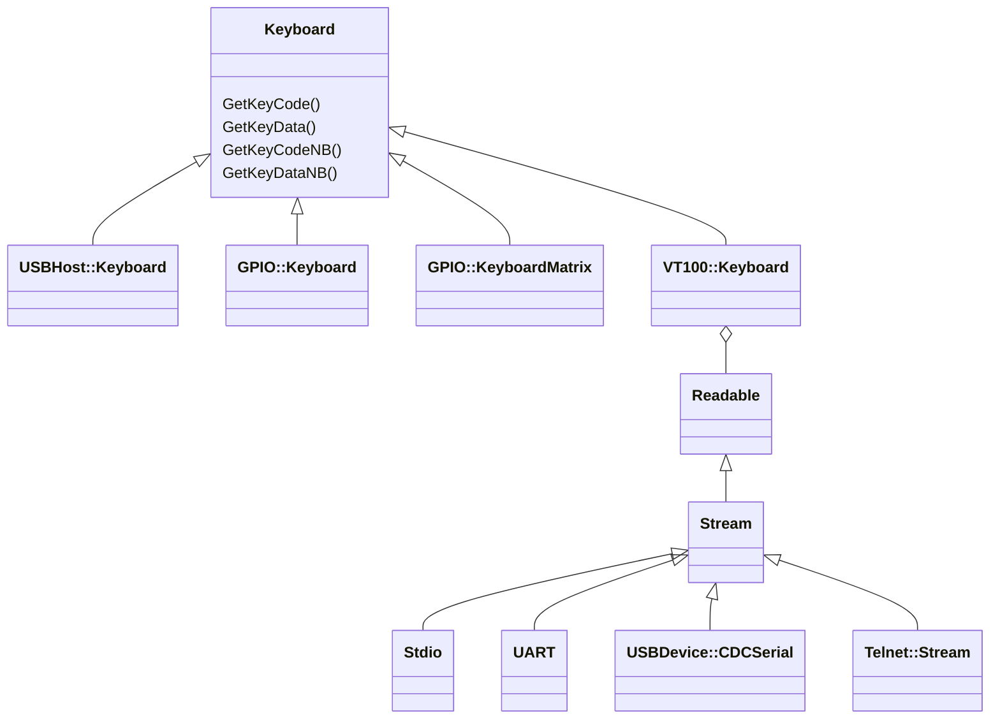

## Keyboard Classes

```mermaid
classDiagram
  class Keyboard {
    GetKeyCode()
    GetKeyData()
    GetKeyCodeNB()
    GetKeyDataNB()
  }
  class USBHost_Keyboard["USBHost::Keyboard"]
  class GPIO_Keyboard["GPIO::Keyboard"]
  class GPIO_KeyboardMatrix["GPIO::KeyboardMatrix"]
  class VT100_Keyboard["VT100::Keyboard"]
  class Stdio
  class UART
  class USBDevice_CDCSerial["USBDevice::CDCSerial"]
  class Telnet_Stream["Telnet::Stream"]
  Keyboard <|-- USBHost_Keyboard
  Keyboard <|-- GPIO_Keyboard
  Keyboard <|-- GPIO_KeyboardMatrix
  Keyboard <|-- VT100_Keyboard
  VT100_Keyboard o-- Readable
  Readable <|-- Stream
  Stream <|-- Stdio
  Stream <|-- UART
  Stream <|-- USBDevice_CDCSerial
  Stream <|-- Telnet_Stream
```

## Virtual Keycode

[https://learn.microsoft.com/en-us/windows/win32/inputdev/virtual-key-codes](https://learn.microsoft.com/en-us/windows/win32/inputdev/virtual-key-codes)
