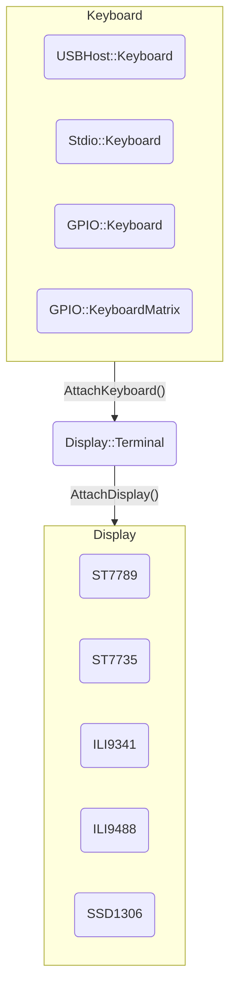
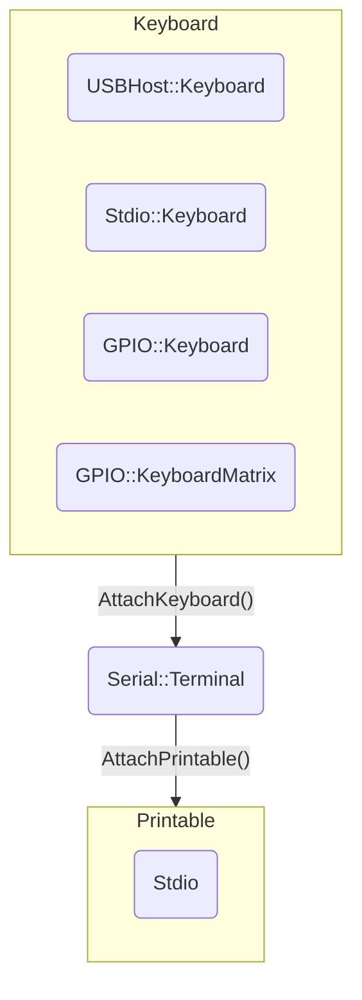

In the article ["Connecting USB Keyboard and Mouse to Pico Board with pico-jxglib"](https://zenn.dev/ypsitau/articles/2025-04-02-usbhost-keyboard-mouse), we connected a USB keyboard to the Pico board. This time, we'll use that to implement a command line editing feature on the Pico board, similar to readline used in Linux bash shells.

In addition to USB keyboards, you can also use tact switches and keyboard matrices as input devices, and command line editing is possible over serial communication with a PC.

Once you can edit input with a keyboard, the Pico board really feels like a standalone microcontroller. If the phrase "microcomputer monitor program" makes your heart skip a beat, you should definitely give this a try!


## About the Command Line Editing Feature

The command line editing feature of **pico-jxglib** supports the following key operations:

| Ctrl Key      | Single Key | Function                                              |
|:-------------:|:----------:|:-----------------------------------------------------|
|`Ctrl` + `P`   |`Up`        | Show previous history entry                           |
|`Ctrl` + `N`   |`Down`      | Show next history entry                              |
|`Ctrl` + `B`   |`Left`      | Move cursor one character left                       |
|`Ctrl` + `F`   |`Right`     | Move cursor one character right                      |
|`Ctrl` + `A`   |`Home`      | Move cursor to the beginning of the line             |
|`Ctrl` + `E`   |`End`       | Move cursor to the end of the line                   |
|`Ctrl` + `D`   |`Delete`    | Delete the character at the cursor                   |
|`Ctrl` + `H`   |`Back`      | Delete the character before the cursor               |
|`Ctrl` + `J`   |`Return`    | Confirm the input                                    |
|`Ctrl` + `K`   |            | Delete from cursor to end of line                    |
|`Ctrl` + `U`   |            | Delete from before cursor to beginning of line       |

When using a display connected to the Pico board, the following key operations are also supported:

| Ctrl Key      | Single Key   | Function                                                                 |
|:-------------:|:------------:|:-------------------------------------------------------------------------|
|               |`PageUp`      | Scroll rollback screen up by one line. Hold `Shift` for page scroll      |
|               |`PageDown`    | Scroll rollback screen down by one line. Hold `Shift` for page scroll    |


## Two Types of Terminal

The command line editing feature can be used with the following two types of Terminal:

- `Display::Terminal` ... Use a display connected to the Pico board for command line input. You can edit commands standalone on the Pico.
- `Serial::Terminal` ... Use serial communication for command line input. You edit commands on a terminal software running on a host PC connected to the Pico.

For `Display::Terminal`, specify a display device such as `ST7789` as the output, and set the input device as one of `USBHost::Keyboard` (USB keyboard), `Stdio::Keyboard` (keyboard input from host via Stdio), `GPIO::Keyboard` (switch input connected to GPIO), or `GPIO::KeyboardMatrix` (matrix switch input connected to GPIO).



For `Serial::Terminal`, specify Stdio as the output[^serial-output]. Set the input device as one of `USBHost::Keyboard`, `Stdio::Keyboard`, `GPIO::Keyboard`, or `GPIO::KeyboardMatrix`.


[^serial-output]: A socket interface is planned to be added in the future.





## Example Project

### Using Display::Terminal

Connect a keyboard and display to the Pico board to enable standalone command input. Many combinations are possible, so here are some examples.

#### Creating a Project for Display::Terminal

From the VSCode command palette, run `>Raspberry Pi Pico: New Pico Project` and create a project with the following settings. For details on creating a Pico SDK project, building, and writing to the board, see ["Getting Started with Pico SDK"](https://zenn.dev/ypsitau/articles/2025-01-17-picosdk#%E3%83%97%E3%83%AD%E3%82%B8%E3%82%A7%E3%82%AF%E3%83%88%E3%81%AE%E4%BD%9C%E6%88%90%E3%81%A8%E7%B7%A8%E9%9B%86).

- **Name** ... Enter the project name. In this example, enter `cmdedit-display-test`.
- **Board type** ... Select the board type.
- **Location** ... Select the parent directory where the project directory will be created.
- **Stdio support** ... Select the port (UART or USB) to connect Stdio, but USB cannot be selected for this program. Select only UART or leave both unchecked.
- **Code generation options** ... **Check `Generate C++ code`**

Assume the project directory and `pico-jxglib` are arranged as follows:

```text
├── pico-jxglib/
└── cmdedit-display-test/
    ├── CMakeLists.txt
    ├── cmdedit-display-test.cpp
    └── ...
```

From here, edit `CMakeLists.txt` and the source file based on this project to create your program.


### Using Serial::Terminal

Connect the Pico board to a PC via a serial line.

#### Creating a Project for Serial::Terminal

From the VSCode command palette, run `>Raspberry Pi Pico: New Pico Project` and create a project with the following settings. For details on creating a Pico SDK project, building, and writing to the board, see ["Getting Started with Pico SDK"](../../../development/pico-sdk/index.md).

- **Name** ... Enter the project name. In this example, enter `cmdedit-serial-test`.
- **Board type** ... Select the board type.
- **Location** ... Select the parent directory where the project directory will be created.
- **Stdio support** ... Select the port (UART or USB) to connect Stdio.
- **Code generation options** ... **Check `Generate C++ code`**

Assume the project directory and `pico-jxglib` are arranged as follows:

```text
├── pico-jxglib/
└── cmdedit-serial-test/
    ├── CMakeLists.txt
    ├── cmdedit-serial-test.cpp
    └── ...
```

#### Connecting to the Host PC via Stdio


Connect the Pico board to the host PC via UART or USB (see [here](https://zenn.dev/ypsitau/articles/2025-01-17-picosdk#stdio-%E3%81%AB%E3%81%A4%E3%81%84%E3%81%A6) for details).

Add the following lines to the end of `CMakeLists.txt`:

```cmake title="CMakeLists.txt"
target_link_libraries(cmdedit-serial-test jxglib_Serial)
add_subdirectory(${CMAKE_CURRENT_LIST_DIR}/../pico-jxglib pico-jxglib)
```

Edit the source file as follows:

```cpp title="cmdedit-serial-test.cpp"
#include <stdio.h>
#include "pico/stdlib.h"
#include "jxglib/Serial.h"

using namespace jxglib;

Serial::Terminal terminal;

int main()
{
    ::stdio_init_all();
    terminal.Initialize();
    terminal.AttachPrintable(Stdio::Instance).AttachKeyboard(Stdio::GetKeyboard());
    terminal.Println("ReadLine Test Program");
    for (;;) {
        char* str = terminal.ReadLine("> ");
        terminal.Printf("%s\n", str);
    }
}
```

You can edit the command line input from the host PC's terminal software.
