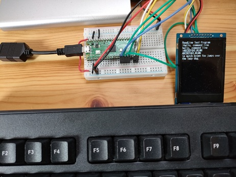

#### USB Keyboard + TFT LCD (ST7789)

Add the following lines to the end of `CMakeLists.txt`:

```cmake title="CMakeLists.txt" linenums="1"
target_link_libraries(cmdedit-display-test jxglib_USBHost jxglib_Display_ST7789)
add_subdirectory(${CMAKE_CURRENT_LIST_DIR}/../pico-jxglib pico-jxglib)
jxglib_configure_USBHost(cmdedit-display-test CFG_TUH_HID 3)
```


Edit the source file as follows:

```cpp title="cmdedit-display-test.cpp" linenums="1"
#include <stdio.h>
#include "pico/stdlib.h"
#include "jxglib/USBHost/HID.h"
#include "jxglib/Display/ST7789.h"
#include "jxglib/Font/shinonome16.h"

using namespace jxglib;

Display::Terminal terminal;

int main()
{
    ::stdio_init_all();
    USBHost::Initialize();
    USBHost::Keyboard keyboard;
    ::spi_init(spi1, 125 * 1000 * 1000);
    GPIO14.set_function_SPI1_SCK();
    GPIO15.set_function_SPI1_TX();
    Display::ST7789 display(spi1, 240, 320, {RST: GPIO10, DC: GPIO11, CS: GPIO12, BL: GPIO13});
    display.Initialize(Display::Dir::Rotate0);
    terminal.SetFont(Font::shinonome16).AttachDisplay(display).AttachKeyboard(keyboard);
    terminal.Println("ReadLine Test Program");
    for (;;) {
        char* str = terminal.ReadLine("> ");
        terminal.Printf("%s\n", str);
    }
}
```

`terminal.ReadLine()` returns a pointer to the entered string.



You can't see it in the photo, but the cursor is blinking properly.


