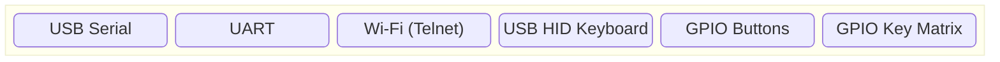

# Shell

The shell can work with a variety of devices.

For input devices, it supports:

For output devices, it supports:

You can easily create shell commands. By simply linking the source or library that implements the command, it becomes available from the shell, making embedding and removal easy.
