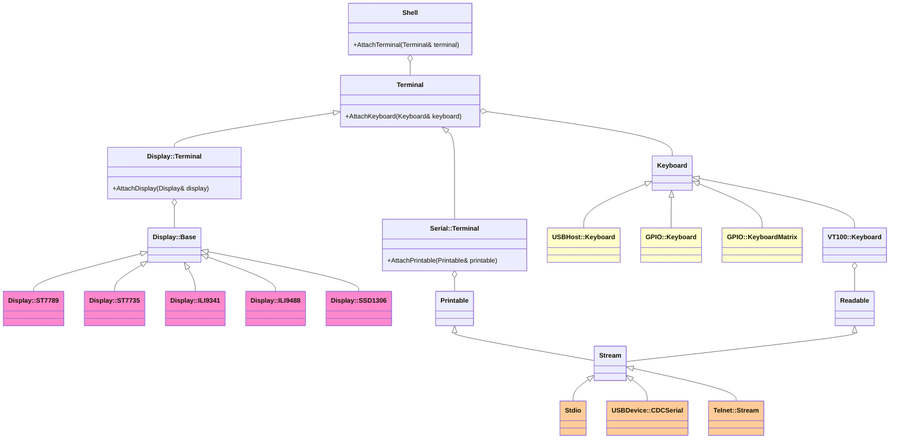

# Shell



## Input and Output Devices

The shell can work with a variety of devices. Below is a class diagram showing the relationship between the shell, terminal, input devices (keyboards), and output devices (displays and printables).

Input
Output
Input/Output

A `Shell` can attach a `Terminal` by `Shell::AttachTerminal()`.

A `Terminal` can attach a `Keyboard` as its input device. There are various types of `Keyboard`, such as `USBHost::Keyboard`, `GPIO::Keyboard`, and `GPIO::KeyboardMatrix`. Additionally, you can also use the `Stdio`, `USBDevice::CDCSerial`, or `Telnet::Stream` as a keyboard input for the shell.

There are two types of `Terminal`: `Serial::Terminal` and `Display::Terminal`. A `Serial::Terminal` can attach a `Printable` (e.g. a `Stream`) as its output device, while a `Display::Terminal` can attach a `Display` as its output device.

A `Printable` is a class that can be printed to. It has a variety of printing methods, such as `Print()`, `Printf()`, and `Println()`. It includes classes like `Stream`, which is a base class for `Stdio`, `USBDevice::CDCSerial`, and `Telnet::Stream`.

A `Display` is a class that can be drawn on. It has methods for drawing images and bitmaps to a display device, such as `DrawImage()` and `DrawBitmap()`. It includes classes like `ST7789`, `ST7735`, `ILI9341`, `ILI9488`, and `SSD1306`.

Therefore, the shell works with a variety of input and output devices by creating `Keyboard`, `Printable`, and `Display` objects and attaching them to the terminal attached to the shell.

## Shell Commands

Libraries that implement shell commands have names starting with `jxglib_ShellCmd_`. By simply linking those libraries, the implemented commands become available from the shell. There is no need for explicit registration, making embedding and removal easy. Below is a list of libraries that implement shell commands and the commands they provide.

| Library | Description |
| --- | --- |
|`jxglib_ShellCmd_Camera`|`camera` command that controls camera devices|
|`jxglib_ShellCmd_Camera_OV7670`|`camera-ov7670` command that controls OV7670 camera device|
|`jxglib_ShellCmd_Basic`|Basic commands such as `help` and `dump`|
|`jxglib_ShellCmd_GPIO`|`gpio` command that controls GPIO|
|`jxglib_ShellCmd_ADC`|`adc` command that controls ADC|
|`jxglib_ShellCmd_Device_SDCard`|`sdcard` command that controls SD card|
|`jxglib_ShellCmd_Device_WS2812`|`ws2812` command that controls WS2812 LEDs|
|`jxglib_ShellCmd_Display`|`draw` command that draws images and texts on display devices|
|`jxglib_ShellCmd_Display_SSD1306`|`display-ssd1306` command that controls SSD1306 display|
|`jxglib_ShellCmd_Display_TFT_LCD`|`display-st7789` command that controls ST7789 display|
|`jxglib_ShellCmd_Display_WS2812`|`display-ws2812` command that controls WS2812 display|
|`jxglib_ShellCmd_Flash`|`flash` command that controls flash memory|
|`jxglib_ShellCmd_FS`|File system commands such as `ls`, `cat`, and `rm`|
|`jxglib_ShellCmd_I2C`|`i2c` command that controls I2C interface|
|`jxglib_ShellCmd_LogicAnalyzer`|`la` command that controls the built-in logic analyzer|
|`jxglib_ShellCmd_Net`|`net` command that configures network settings|
|`jxglib_ShellCmd_NetUtil`|Net utility commands such as `ping` and `dns`|
|`jxglib_ShellCmd_LED`|`led` command that controls the built-in LED|
|`jxglib_ShellCmd_Net_Telnet`|`telnet-server` command that starts and stops the Telnet server|
|`jxglib_ShellCmd_PWM`|`pwm` command that controls PWM|
|`jxglib_ShellCmd_Resets`|`resets` command|
|`jxglib_ShellCmd_RTC`|`rtc` command that controls an RTC device|
|`jxglib_ShellCmd_RTC_DS3231`|`rtc-ds3231` command that controls DS3231 RTC device|
|`jxglib_ShellCmd_SPI`|`spi` command that controls SPI interface|
|`jxglib_ShellCmd_UART`|`uart` command that controls UART interface|

<!--
|`jxglib_ShellCmd_Display_VideoTransmitter`||
|`jxglib_ShellCmd_Font`||
|`jxglib_ShellCmd_ImageFile`||
|`jxglib_ShellCmd_PIO`||
|`jxglib_ShellCmd_USBHost_MSC`||
-->

You can also easily create shell commands by using `ShellCmd` macro. For more details, please refer to the [Custom Commands](custom-commands/index.md) documentation.
