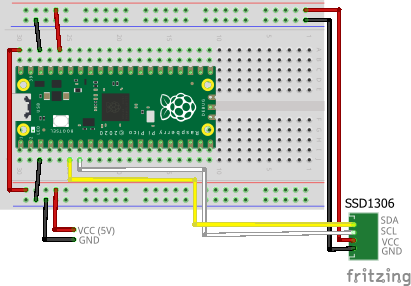

## Sample Program

### Wiring

The breadboard wiring image is as follows:



### Building and Flashing the Program

Here, we will create a sample program that implements a custom command named `argtest`. It displays the contents of the arguments passed to it.

Create a new Pico SDK project named `shell-with-oled-usbkey`.



Clone the pico-jxglib repository from GitHub so the direcory structure looks like this:

```text
├── pico-jxglib/
└── shell-with-oled-usbkey/
    ├── CMakeLists.txt
    ├── shell-with-oled-usbkey.cpp
    └── ...
```



Add the following lines to the end of `CMakeLists.txt`:

```cmake title="CMakeLists.txt"

```

Edit `shell-with-oled-usbkey.cpp` as follows:

```cpp title="shell-with-oled-usbkey.cpp"

```


