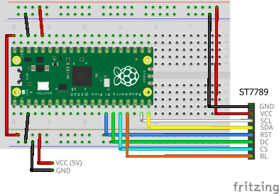

# Shell with TFT LCD and USB Keyboard

The shell can work with a TFT LCD display as an output device and a USB keyboard as an input device. This allows you to use the shell without connecting the Pico board to a computer, making it more portable and versatile.

## Wiring

The breadboard wiring image is as follows:



This circuit requires an external power supply to power the board and the USB keyboard. Make sure to connect the VCC to pin 40 (VBUS) that is directly connected to the USB power, not to pin 39 (VSYS).

## Building and Flashing the Program

Here, we will create a sample program that implements a custom command named `argtest`. It displays the contents of the arguments passed to it.

Create a new Pico SDK project named `shell-with-tftlcd-usbkey`.



Clone the pico-jxglib repository from GitHub so the direcory structure looks like this:

```text
├── pico-jxglib/
└── shell-with-tftlcd-usbkey/
    ├── CMakeLists.txt
    ├── shell-with-tftlcd-usbkey.cpp
    └── ...
```



Add the following lines to the end of `CMakeLists.txt`:

```cmake title="CMakeLists.txt" linenums="1"

```

Edit `shell-with-tftlcd-usbkey.cpp` as follows:

```cpp title="shell-with-tftlcd-usbkey.cpp" linenums="1"

```

Build and flash the program to the board.


