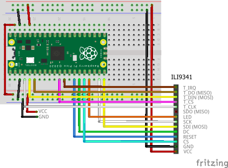
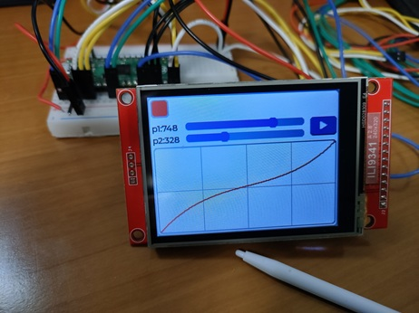

# Simple Program

Connect an ILI9341 with a touchscreen and run a program using LVGL.

## Wiring

The breadboard wiring image is as follows:



### Building and Flashing the Program

Create a new Pico SDK project named `lvgl-simple`.



Clone the pico-jxglib repository from GitHub so the direcory structure looks like this:

```text
├── pico-jxglib/
└── lvgl-simple/
    ├── CMakeLists.txt
    ├── lvgl-simple.cpp
    └── ...
```



Add the following lines to the end of `CMakeLists.txt`:

```cmake title="CMakeLists.txt" linenums="1"

```

Edit `lvgl-simple.cpp` as follows:

```cpp title="lvgl-simple.cpp" linenums="1"

```

Build and flash the program to the board.



## Running the Program



## Program Explanation

The program's processing content is explained as follows:

```cpp linenums="12"
::spi_init(spi0, 2 * 1000 * 1000);
::spi_init(spi1, 125 * 1000 * 1000);
```

Initialize SPI0 at 2MHz for the touchscreen and SPI1 at 125MHz for the TFT LCD.

```cpp linenums="14"
GPIO2.set_function_SPI0_SCK();
GPIO3.set_function_SPI0_TX();
GPIO4.set_function_SPI0_RX();
GPIO14.set_function_SPI1_SCK();
GPIO15.set_function_SPI1_TX();
```

Assign GPIOs to the SPI0 and SPI1 signal lines.

```cpp linenums="19"
Display::ILI9341 display(spi1, 240, 320, {RST: GPIO10, DC: GPIO11, CS: GPIO12, BL: GPIO13});
Display::ILI9341::TouchScreen touchScreen(spi0, {CS: GPIO6, IRQ: GPIO7});
display.Initialize(Display::Dir::Rotate90);
touchScreen.Initialize(display);
//touchScreen.Calibrate(display);
```

Assign SPI and GPIO to the TFT LCD and touchscreen parts, initializing them. The touchscreen's screen coordinates are mapped to preset values from the device's calibration, but the device-specific variations are still unknown. If the screen is too far off, call the `Calibrate()` function to calibrate.

```cpp linenums="24"
LVGL::Initialize();
LVGL::Adapter lvglAdapter;
lvglAdapter.EnableDoubleBuff().AttachDisplay(display).AttachTouchScreen(touchScreen);
```

Initialize LVGL. Use `LVGL::Adapter` to connect the TFT LCD and touchscreen to LVGL. `EnableDoubleBuff()` enables double buffering, which increases drawing speed using DMA. However, it consumes 2 times the memory.

```cpp linenums="27"
::lv_example_anim_3();
```

Call LVGL's sample program functions. Internally, widget creation and callback registration occur.
