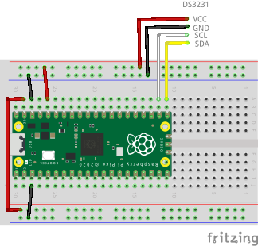

# RTC (Real Time Clock) Support

In this page, we will connect a DS3231 RTC module to the board and check the timestamp is recorded correctly when creating files in the flash file system.

## Wiring

The breadboard wiring image is as follows:



## Building and Flashing the Program

Create a new Pico SDK project named `fs-timestamp`. **Check** `Console over UART` and/or `Console over USB` in `Stdio support`.



Clone the pico-jxglib repository from GitHub so the direcory structure looks like this:

```text
├── pico-jxglib/
└── fs-timestamp/
    ├── CMakeLists.txt
    ├── fs-timestamp.cpp
    └── ...
```



Add the following lines to the end of `CMakeLists.txt`:

```cmake title="CMakeLists.txt" linenums="1"

```

Edit `fs-timestamp.cpp` as follows:

```cpp title="fs-timestamp.cpp" linenums="1"

```

Build and flash the program to the board.



## Running the Program

Check the current status of drives with `ls-drive` command:

```text
K:?>ls-drive
 Drive  Format        Total
 J:     none              0
*K:     none              0
 L:     none              0
 M:     none              0
K:?>
```

Format the flash drive and check the drive information again:

```text
K:?>format j: k: l: m:
drive j: formatted in LFS
drive k: formatted in LFS
drive l: formatted in FAT12
drive m: formatted in FAT12
K:/>ls-drive
 Drive  Format        Total
 J:     LFS          262144
*K:     LFS          262144
 L:     FAT12        262144
 M:     FAT12        262144
```

Check if the RTC is working by executing `rtc` command:

```text
K:/>rtc
2026-05-01 13:36:47.000
```

Create a file in `K:` drive, which is formatted in LFS, and check the timestamp:

```text
K:/>touch file1
K:/>dir
-a--- 2026-05-01 13:37:52      0 file1
```

Create a file in `L:` drive, which is formatted in FAT12, and check the timestamp:

```text
K:/>L:
L:/>dir
L:/>touch file2
L:/>dir
-a--- 2026-05-01 13:39:16      0 file2
```
