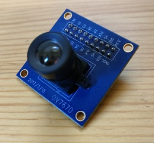

# Camera - OV7670

The OV7670 is a VGA resolution (640x480) camera module developed by Omnivision. It is a very popular camera module, widely used in electronics projects due to its low cost (about $5 USD). However, there are not many general-purpose libraries available, so integrating it into your own project usually requires some programming skill.

With pico-jxgLABO, you can set up the OV7670 camera module using commands, making it easy to test and experiment with the camera without writing code. You can change the resolution and adjust parameters via commands, so you can try things out before moving on to more advanced programming.

This article demonstrates the following experiments using this camera module:

**Experiment 1:** Start a camera app on a host PC (Windows) connected to the Pico board via USB, and stream video from the OV7670 camera module. This experiment only requires the OV7670 camera module, Pico board, and host PC. [:octicons-arrow-right-24: Learn More](ov7670-video-streaming.md)

**Experiment 2:** Add a TFT LCD display module (ST7789) and display the camera image in real time on the display. [:octicons-arrow-right-24: Learn More](ov7670-display.md)

The host PC for development and testing is assumed to be Windows.

## Demo Video

  <iframe 
    src="https://www.youtube.com/embed/jml-jgPkZZU?rel=0&modestbranding=1" 
    title="pico-jxgLABO OV7670 Demo"
    frameborder="0" 
    allow="accelerometer; autoplay; clipboard-write; encrypted-media; gyroscope; picture-in-picture; web-share" 
    allowfullscreen>
  </iframe>

