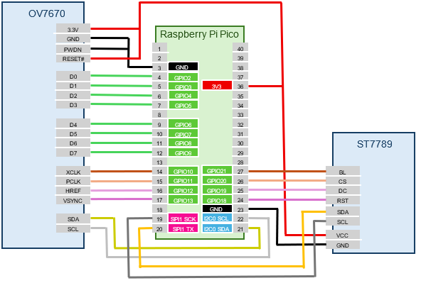
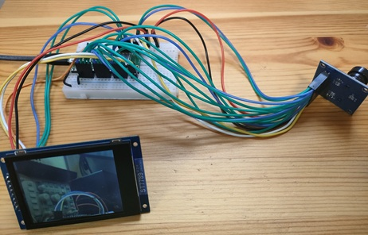

# Real-Time Display on TFT Display

Display the camera image in real time on an ST7789 TFT display module.

## Wiring

Connect the OV7670 camera module and ST7789 TFT display module to the Pico board as shown below:

  

  

## Setting Up the Camera and Display Modules

1. Run the following commands to set up the OV7670 camera module and ST7789 TFT display module:
    ```text
    L:>i2c0 -p 16,17 --baudrate:100000
    L:>camera-ov7670 setup {i2c:0 d0:2 xclk:10 pclk:11 href:12 vsync:13}
    L:>spi1 -p 14,15 --baudrate:50000000
    L:>display-st7789 setup {spi:1 rst:18 dc:19 cs:20 bl:21 dir:rotate90}
    ```
2. Test the TFT display by running the following command. If the entire screen turns red, the display is working:
    ```text
    L:>draw fill {color:red}
    ```
3. Run the `display-start` subcommand of the `camera` command to display the OV7670 camera image on the TFT display in real time:
    ```text
    L:>camera display-start
    ```

Run the `camera fps` command to check the current frame rate:

```text
L:>camera fps
27 fps
```

The maximum frame rate of the OV7670 is 30 fps, so this is nearly full speed.

When outputting to the TFT display module, you can also change the resolution. Use the `resolution` subcommand of `camera-ov7670` to change to one of the following resolutions:

|Resolution Name|Pixels     |RAM Usage|
|--------------|-----------|---------|
|`qvga`        |320 x 240  |153.6 kB |
|`qqvga`       |160 x 120  |38.4 kB  |
|`qqqvga`      |80 x 60    |9.6 kB   |

For example, to change the resolution to QQVGA (160x120):

```text
L:>camera-ov7670 resolution:qqvga
```

The maximum resolution of the OV7670 camera module is VGA (640x480), but the image data size is 614.4 kB, which exceeds the RAM size of the Pico board (Pico: 264 kB, Pico2: 520 kB), so it cannot be used.
