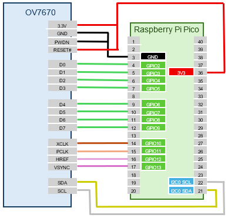
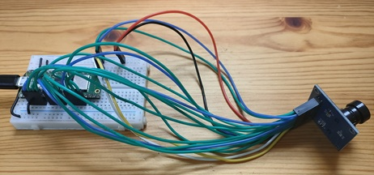
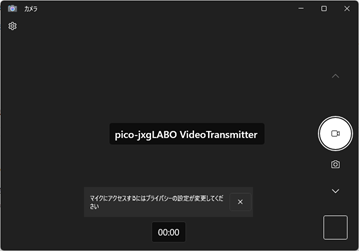
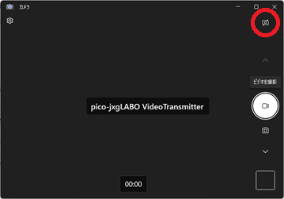
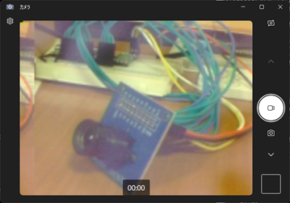

# Video Streaming to Host PC

## Wiring

The OV7670 camera module connects to the Pico board using the I2C interface and several GPIO pins. Refer to the wiring example below:



You can customize the GPIO pins via commands. Keep the following points in mind:

- Connect 3.3V and GND to power
- Connect PWDN to GND and RESET to 3.3V
- Connect the 8 data lines D0 to D7 to consecutive GPIO pins
- Connect XCLK, PCLK, HREF, and VSYNC to any GPIO pins
- Connect SDA and SCL to either I2C0 or I2C1 on the Pico board

The signal lines carry high-frequency currents, with XCLK reaching up to 24 MHz. Shorter wires are better, but in practice, even 16 cm jumper wires worked fine in my tests.



## Testing the Connection

Run the following commands to set up the I2C interface and camera module:

```text
L:>i2c0 -p 16,17 --baudrate:100000
L:>camera-ov7670 setup {i2c:0 d0:2 xclk:10 pclk:11 href:12 vsync:13}
```

- The `i2c0` command sets I2C0 to GPIO16 (SDA) and GPIO17 (SCL) at 100 kHz.
- The `camera-ov7670 setup` command specifies the connection pins for the OV7670 camera module. I2C0 is selected for I2C. D0 is connected to GPIO2, and D1-D7 are automatically assigned to GPIO3-GPIO9. XCLK, PCLK, HREF, and VSYNC are connected to GPIO10, GPIO11, GPIO12, and GPIO13, respectively.

Now the OV7670 camera module is ready to use. Run the `dump` subcommand of `camera-ov7670` to check the camera module's register settings:

```text
L:/>camera-ov7670 dump
00  3C 80 80 00 01 0B 61 40 9D 00 76 73 04 00 01 02
10  7F 01 04 EF 20 02 00 11 61 03 7B 00 7F A2 04 00
20  04 02 01 00 75 63 A5 80 80 07 00 00 80 00 00 61
30  08 30 80 08 11 1A 00 3F 01 00 00 08 68 C0 19 00
40  11 08 00 14 F0 45 61 51 79 00 00 01 00 00 00 80
50  80 00 22 5E 80 00 40 80 1E 00 00 01 00 00 00 F0
60  F0 F0 00 00 04 20 05 80 80 01 80 4A 0A 55 11 9A
70  3A 35 11 F1 11 0F C1 10 00 00 20 1C 28 3C 55 68
80  76 80 88 8F 96 A3 AF C4 D7 E8 00 00 00 0F 00 00
90  00 00 00 00 04 08 01 01 10 40 40 20 00 99 7F 78
A0  68 03 02 00 00 05 DF DF F0 90 94 07 00 00 00 00
B0  84 04 00 82 00 20 00 66 00 06 00 00 00 00 00 00
C0  00 00 00 00 00 00 00 00 06 CE
```

```text
i2c0 -p 16,17 --baudrate:100000
```

## Video Streaming to Host PC

Start the camera app on a host PC (Windows) connected to the Pico board via USB, and display video streaming from the OV7670 camera module.

1. Connect the host PC and Pico board with a USB cable.

2. Create a `.startup` file in the root directory of the Pico board's `L:` drive with the following content. The `L:` drive appears as a USB mass storage device on the host PC, so you can create this file with a text editor on your PC.

  ```text:.startup
  usbdev-video-transmitter setup
  i2c0 -p 16,17 --baudrate:100000
  camera-ov7670 setup {i2c:0 d0:2 xclk:10 pclk:11 href:12 vsync:13}
  ```

  The `usbdev-video-transmitter setup` command sets up the Pico board as a USB video device. The remaining commands set up the OV7670 camera module.

  Unplug and replug the USB cable to reboot the Pico board. It should now be recognized as a USB video device.

3. On the host PC, search for "Camera" in the taskbar and start the camera app. If recognized correctly, "pico-jxgLABO VideoTransmitter" will be displayed at startup.

  

  If multiple camera devices are connected to the PC, a camera selection button will appear in the top right of the app. Switch to the screen showing "pico-jxgLABO VideoTransmitter".

  

4. In the terminal, run the following command to start video streaming from the OV7670 camera module to the host PC:

  ```text
  L:>camera video-transmit-start
  ```

  If the camera app displays video from the OV7670 camera module, it is working.

  

Run the `camera fps` command to check the current frame rate:

```text
L:>camera fps
6 fps
```

The screen size is set to QQVGA (160x120), but the USB transfer speed is a bottleneck, so the frame rate is only about 6 fps.
