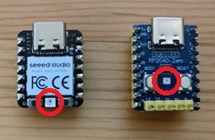
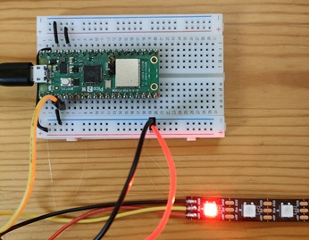

# Multi-Color LED

XIAO RP2040 and Waveshare RP2040-Zero boards have a built-in multi-color LED that can display various colors by controlling the RGB values. You can use the `ws2812` command to control it.



## Setup

Although the boards are equipped with the same WS2812 LED, the connection information differs, so you need to set it up according to your board.

### XIAO RP2040

For the Speed Studio XIAO RP2040 board, the built-in WS2812 DIN pin is connected to GPIO12. The VCC is connected to GPIO11, so set this pin as a digital output and output 1.

```text
L:/>ws2812 setup {din:12}
L:/>gpio11 func:sio dir:out put:1
```

### Waveshare RP2040-Zero

For the Waveshare RP2040-Zero board, the built-in WS2812 DIN pin is connected to GPIO16. Set it as follows:

```text
L:/>ws2812 setup {din:16}
```

## Control the LED

Use the `put` subcommand to set the color of the LED. For example, to light up red:

```text
L:/>ws2812 put:red
```



You can also specify the color using a hexadecimal color code:

```text
L:/>ws2812 put:#ff0000
```

To turn off the LED, set the color to black:

```text
L:/>ws2812 put:black
```

You can blink the LED by alternating between a color and black with the `repeat` subcommand. The following example blinks blue every 500ms:

```text
L:/>ws2812 repeat {put:blue sleep:500 put:black sleep:500}
```

## Command Reference

### ws2812

```text title="Help of the Command"
sage: ws2812 [OPTION]... [PIN [COMMAND]...]
Options:
 -h --help       prints this help
 -b --brightness set brightness (0.0 - 1.0)
Sub Commands:
 sleep:MSEC           sleep for specified milliseconds
 repeat[:N] {CMD...}  repeat the commands N times (default: infinite)
 setup                setup a WS2812 device with the given parameters: {din:PIN}
 brightness:RATIO     set brightness (RATIO: 0.0 - 1.0)
 put:COLOR            put the color (COLOR format: #RRGGBB or color name)
```
