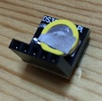

In this page, we will connect an RTC (Real Time Clock) module to the Pico board by using shell commands.

<!-- mkdocs-start:[skip-abstract] -->
<!-- mkdocs-start:[about-rtc] -->
## About RTC Module

An RTC module is hardware that keeps track of real-time date and time.

If you read [RP2040 Datasheet](https://datasheets.raspberrypi.com/rp2040/rp2040-datasheet.pdf), you will find that the RP2040 microcontroller has a built-in RTC module. However, this built-in RTC does not have a backup battery, so it loses the date and time when power is lost. Therefore, it is not practical for use in applications where maintaining accurate time is important.

The practical way to use RTC is to connect an RTC module with a backup battery to the Pico board. This allows the date and time to be retained regardless of the Pico board's power state.

The DS3231 is a commonly used RTC module for electronics projects, as it can be connected via I2C. There is also a cheaper DS1307, but it can drift by several seconds per day, so the DS3231 is recommended for its higher accuracy.

The DS3231 module I purchased from Amazon looks like this:

It comes with a backup battery pre-installed and has a compact shape. The signal names printed on the board can be confusing, but they correspond as follows:

|Board Label|Signal Name|
|------|-----|
|`+`   |VCC (3.3V) |
|`D`   |I2C SDA  |
|`C`   |I2C SCL  |
|`-`   |GND  |

There is also a cheaper RTC module named DS1307, but it can drift by several seconds per day, so the more accurate DS3231 is recommended. The DS1307 also shares the same I2C address and data format as the DS3231, so it should work similarly when connected to the Pico board.
<!-- mkdocs-end:[about-rtc] -->
