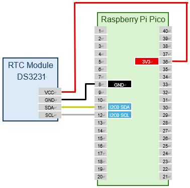

# Device Connection

The DS3231 RTC module is connected via the I2C interface. You can use either I2C0 or I2C1 on the Pico board, and the pin layout can be freely set with commands. Here, we use I2C0 and connect as follows:

|DS3231       |Pico Pin No.|GPIO  |Function   |
|-------------|------------|------|-----------|
|VCC          |36          |      |3V3        |
|GND          |8           |      |GND        |
|SDA          |11          |GPIO8 |I2C0 SDA   |
|SCL          |12          |GPIO9 |I2C0 SCL   |

The wiring diagram is shown below. There are multiple GND pins on the Pico board, so you can connect to any of them.



Run the following command to set the GPIO assignment for I2C0 to GPIO8 (I2C0 SDA) and GPIO9 (I2C0 SCL). The appropriate function assignment is done automatically, so the order does not matter.

```text
L:/>i2c0 -p 8,9
```

Scan the devices connected to the I2C bus to confirm that the RTC module is connected correctly. The DS3231 uses I2C address `0x68`.

```text
L:/>i2c0 scan
Bus Scan on I2C0
   0  1  2  3  4  5  6  7  8  9  A  B  C  D  E  F
00 -- -- -- -- -- -- -- -- -- -- -- -- -- -- -- --
10 -- -- -- -- -- -- -- -- -- -- -- -- -- -- -- --
20 -- -- -- -- -- -- -- -- -- -- -- -- -- -- -- --
30 -- -- -- -- -- -- -- -- -- -- -- -- -- -- -- --
40 -- -- -- -- -- -- -- -- -- -- -- -- -- -- -- --
50 -- -- -- -- -- -- -- -- -- -- -- -- -- -- -- --
60 -- -- -- -- -- -- -- -- 68 -- -- -- -- -- -- --
70 -- -- -- -- -- -- -- -- -- -- -- -- -- -- -- --
```

Run the following command to set up the DS3231 RTC module:

```text
L:/>rtc-ds3231 setup {i2c:0}
```

This completes the setup of the DS3231 RTC module.
