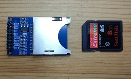
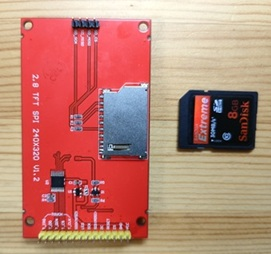
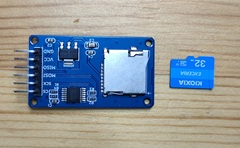
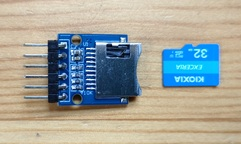
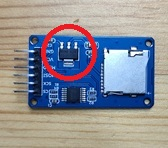

In this page, we connect an SD card to the Pico board by using shell commands.

## SD Card Reader Modules

SD card reader modules are basically just an SD card slot with some resistors and a voltage regulator, but the supply voltage, signal level, and presence of pull-up resistors vary by module, so be careful.

Below are some SD card reader modules I had on hand (mainly from Amazon), with notes on supply voltage, pull-up resistors, and signal levels.

|Appearance|Notes|
|----|----|
||Standard SD card module. Both **5V** and **3.3V** supply pins are available. If using 5V, a voltage regulator steps down to 3.3V for the SD card. All signal lines have 10kΩ pull-up resistors, so **no external pull-ups are needed**. Signal level is **3.3V**.|
||Standard SD card slot on the TFT LCD ILI9341. Power is supplied from the TFT LCD connector at **3.3V**. **External pull-up resistors are required**[^pullup]. Signal level is **3.3V**.|
||microSD card module. Supply voltage is **5V**, stepped down to 3.3V by a voltage regulator. **No external pull-ups are needed**. Signal lines have a buffer (74HC125), so it can connect to both **3.3V** and **5V** signal levels.|
||microSD card module. Supply voltage is **3.3V**. All signal lines have 10kΩ pull-up resistors, so **no external pull-ups are needed**. Signal level is **3.3V**.|

To distinguish the supply voltage, if the SD card reader module has a voltage regulator like the one shown below, use 5V supply; if not, use 3.3V supply.



[^pullup]: In my tests, the SD card worked without pull-up resistors, but some SD cards may require them. If it doesn't work, check for pull-up resistors.

## Device Connection and Operation Check

The SD card reader module is connected via the SPI interface. You can use either SPI0 or SPI1 on the Pico board, and the pin layout can be freely set with commands. Here, we use SPI0 and connect as follows:

|SD Card Reader Module|Pico Pin No.|GPIO |Function      |
|---------------------|------------|-----|--------------|
|VCC                  |39 or 36    |     |VSYS or 3V3   |
|GND                  |3           |     |GND           |
|SCK                  |4           |GPIO2|SPI0 SCK      |
|MOSI                 |5           |GPIO3|SPI0 TX (MOSI)|
|MISO                 |6           |GPIO4|SPI0 RX (MISO)|
|CS                   |7           |GPIO5|SIO           |


!!! warning
    Be careful where you connect the VCC of the SD card reader module, depending on the supply voltage:
    - For 5V supply, connect to VSYS (pin 39) on the Pico board. If you connect to 3V3, the voltage drop across the module's regulator will prevent proper operation.
    - For 3.3V supply, connect to 3V3 (pin 36) on the Pico board. If you connect to VSYS, **the SD card may be damaged**.

The wiring diagram is shown below. There are multiple GND pins on the Pico board, so you can connect to any of them.


Run the following command to set the GPIO assignment for SPI0 to GPIO2 (SPI0 SCK), GPIO3 (SPI0 TX), and GPIO4 (SPI0 RX). The appropriate function assignment is done automatically, so the order does not matter.

```text
L:/>spi0 -p 2,3,4
```

Run the following command to set the SPI interface for the SD card to SPI0, the CS pin to GPIO5, and the drive name to `M`:

```text
L:/>sdcard setup {spi:0 cs:5 drive:'M'}
```

This completes the SD card setup.

## File Operations

Use the `ls-drive` command to display the list of available drives:

```text
L:/>ls-drive
 Drive  Format           Total
*L:     FAT12          2621440
 M:     unmounted            0
```

Since there is no SD card inserted yet, it shows as unmounted. Insert an SD card and run `ls-drive` again. Here, a 32 GByte SD card formatted as FAT was inserted:

```text
L:/>ls-drive
 Drive  Format        Total
*L:     FAT12       2621440
 M:     FAT32   30945574912
```

Try various file operations. See [here](../../filesystem/file-operating-commands/index.md) for a summary of file operation commands provided by the shell.

```text
L:/>M:
M:/>dir
...
```

## Command Reference

### sdcard

```text title="Help of the Command"
Usage: sdcard [OPTION]...
Options:
 -h --help prints this help
Sub Commands:
 setup  Setup an SD card with the given parameters:
          {spi:SPI cs:CS [drive:DRIVE] [baudrate:BAUDRATE]}
 init   Initialize the SD card
```
