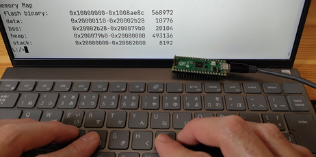

# Shell

<!-- shared with library/shell/index.md -->
<!-- mkdocs-start:abstract -->
The shell of pico-jxglib is a powerful interactive command-line interface that allows you to interact with your firmware in real-time. It provides a bash-like experience, enabling you to execute various built-in commands for debugging, file management, and more. With the shell, you can easily test and modify the behavior of your firmware without the need for recompilation, making your development process more efficient and enjoyable.
<!-- mkdocs-end:abstract -->

## Setting Up pico-jxgLABO

The shell is implemented in the `jxglib_Shell` library. Linking this library or other libraries that depend on it, such as `jxglib_LABOPlatform`, will make the shell available in your firmware.

<div class="grid" markdown>

Here, we will use pico-jxgLABO, a ready-to-flash UF2 Binary that links `jxglib_LABOPlatform`, as an example to demonstrate how to use the shell and its commands. It uses the USB serial interface for the shell, so you can easily try it with a single USB cable.

{:width="300px"}

</div>

Below is a list of pico-jxgLABO UF2 files:



These UF2 files are pre-compiled with the latest version of pico-jxglib and can be flashed to your Pico board using the standard UF2 flashing method.



Go to [this page](../library/shell/index.md) if you are interested in the details of how to build your own firmware with the shell.

After flashing the pico-jxgLABO, establish a serial communication with a terminal program such as Tera Term on Windows.



## Key Operations

The shell provides bash-like key operations to make it easier to enter commands. Below is a list of key operations that you can use in the shell.



## Help Option

Each command is equipped with a help option `--help` (or `-h`) that displays the command's detailed usage information.

```text
L:/>cp --help
Usage: cp [OPTION]... SOURCE... DEST
Options:
 -h --help      prints this help
 -r --recursive copies directories recursively
 -v --verbose   prints what is being done
 -f --force     overwrites existing files without prompting
```
