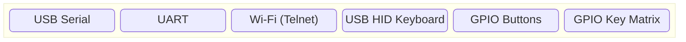

# Shell Commands

The shell of pico-jxglib is a powerful interactive command-line interface that allows you to interact with your firmware in real-time. It provides a bash-like experience, enabling you to execute various built-in commands for debugging, file management, and more. With the shell, you can easily test and modify the behavior of your firmware without the need for recompilation, making your development process more efficient and enjoyable.

The shell can work with a variety of devices.

For input devices, it supports:



For output devices, it supports:


You can choose any combination of these devices to create your own unique shell experience.

The most common use case of the shell is to use it with a USB serial. In this page, we will use pico-jxgLABO, a firmware platform that uses USB serial for the shell, as an example to demonstrate how to use the shell and its commands.

## Setting Up the Terminal

After flashing the pico-jxgLABO, connect the Pico board to your computer using a USB cable. Then, to establish a serial communication, you can use a terminal emulator program such as Tera Term (Windows), minicom (Linux), or screen (macOS).

Here, we will use Tera Term as an example. From the menu bar, select `[Setup]` - `[Serial port...]` to open the dialog below:


pico-jxgLABO provides two USB serial ports. On Windows, each is displayed with the following Device Instance IDs:

- `USB\VID_CAFE&PID_1AB0&MI01` ... for terminal use
- `USB\VID_CAFE&PID_1AB0&MI03` ... for applications such as logic analyzers and plotters

Select the serial port for terminal use.

When you press the `Enter` key in the terminal, the following prompt will appear:

```console
L:/>
```

The prompt consists of the drive letter `L:` and the current directory path. The pico-jxgLABO firmware mounts the flash memory of the Pico board as a FAT file system, and the drive letter `L:` represents this flash memory.

## Key Operations

The shell provides bash-like key operations to make it easier to enter commands. Below is a list of key operations that you can use in the shell.

|Ctrl Key|Single Key|Function|
|---|---|---|
|Ctrl + I|TAB|Autocomplete command and file names|
|Ctrl + P|Up|Show previous history|
|Ctrl + N|Down|Show next history|
|Ctrl + B|Left|Move cursor one character left|
|Ctrl + F|Right|Move cursor one character right|
|Ctrl + A|Home|Move cursor to the beginning of the line|
|Ctrl + E|End|Move cursor to the end of the line|
|Ctrl + D|Delete|Delete the character at the cursor position|
|Ctrl + H|Back|Delete the character before the cursor|
|Ctrl + J|Return|Confirm input|
|Ctrl + K| |Delete from cursor to end of line|
|Ctrl + U| |Delete from before cursor to beginning of line|


## Command Help

First, try entering the `help` command to display a list of available commands.

```console
L:/>help
.               executes the given script file
about-me        prints information about this own program
about-platform  prints information about the platform
adc             controls ADC (Analog-to-Digital Converter)
adc0            controls ADC (Analog-to-Digital Converter)
adc1            controls ADC (Analog-to-Digital Converter)
                        :
                        :
```

If you run a command with the `--help` (or `-h`) option, detailed usage information will be displayed.

```console
L:/>cp --help
Usage: cp [OPTION]... SOURCE... DEST
Options:
 -h --help      prints this help
 -r --recursive copies directories recursively
 -v --verbose   prints what is being done
 -f --force     overwrites existing files without prompting
```

## `about-me` command

Displays information about the currently running program (build info, pin layout info embedded with the `bi_decl()` macro, and memory map). The output format is similar to picotool.

```text
>about-me
Program Information
 name:              shell-test
 version:           0.1
 feature:           UART stdin / stdout
 binary start:      0x10000000
 binary end:        0x1000e960

Fixed Pin Information
 0:                 UART0 TX
 1:                 UART0 RX

Build Information
 sdk version:       2.1.1
 pico_board:        pico
 boot2_name:        boot2_w25q080
 build date:        May 13 2025
 build attributes:  Debug

Memory Map
 flash binary:      0x10000000-0x1000e960   59744
 ram vector table:  0x20000000-0x200000c0     192
 data:              0x200000c0-0x20000968    2216
 bss:               0x20000968-0x20001aa4    4412
 heap:              0x20001aa4-0x20040000  255324
 stack:             0x20040000-0x20042000    8192
```

## `about-platform` command

Displays platform information for the Pico board.

```text
>about-platform
RP2350 (ARM) 150 MHz
Flash  0x10000000-0x10400000 4194304
SRAM   0x20000000-0x20082000  532480
```

## `d` command

Outputs a dump image of memory or files. If run with no arguments, it displays memory contents from address 0x00000000.

```text
>d
00000000  00 1F 04 20 EB 00 00 00 35 00 00 00 31 00 00 00
00000010  4D 75 01 03 7A 00 C4 00 1D 00 00 00 00 23 02 88
00000020  9A 42 03 D0 43 88 04 30 91 42 F7 D1 18 1C 70 47
00000030  30 BF FD E7 F4 46 00 F0 05 F8 A7 48 00 21 01 60
```

If you run it again with no arguments, it displays the next block of memory.

```text
>d
00000040  41 60 E7 46 A5 48 00 21 C9 43 01 60 41 60 70 47
00000050  CA 9B 0D 5B F9 1D 00 00 28 43 29 20 32 30 32 30
00000060  20 52 61 73 70 62 65 72 72 79 20 50 69 20 54 72
00000070  61 64 69 6E 67 20 4C 74 64 00 50 33 09 03 52 33
```

The first argument is the start address, and the second argument is the number of bytes to display. To specify a hexadecimal value, prefix it with `0x`.

```text
>d 0x10000000
10000000  00 B5 32 4B 21 20 58 60 98 68 02 21 88 43 98 60
10000010  D8 60 18 61 58 61 2E 4B 00 21 99 60 02 21 59 61
10000020  01 21 F0 22 99 50 2B 49 19 60 01 21 99 60 35 20
10000030  00 F0 44 F8 02 22 90 42 14 D0 06 21 19 66 00 F0
```

```text
>d 0x10000000 128
10000000  00 B5 32 4B 21 20 58 60 98 68 02 21 88 43 98 60
10000010  D8 60 18 61 58 61 2E 4B 00 21 99 60 02 21 59 61
10000020  01 21 F0 22 99 50 2B 49 19 60 01 21 99 60 35 20
10000030  00 F0 44 F8 02 22 90 42 14 D0 06 21 19 66 00 F0
10000040  34 F8 19 6E 01 21 19 66 00 20 18 66 1A 66 00 F0
10000050  2C F8 19 6E 19 6E 19 6E 05 20 00 F0 2F F8 01 21
10000060  08 42 F9 D1 00 21 99 60 1B 49 19 60 00 21 59 60
10000070  1A 49 1B 48 01 60 01 21 99 60 EB 21 19 66 A0 21
```

If you specify a string other than a number as an argument, it is interpreted as a file name and the file contents are dumped. This feature is enabled when a file system is mounted.
