# Logic Analyzer - PulseView

## Installing PulseView and Connecting to pico-jxgLABO

### Installation

PulseView is a tool for visualizing logic analyzer signals. It supports decoding various protocols such as I2C and SPI, making it easy to analyze signals captured with pico-jxgLABO.

You can download PulseView from the following site:

▶️ [sigrok Downloads](https://sigrok.org/wiki/Downloads)

Download and install either "PulseView (32bit)" or "PulseView (64bit)" from the Nightly builds section.

### Connecting pico-jxgLABO and PulseView

Follow these steps to connect pico-jxgLABO and PulseView:

1. Connect the Pico board with pico-jxgLABO flashed to your PC using a USB cable.

2. Start Tera Term for serial communication. From the menu bar, select `[Setup (S)]` - `[Serial Port (E)...]`.

   

   pico-jxgLABO provides two USB serial ports. On Windows, the Device Instance IDs are as follows:

   - `USB\VID_CAFE&PID_1AB0&MI01` ... for terminal use
   - `USB\VID_CAFE&PID_1AB0&MI03` ... for applications such as logic analyzer and plotter

   Note the port number for the application port, as it will be used in step 6 for PulseView settings. Here, select the terminal port and click `[New Open (N)]` or `[Reconfigure Current Connection (N)]`.

3. In Tera Term, run the pico-jxgLABO logic analyzer command `la` and specify the GPIO pins to measure. In the example below, GPIO2, GPIO3, and GPIO4 are selected:

   ```text
   L:/>la -p 2,3,4
   disabled ---- 12.5MHz (samplers:1) pins:2-4 events:0/0 (heap-ratio:0.7)
   ```

4. Start PulseView. One of the following main screens will appear:

   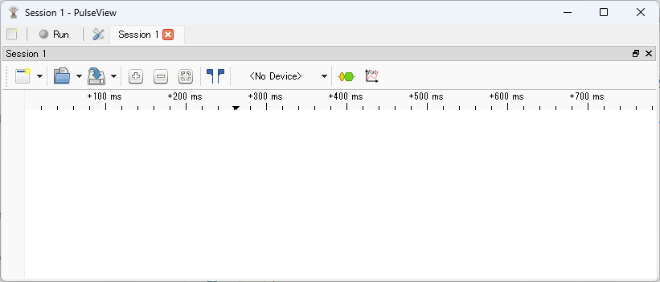

   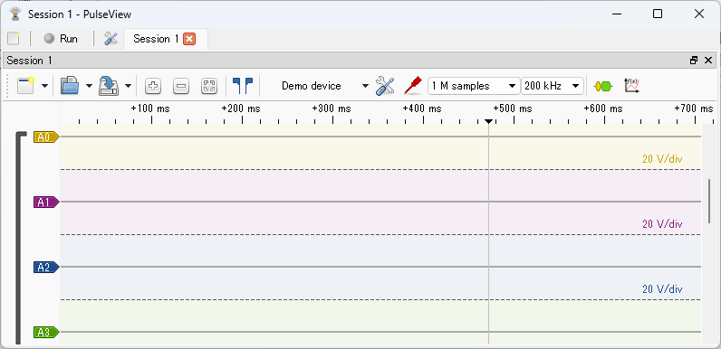

   Click the area labeled `<No Device>` or `Demo device` to open the "Connect to Device" dialog.

5. In `Step 1: Choose the driver`, select `RaspberryPI PICO (raspberrypi-pico)` from the dropdown list.

   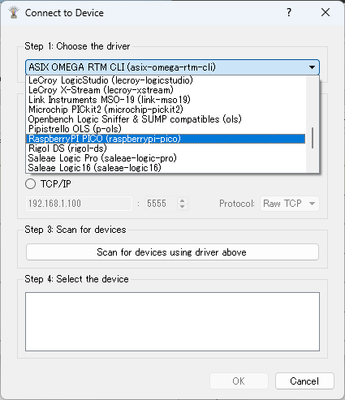

6. In `Step 2: Choose the interface`, select `Serial Port` and specify the application serial port noted in step 2. Leave the baud rate blank.

   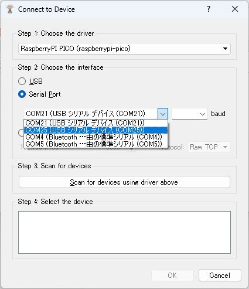

7. In `Step 3: Scan for devices`, click the `Scan for devices using driver above` button. In the list for `Step 4: Select the device`, confirm that `RaspberryPi PICO with 3 channels` appears and click `OK`.

   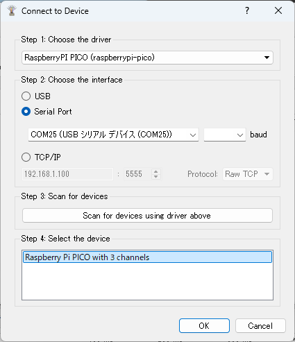

8. The main screen will look like this:

   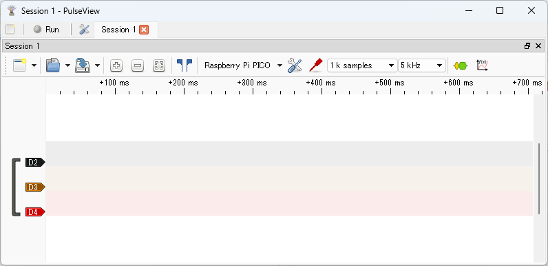


The signals for each GPIO specified with the `-p` option of the `la` command will be displayed as `D2`, `D3`, `D4`, etc.

By default, the number of samples is set to `1k samples` and the sampling rate to `5 kHz`. Change these as follows:

- Number of samples: Set to the maximum `1 G samples`
- Sampling rate: Set appropriately for the frequency of the signal to be observed. Here, set it to `15 MHz`.

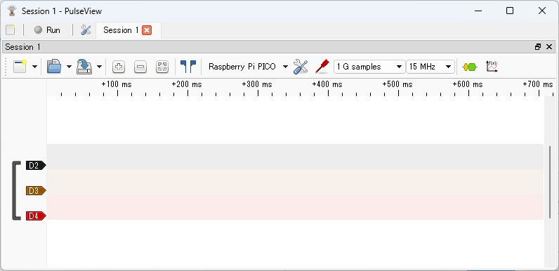

Now you can operate pico-jxgLABO on the Pico board from PulseView. Click the `Run` button at the top left to start capturing signals (the label changes to `Stop`).


Click the `Stop` button to stop capturing and display the observed waveform. If no signal is being generated, nothing will be displayed yet.

Now, let's generate various signals and observe their waveforms!

## Observing Internal Signals on the Pico Board

Here, we use pico-jxgLABO commands to generate I2C, SPI, UART, and PWM signals on the Pico board itself and observe their waveforms. We also explain how to analyze these signals with protocol decoders.

### Observing I2C Waveforms

After clicking the `Run` button in PulseView to start capturing, run the following command in your terminal software:

```text
L:/>i2c1 -p 2,3 scan
```

This command assigns GPIO2 and GPIO3 to I2C1 SDA and SCL, and sends Read requests to I2C addresses 0x00 to 0x7f.

Click the `Stop` button in PulseView to stop capturing. The captured waveforms will be displayed as shown below. `D2` is GPIO2 (I2C1 SDA), and `D3` is GPIO3 (I2C1 SCL).

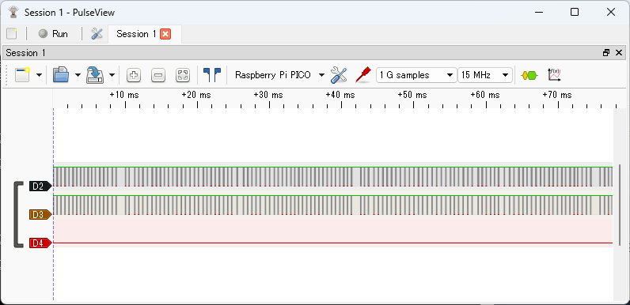

Basic mouse operations:

- Use the wheel to zoom in and out
- Drag within the waveform area with the left mouse button to move the display range

The image below shows a zoomed-in view of the beginning of the signal waveform.


Click the button indicated by the arrow below:

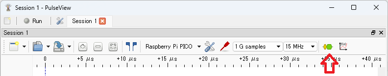

to display the `Decoder Selector` pane, where you can select protocol decoders. Enter `i2c` in the search box and double-click `I2C` in the list to add the I2C decoder to the waveform.


Click the button indicated by the arrow below:


to hide the `Decoder Selector` pane.


Left-click the `I2C` label in the signal name to open a dialog for setting protocol decoder parameters. Set `SCL` to `D3` and `SDA` to `D2`.

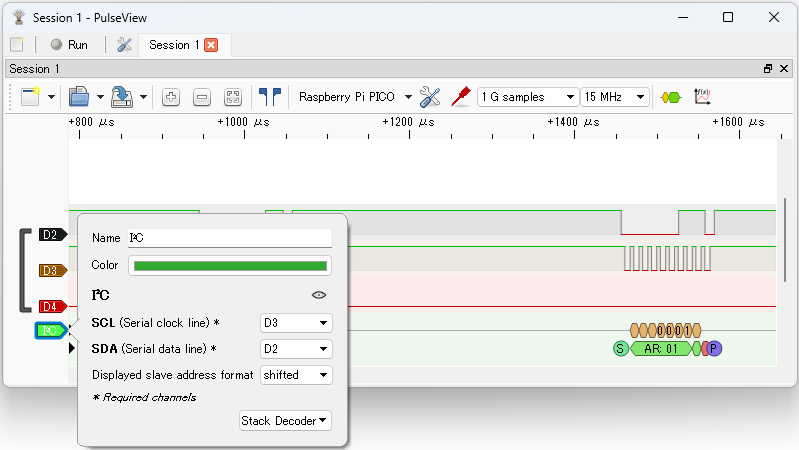

Close the dialog to see the decoded I2C results.

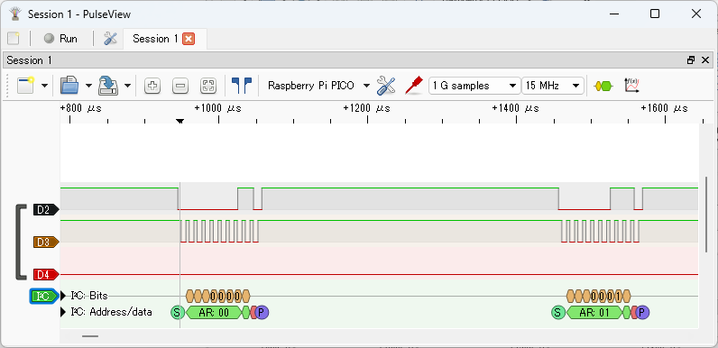

You can see that Read requests are sent to I2C addresses 0x00 to 0x7f. Since no I2C device is connected, NACK responses are returned.


### Observing SPI Waveforms

After clicking the `Run` button in PulseView to start capturing, run the following command in your terminal software:

```text
L:/>spi0 -p 2,3 write:0-255
```

This command assigns GPIO2 and GPIO3 to SPI0 MOSI and SCK, and sends data from 0 to 255.

Click the `Stop` button in PulseView to stop capturing. The captured waveforms will be displayed as shown below. `D2` is GPIO2 (SPI0 SCK), and `D3` is GPIO3 (SPI0 MOSI).

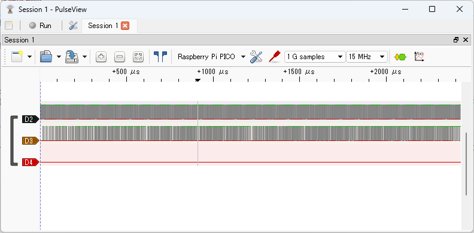

The image below shows a zoomed-in view of the beginning of the signal waveform.

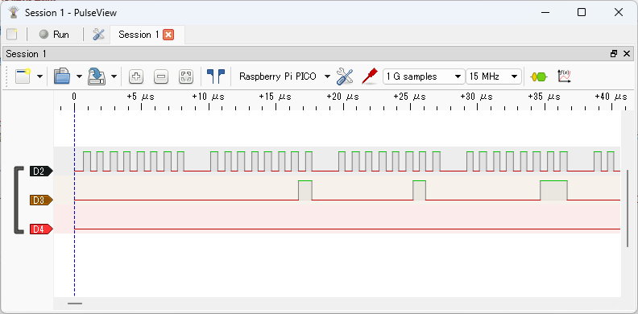

Display the `Decoder Selector` pane, enter `spi` in the search box, and double-click `SPI` in the list to add the SPI decoder to the waveform. Left-click the `SPI` label in the signal name to open the protocol decoder parameter dialog, and set `CLK` to `D2` and `MOSI` to `D3`.


Close the dialog to see the decoded SPI results.


You can see that data from 0 to 255 is sent on SPI MOSI.


### Observing UART Waveforms

After clicking the `Run` button in PulseView to start capturing, run the following command in your terminal software:

```text
L:/>uart1 -p 4 write:0-255,0
```

This command assigns GPIO4 to UART1 TX and sends data from 0 to 255, followed by 0. The final 0 is sent because if the last data is 255, PulseView's UART protocol decoder may not recognize the stop bit correctly.

Click the `Stop` button in PulseView to stop capturing. The captured waveform will be displayed as shown below. `D4` is GPIO4 (UART1 TX).

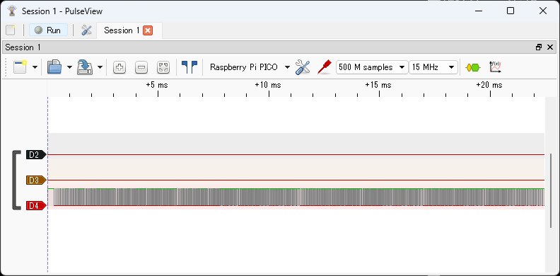

The image below shows a zoomed-in view of the beginning of the signal waveform.


Display the `Decoder Selector` pane, enter `uart` in the search box, and double-click `UART` in the list to add the UART decoder to the waveform. Left-click the `UART` label in the signal name to open the protocol decoder parameter dialog, and set `TX` to `D4`.

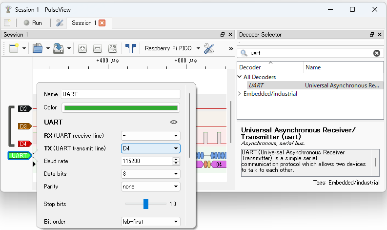


Close the dialog to see the decoded UART results.

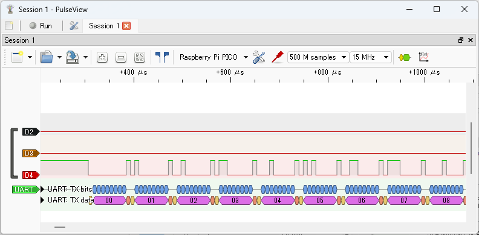

You can see that data from 0 to 255 and 0 is sent on UART TX.


### Observing PWM Waveforms

After clicking the `Run` button in PulseView to start capturing, run the following commands in your terminal software:

```text
L:/>pwm 2,3,4 func:pwm freq:1000 counter:0
L:/>pwm2 duty:.2; pwm3 duty:.5; pwm4 duty:.8
L:/>pwm 2,3,4 enable
```

These commands set GPIO2, GPIO3, and GPIO4 to PWM function, set the frequency to 1kHz, set the duty cycles to 20%, 50%, and 80% respectively, and enable PWM.

Click the `Stop` button in PulseView to stop capturing. The captured waveforms will be displayed as shown below.

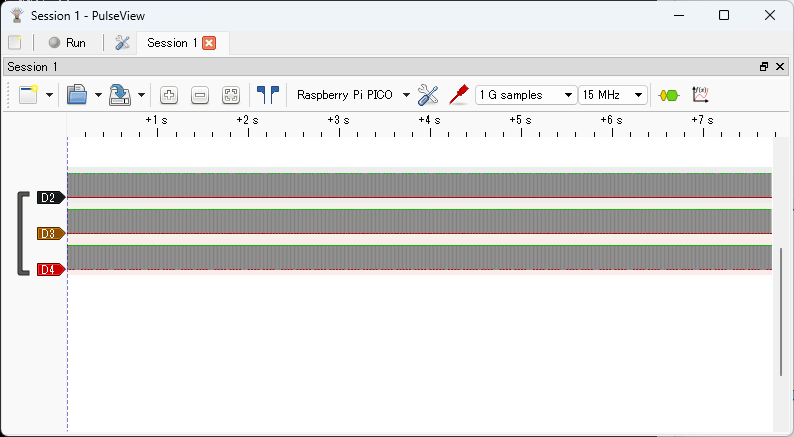

The image below shows a zoomed-in view of the beginning of the signal waveform.


Display the `Decoder Selector` pane, enter `pwm` in the search box, and double-click `PWM` in the list to add PWM decoders to the waveform (add three in total). Left-click the `PWM` label in the signal name to open the protocol decoder parameter dialog, and set the `Data` field to `D2`, `D3`, and `D4` for each decoder.

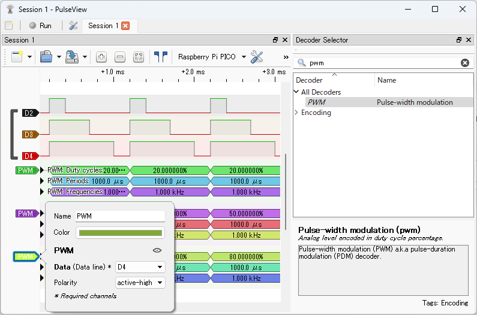

Close the dialog to see the decoded PWM results.

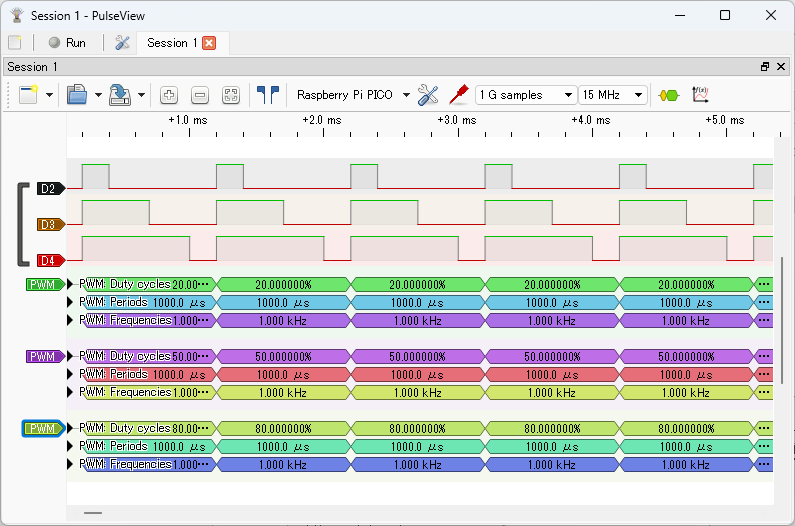

You can see PWM signals with duty cycles of 20%, 50%, and 80% at a frequency of 1.0kHz.

For more details on PWM operation with pico-jxgLABO, see the following article:

▶️ [Mastering PWM on Pico with the pwm command](https://zenn.dev/ypsitau/articles/2025-08-06-labo-pwm)


## `la` Command Options

`la` is the logic analyzer command for pico-jxgLABO. By changing the options for the `la` command, you can specify which GPIO pins to measure, the measurement target (internal/external signals), sampling rate, and more.

Here are the main options that affect integration with PulseView.

### Specifying GPIO Pins to Measure

Use the `-p` option of the `la` command to specify which GPIO pins to measure. You can specify a single GPIO pin or a range. Examples:

|Command                |Description                                  |
|-----------------------|---------------------------------------------|
|`la -p 0`              |Measure GPIO0                                |
|`la -p 2,3,8,9`        |Measure GPIO2, 3, 8, 9                       |
|`la -p 2-15`           |Measure GPIO2 to GPIO15                      |
|`la -p 2-5,8-10,15`    |Measure GPIO2 to 5, GPIO8 to 10, and GPIO15  |

In PulseView, the labels will always be `D2`, `D3`, `D4`, etc., regardless of the GPIO pin numbers set here. You can left-click the label to change the display name for clarity.

### Specifying the Measurement Target


Use the `--target` option to specify whether to measure internal signals (inside the Pico board) or external signals (input to the Pico board's GPIO pins). If not specified, internal signals are measured by default.

|Command                                 |Description                                  |
|-----------------------------------------|---------------------------------------------|
|`la --target:external`                   |Measure external signals                     |
|`la --target:internal`                   |Measure internal signals                     |

The `--target` option sets the measurement target for all GPIO pins, but you can use the `--internal` or `--external` options to specify some GPIO pins as internal or external signals. Examples:

|Command                                               |Description                                  |
|------------------------------------------------------|---------------------------------------------|
|`la --target:external --internal:2,3,4`               |GPIO2, 3, 4 as internal, others as external  |
|`la --target:internal --external:2,3,4`               |GPIO2, 3, 4 as external, others as internal  |

### Sampling Rate

pico-jxgLABO uses units called samplers to sample signals, and up to 4 can operate simultaneously. One sampler operates at up to 12.5MHz (Pico2) or 10.4MHz (Pico), and the total sampling rate is this rate multiplied by the number of samplers. Specify the number of samplers with the `--samplers` option. Examples:

|Command                |Sampling Rate                                 |
|-----------------------|----------------------------------------------|
|`la --samplers:1`      |12.5MHz (Pico2), 10.4MHz (Pico)               |
|`la --samplers:2`      |25.0MHz (Pico2), 20.8MHz (Pico)               |
|`la --samplers:3`      |37.5MHz (Pico2), 31.2MHz (Pico)               |
|`la --samplers:4`      |50.0MHz (Pico2), 41.7MHz (Pico)               |

Increasing the number of samplers increases the sampling rate but decreases the number of events that can be sampled.


## Using the Pico Board as a Dedicated Logic Analyzer

You can use the Pico board as a dedicated logic analyzer to observe external signals. For example, running the following `la` command allows you to use a total of 24 GPIO pins (GPIO2 to GPIO22 and GPIO26 to GPIO28) as measurement pins for the logic analyzer:

```text
L:/>la -p 2-22,26-28 --target:external
```

If you create a file named `autoexec.sh` with the following content in the root directory of the `L:` drive, the Pico board will automatically configure the logic analyzer GPIO pins when powered on. This eliminates the need to operate commands from the terminal software.

```text:autoexec.sh
la -p 2-22,26-28 --target:external
```
