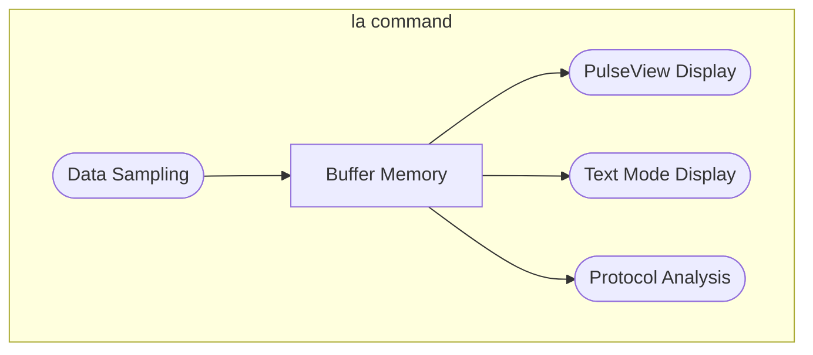
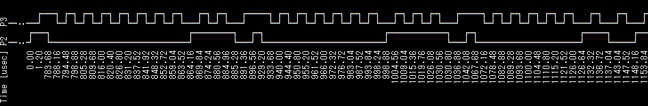
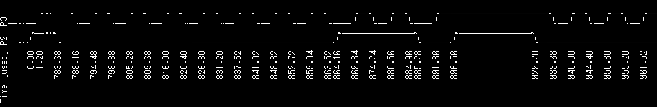
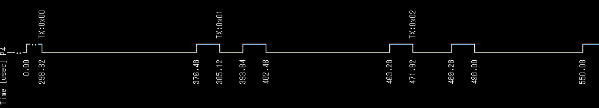

# Logic Analyzer - Text Mode

## Features of the `la` Command

The `la` command has two main features: data sampling and waveform display/analysis. Data sampling captures signal data into buffer memory, and waveform display or protocol analysis is performed by referencing this buffer memory.



Once data sampling is performed, the buffer memory contents are retained until the next sampling operation, so you can display or analyze the waveform as many times as you like.

### Data Sampling

#### Starting and Stopping Data Sampling

Specify the GPIO pins to measure with the `-p` (or `--pins`) option of the `la` command, and start sampling with the `enable` subcommand.

```text
L:/>la -p 2,3,4 enable
```

GPIO pins are specified as comma-separated pin numbers. You can also specify ranges using hyphens. Examples:

|GPIO Pin Option |Description                             |
|---------------|----------------------------------------|
|`-p 0`         |Specifies GPIO0                         |
|`-p 2,3,8,9`   |Specifies GPIO2, 3, 8, 9                |
|`-p 8-15`      |Specifies GPIO8 to GPIO15               |
|`-p 2-4,8-13`  |Specifies GPIO2 to 4 and GPIO8 to 13    |

The GPIO pins specified here are reflected in the `print` subcommand and in PulseView waveform display.

After allocating buffer memory for data storage, the `la` command instructs PIO (Programmable Input/Output) and DMA (Direct Memory Access) to start sampling and then immediately exits. The actual processing is performed by PIO and DMA, so **CPU load is almost zero**. When the buffer memory is full, sampling stops automatically.

Running the `disable` subcommand with the `la` command stops data sampling and releases PIO, DMA, and buffer memory resources. Normally, you do not need to explicitly run the `disable` subcommand.

```text
L:/>la disable
```

Running the `enable` subcommand again reinitializes resources and starts data sampling. The previous settings for GPIO pins and other sampling parameters are retained, so if there are no changes, just run `enable`.

```text
L:/>la enable
```

#### Integration with PulseView

When you press the `Start` button in PulseView, it performs the equivalent of the `la enable` command on the Pico board. You must set the GPIO pins and other sampling options with the `la` command beforehand.

When sampling starts, pico-jxgLABO polls the buffer memory status and sends sampling data to PulseView when available. Pressing the `Stop` button stops sending this data. Even after data transfer is complete, the buffer memory contents remain, so you can display waveform data or perform protocol analysis with the `print` subcommand of the `la` command.


#### About Sampling Mode

The logic analyzer in pico-jxgLABO performs sampling in transitional mode. In transitional mode, data is sampled only when the signal changes, making efficient use of buffer memory. The same sampling rate can be used for both fast (high-frequency) and slow (low-frequency) signals.

#### Selecting Internal or External Signals

You can specify the sampling target with the `--target` option. If you specify `internal` (default), internal Pico signals are sampled; if you specify `external`, external signals input to GPIO pins are sampled.

- `--target:internal` samples internal Pico signals
- `--target:external` samples external signals on GPIO pins

The `--target` option sets all GPIO pins at once, but you can change the setting for each GPIO pin using the following options:

- `--internal:PINS` specifies GPIO pins to sample internal signals
- `--external:PINS` specifies GPIO pins to sample external signals
- `--inherited:PINS` specifies GPIO pins to inherit the `--target` option setting

If the measurement target is external signals, a backquote (`) is added before the GPIO pin number in the status display when you run `la`. Example:

```text
L:/>la -p 2,3 --target:internal
disabled ---- 12.5MHz (samplers:1) pins:2,3 events:0/0 (heap-ratio:0.7)
L:/>la -p 2,3 --target:external
disabled ---- 12.5MHz (samplers:1) pins:`2,`3 events:0/0 (heap-ratio:0.7)
```

#### Specifying the Sampling Rate

pico-jxgLABO uses the PIO state machine for sampling. Here, the state machine used for sampling is called a sampler.

It takes 12 clock cycles for a sampler to sample one data point. For Pico2 (150MHz clock), 150MHz ÷ 12 = 12.5MHz sampling is possible. For Pico (125MHz clock), 125MHz ÷ 12 = 10.4MHz sampling is possible.

Each PIO block on the Pico board has 4 state machines (samplers). By running these in parallel with staggered start times, you can increase the sampling rate. Specify the number of samplers with the `--samplers` option. Examples:

|Option           |Pico2   |Pico     |
|-----------------|--------|---------|
|`--samplers:1`   |12.5MHz |10.4MHz  |
|`--samplers:2`   |25.0MHz |20.8MHz  |
|`--samplers:3`   |37.5MHz |31.2MHz  |
|`--samplers:4`   |50.0MHz |41.7MHz  |

Increasing the number of samplers increases the sampling rate but decreases the number of events that can be sampled.

#### Specifying the PIO Block to Use

Pico2 has three blocks: PIO0, PIO1, and PIO2; Pico has two: PIO0 and PIO1. By default, PIO2 (Pico2) or PIO1 (Pico) is used for the logic analyzer, but you can specify the PIO block to use with the `--pio` option. Examples:

- `--pio:0` uses PIO0
- `--pio:1` uses PIO1
- `--pio:2` uses PIO2

#### Specifying Buffer Memory Size

The `--heap-ratio:N` option (`N` is a value between 0 and 1) specifies the proportion of the heap area to use as buffer memory. The default is `0.7`, using 70% of the heap as buffer memory. If you get a memory allocation error when running `la enable`, reduce this value.


### Waveform Display

You can display the sampled waveform data in text format using the `print` subcommand of the `la` command. Here, we capture I2C interface signals as an example.

First, start capturing with GPIO2 (I2C SDA) and GPIO3 (I2C SCL) as measurement targets.

```text
L:/>la -p 2,3 enable
enabled pio:2 12.5MHz (samplers:1) pins:2,3 events:1/88620 (heap-ratio:0.7)
```

Next, use the `i2c1` command to output I2C protocol signals. Use the `-p` option to specify the SDA and SCL pins. The `scan` subcommand sends Read requests to addresses 0 to 127 and displays the addresses that respond.

```text
L:/>i2c1 -p 2,3 scan
Bus Scan on I2C1
   0  1  2  3  4  5  6  7  8  9  A  B  C  D  E  F
00 -- -- -- -- -- -- -- -- -- -- -- -- -- -- -- --
10 -- -- -- -- -- -- -- -- -- -- -- -- -- -- -- --
20 -- -- -- -- -- -- -- -- -- -- -- -- -- -- -- --
30 -- -- -- -- -- -- -- -- -- -- -- -- -- -- -- --
40 -- -- -- -- -- -- -- -- -- -- -- -- -- -- -- --
50 -- -- -- -- -- -- -- -- -- -- -- -- -- -- -- --
60 -- -- -- -- -- -- -- -- -- -- -- -- -- -- -- --
70 -- -- -- -- -- -- -- -- -- -- -- -- -- -- -- --
```

Now the I2C signal is generated. To check if it was captured, run the `la` command to check the logic analyzer status.

```text
L:/>la
enabled pio:2 12.5MHz (samplers:1) pins:2,3 events:3459/88620 (heap-ratio:0.7)
```

The number of events increases, indicating that the signal was captured. Use the `la print` command to display the captured signal.

```text
L:/>la print
```

The following is a screenshot of the terminal software rotated 90 degrees.



The display resolution (time interval per line) is 1000usec (1msec) by default. In the example above, the edge interval is about 5usec, so you need to set a shorter interval for correct display. Use the `--reso` option to set the display resolution to 4usec and display the waveform.

```text
L:/>la print --reso:4
```


By default, `la print` displays the first 80 events in buffer memory. Use the `--part` option to specify the range of events to display.

- `--part:head`: Displays the first events (default)
- `--part:tail`: Displays the last events
- `--part:all`: Displays all events

To change the number of events displayed for `head` or `tail`, use the `--events:N` option (`N` is the number of events).

With the `--part:all` option, you can display all events. Press `Ctrl-C` to interrupt the display.

```text
L:/>la print --part:all
 Time [usec] P2  P3
             │   │
             :   :
        0.00 └─┐ │
        1.28   │ └─┐
               :   :
      776.00 ┌─┘   │
             │     │
      780.40 │   ┌─┘
             │   │
      786.72 │   └─┐
             │     │
             :
             :
```

You can save the display output to a file using redirection. For example, to save to a file named `i2c.log`:

```text
L:/>la print --part:all > i2c.log
```

Waveform display uses Unicode multibyte characters, but these may not display correctly in some environments. In that case, specify an option such as `--style:ascii2` to display using only ASCII characters.

```text
L:/>la print --style:ascii2 --reso:4
```



The `--style` option allows you to specify the character set and waveform size. The default is `unicode2`.

- `unicode1`, `unicode2`, `unicode3`, `unicode4` ... use Unicode multibyte characters
- `ascii1`, `ascii2`, `ascii3`, `ascii4` ... use ASCII characters

### Communication Protocol Analysis

You can analyze communication protocols such as I2C, SPI, and UART using the `dec` subcommand. The format is `dec:DECODER {SUB-COMMANDS...}`. `DECODER` is the protocol decoder name such as `i2c`, `spi`, or `uart`. The `SUB-COMMANDS` in braces are subcommands specific to each decoder.

#### I2C Protocol Analysis

To decode the I2C protocol, specify `i2c` as the protocol name for the `dec` subcommand and the following subcommands:

- `sda:PIN`: Specify the SDA pin
- `scl:PIN`: Specify the SCL pin

Capture the signal when sending Read requests to addresses 0 to 127 using the `i2c1 scan` command, and decode it with the `la dec:i2c` command.

```text
L:/>la -p 2,3 enable
L:/>i2c1 -p 2,3 scan
L:/>la dec:i2c {sda:2 scl:3} print --reso:4
```


#### SPI Protocol Analysis

To decode the SPI protocol, specify `spi` as the protocol name for the `dec` subcommand and the following subcommands:

- `mode:MODE`: Specify the SPI mode (0-3)
- `mosi:PIN`: Specify the MOSI pin
- `miso:PIN`: Specify the MISO pin
- `sck:PIN`: Specify the SCK pin

You must specify at least one of `mosi` or `miso`.

Capture the signal when sending data from 0 to 255 on SPI MOSI using the `spi0 write` command, and decode it with the `la dec:spi` command.

```text
L:/>la -p 2,3 enable
L:/>spi0 -p 2,3 write:0-255
L:/>la dec:spi {mode:0 sck:2 mosi:3} print --reso:0.4
```


#### UART Protocol Analysis

To decode the UART protocol, specify `uart` as the protocol name for the `dec` subcommand and the following subcommands:

- `tx:PIN`: Specify the TX pin
- `rx:PIN`: Specify the RX pin
- `baudrate:RATE`: Specify the baud rate in bps (default: 115200)
- `frame:NPS`: Specify the frame format. `N` is the data bit length (5, 6, 7, 8, 9), P is parity (n:none, e:even, o:odd), S is stop bit length (1, 2). Default is `8n1` (8bit, none, 1bit stop)

`baudrate` and `frame` are optional. You must specify at least one of `tx` or `rx`.

Capture the signal when sending data from 0 to 255 on UART TX using the `uart1 write` command, and decode it with the `la dec:uart` command.

```text
L:/>la -p 4 enable
L:/>uart1 -p 4 write:0-255
L:/>la dec:uart {tx:4} print --reso:4
```


