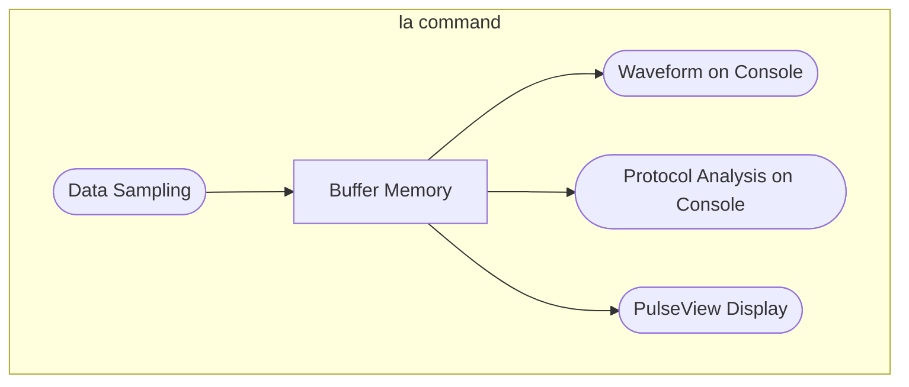

This page introduces the features of the pico-jxgLABO logic analyzer command `la`. The `la` command is a console-based tool that can operate independently to display waveforms and analyze communication protocols such as I2C, SPI, and UART.

## Features of the `la` Command

The `la` command has two main features: data sampling and waveform display/analysis. Data sampling captures signal data into buffer memory, and waveform display or protocol analysis is performed by referencing this buffer memory.

Once data sampling is performed, the buffer memory contents are retained until the next sampling operation, so you can display or analyze the waveform as many times as you like.
