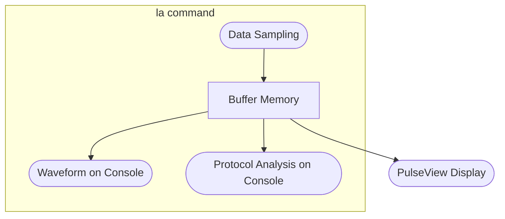

# Logic Analyzer

Have you ever wanted to analyze digital signals or communication protocols? Logic analyzers are essential tools for debugging and understanding digital circuits, but connecting probes to a target device can be cumbersome.

The pico-jxglib provides a built-in logic analyzer that requires no additional hardware. The Pico board that runs your firmware works as a logic analyzer, allowing you to monitor and analyze digital signals without any wirings or probes.

The built-in logic analyzer supports transitional sampling. While normal sampling captures signal data at fixed intervals, transitional sampling captures data only when the signal changes. This means that you can use the same sampling rate for both fast (high-frequency) and slow (low-frequency) signals and reduce the amount of memory used for sampling.

## Features of the `la` Command

The `la` command is the main interface for the logic analyzer. It provides various options for data sampling, waveform display, and protocol analysis. You can use it to capture signal data into buffer memory and then display or analyze the waveform on the console or with PulseView.



Once data sampling is performed, the buffer memory contents are retained until the next sampling operation, so you can display or analyze the waveform as many times as you like.

## Command Reference

### la

```text title="Help of the Command"
Usage: la [OPTION]... [COMMAND]...
Options:
 -h --help                prints this help
 -q --quiet               suppresses print of settings
    --no-quiet            enables print of settings
 -P --pio=PIO             PIO to use (0-1)
 -p --pins=PINS           pins to monitor
 -E --external=PINS       pins specified as external
 -I --internal=PINS       pins specified as internal
 -H --inherited=PINS      pins specified as inherited
 -t --target=TARGET       default pin target (internal, external)
 -S --samplers=NUM        number of samplers (1-4)
 -R --heap-ratio=RATIO    heap ratio to use as event buffer (0.0-1.0)
 -r --reso=RESO           resolution in microseconds (default 1000)
 -t --part=PART           printed part of the waveform (head, tail, all)
 -e --events=NUM          number of events to print (default 80)
 -s --style=STYLE         waveform style (unicode1, unicode2, unicode3, unicode4, ascii1, ascii2, ascii3, ascii4)
 -f --event-format=FORMAT event format (auto, short, long)
Sub Commands:
 sleep:MSEC           sleep for specified milliseconds
 enable               enable sampling of the logic analyzer
 disable              disable sampling of the logic analyzer
 dec:DECODER          specify the decoder to use
 print                print the sampled waveforms
```
