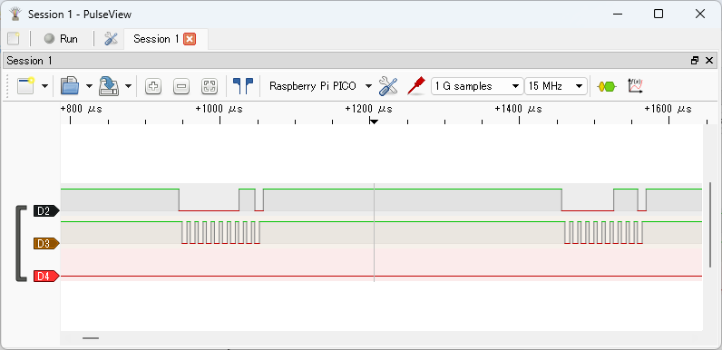
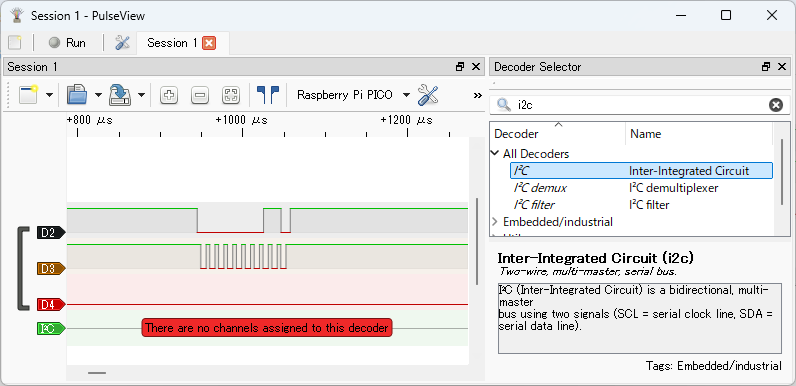
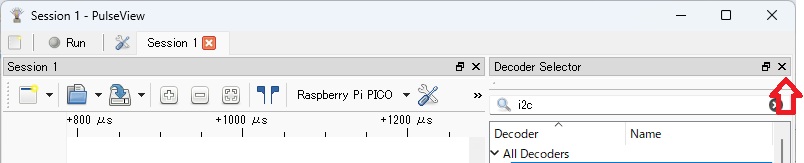

# Observing I2C Signals

After clicking the `Run` button in PulseView to start capturing, run the following command in your terminal software:

```text
L:/>i2c1 -p 2,3 scan
```

This command assigns GPIO2 and GPIO3 to I2C1 SDA and SCL, and sends Read requests to I2C addresses 0x00 to 0x7f.

Click the `Stop` button in PulseView to stop capturing. The captured waveforms will be displayed as shown below. `D2` is GPIO2 (I2C1 SDA), and `D3` is GPIO3 (I2C1 SCL).


Basic mouse operations:

- Use the wheel to zoom in and out
- Drag within the waveform area with the left mouse button to move the display range

The image below shows a zoomed-in view of the beginning of the signal waveform.



Click the button indicated by the arrow below:


to display the `Decoder Selector` pane, where you can select protocol decoders. Enter `i2c` in the search box and double-click `I2C` in the list to add the I2C decoder to the waveform.



Click the button indicated by the arrow below:



to hide the `Decoder Selector` pane.


Left-click the `I2C` label in the signal name to open a dialog for setting protocol decoder parameters. Set `SCL` to `D3` and `SDA` to `D2`.


Close the dialog to see the decoded I2C results.


You can see that Read requests are sent to I2C addresses 0x00 to 0x7f. Since no I2C device is connected, NACK responses are returned.
