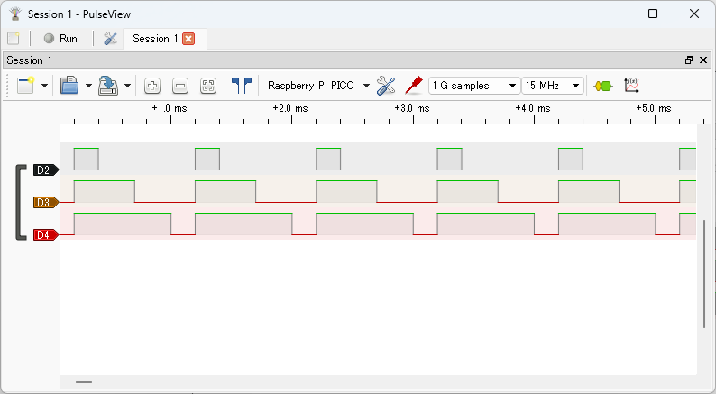

# Observing PWM Signals

After clicking the `Run` button in PulseView to start capturing, run the following commands in your terminal software:

```text
L:/>pwm 2,3,4 func:pwm freq:1000 counter:0
L:/>pwm2 duty:.2; pwm3 duty:.5; pwm4 duty:.8
L:/>pwm 2,3,4 enable
```

These commands set GPIO2, GPIO3, and GPIO4 to PWM function, set the frequency to 1kHz, set the duty cycles to 20%, 50%, and 80% respectively, and enable PWM.

Click the `Stop` button in PulseView to stop capturing. The captured waveforms will be displayed as shown below.


The image below shows a zoomed-in view of the beginning of the signal waveform.



Display the `Decoder Selector` pane, enter `pwm` in the search box, and double-click `PWM` in the list to add PWM decoders to the waveform (add three in total). Left-click the `PWM` label in the signal name to open the protocol decoder parameter dialog, and set the `Data` field to `D2`, `D3`, and `D4` for each decoder.


Close the dialog to see the decoded PWM results.


You can see PWM signals with duty cycles of 20%, 50%, and 80% at a frequency of 1.0kHz.

For more details on PWM operation with pico-jxgLABO, see the following article:

▶️ [Mastering PWM on Pico with the pwm command](https://zenn.dev/ypsitau/articles/2025-08-06-labo-pwm)
