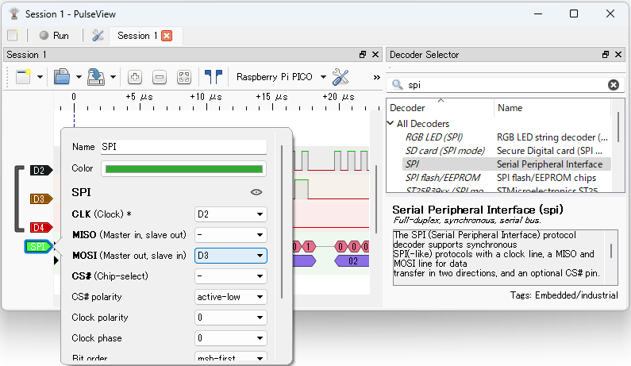
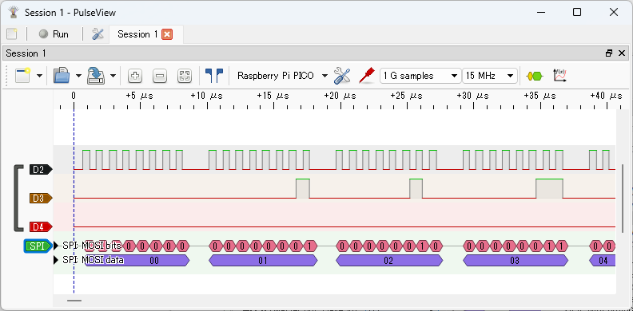

# Observing SPI Signals

After clicking the `Run` button in PulseView to start capturing, run the following command in your terminal software:

```text
L:/>spi0 -p 2,3 write:0-255
```

This command assigns GPIO2 and GPIO3 to SPI0 MOSI and SCK, and sends data from 0 to 255.

Click the `Stop` button in PulseView to stop capturing. The captured waveforms will be displayed as shown below. `D2` is GPIO2 (SPI0 SCK), and `D3` is GPIO3 (SPI0 MOSI).


The image below shows a zoomed-in view of the beginning of the signal waveform.


Display the `Decoder Selector` pane, enter `spi` in the search box, and double-click `SPI` in the list to add the SPI decoder to the waveform. Left-click the `SPI` label in the signal name to open the protocol decoder parameter dialog, and set `CLK` to `D2` and `MOSI` to `D3`.



Close the dialog to see the decoded SPI results.



You can see that data from 0 to 255 is sent on SPI MOSI.
