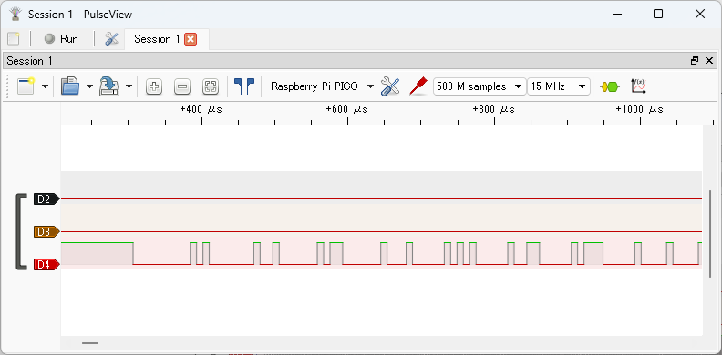

# Observing UART Signals

After clicking the `Run` button in PulseView to start capturing, run the following command in your terminal software:

```text
L:/>uart1 -p 4 write:0-255,0
```

This command assigns GPIO4 to UART1 TX and sends data from 0 to 255, followed by 0. The final 0 is sent because if the last data is 255, PulseView's UART protocol decoder may not recognize the stop bit correctly.

Click the `Stop` button in PulseView to stop capturing. The captured waveform will be displayed as shown below. `D4` is GPIO4 (UART1 TX).


The image below shows a zoomed-in view of the beginning of the signal waveform.



Display the `Decoder Selector` pane, enter `uart` in the search box, and double-click `UART` in the list to add the UART decoder to the waveform. Left-click the `UART` label in the signal name to open the protocol decoder parameter dialog, and set `TX` to `D4`.


Close the dialog to see the decoded UART results.


You can see that data from 0 to 255 and 0 is sent on UART TX.
