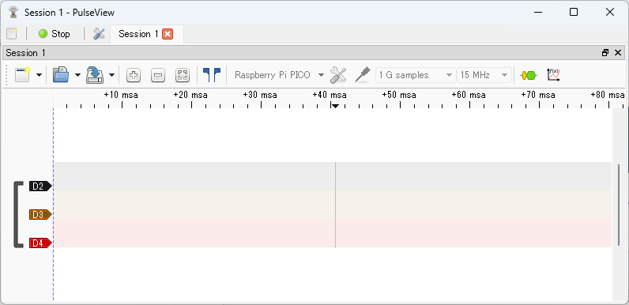

The signals for each GPIO specified with the `-p` option of the `la` command will be displayed as `D2`, `D3`, `D4`, etc.

By default, the number of samples is set to `1k samples` and the sampling rate to `5 kHz`. Change these as follows:

- Number of samples: Set to the maximum `1 G samples`
- Sampling rate: Set appropriately for the frequency of the signal to be observed. Here, set it to `15 MHz`.

Now you can operate pico-jxgLABO on the Pico board from PulseView. Click the `Run` button at the top left to start capturing signals (the label changes to `Stop`).

Click the `Stop` button to stop capturing and display the observed waveform. If no signal is being generated, nothing will be displayed yet.

Now, let's generate various signals and observe their waveforms!
