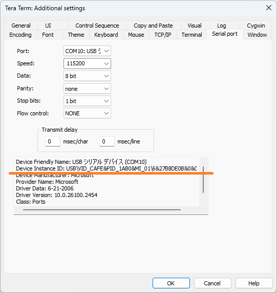

# Connecting pico-jxgLABO and PulseView

Follow these steps to connect pico-jxgLABO and PulseView:

1. Connect the Pico board with pico-jxgLABO flashed to your PC using a USB cable.

2. Start Tera Term for serial communication. From the menu bar, select `[Setup (S)]` - `[Serial Port (E)...]`.

   

   pico-jxgLABO provides two USB serial ports. On Windows, the Device Instance IDs are as follows:

   - `USB\VID_CAFE&PID_1AB0&MI01` ... for terminal use
   - `USB\VID_CAFE&PID_1AB0&MI03` ... for applications such as logic analyzer and plotter

   Note the port number for the application port, as it will be used in step 6 for PulseView settings. Here, select the terminal port and click `[New Open (N)]` or `[Reconfigure Current Connection (N)]`.

3. In Tera Term, run the pico-jxgLABO logic analyzer command `la` and specify the GPIO pins to measure. In the example below, GPIO2, GPIO3, and GPIO4 are selected:

   ```text
   L:/>la -p 2,3,4
   disabled ---- 12.5MHz (samplers:1) pins:2-4 events:0/0 (heap-ratio:0.7)
   ```

4. Start PulseView. One of the following main screens will appear:

   

   

   Click the area labeled `<No Device>` or `Demo device` to open the "Connect to Device" dialog.

5. In `Step 1: Choose the driver`, select `RaspberryPI PICO (raspberrypi-pico)` from the dropdown list.

   

6. In `Step 2: Choose the interface`, select `Serial Port` and specify the application serial port noted in step 2. Leave the baud rate blank.

   

7. In `Step 3: Scan for devices`, click the `Scan for devices using driver above` button. In the list for `Step 4: Select the device`, confirm that `RaspberryPi PICO with 3 channels` appears and click `OK`.

   

8. The main screen will look like this:

   


The signals for each GPIO specified with the `-p` option of the `la` command will be displayed as `D2`, `D3`, `D4`, etc.

By default, the number of samples is set to `1k samples` and the sampling rate to `5 kHz`. Change these as follows:

- Number of samples: Set to the maximum `1 G samples`
- Sampling rate: Set appropriately for the frequency of the signal to be observed. Here, set it to `15 MHz`.


Now you can operate pico-jxgLABO on the Pico board from PulseView. Click the `Run` button at the top left to start capturing signals (the label changes to `Stop`).


Click the `Stop` button to stop capturing and display the observed waveform. If no signal is being generated, nothing will be displayed yet.

Now, let's generate various signals and observe their waveforms!
