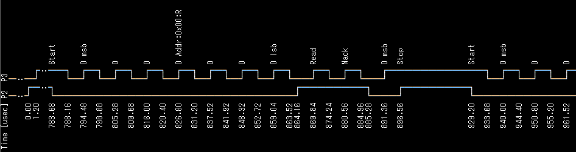
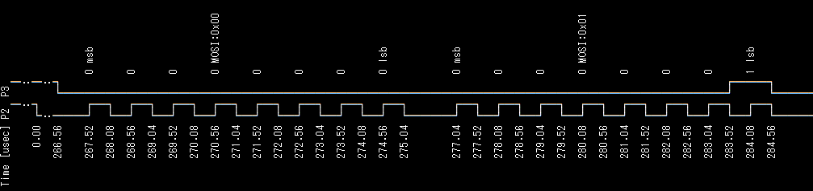

# Communication Protocol Analysis

You can analyze communication protocols such as I2C, SPI, and UART using the `dec` subcommand. The format is `dec:DECODER {SUB-COMMANDS...}`. `DECODER` is the protocol decoder name such as `i2c`, `spi`, or `uart`. The `SUB-COMMANDS` in braces are subcommands specific to each decoder.

## I2C Protocol Analysis

To decode the I2C protocol, specify `i2c` as the protocol name for the `dec` subcommand and the following subcommands:

- `sda:PIN`: Specify the SDA pin
- `scl:PIN`: Specify the SCL pin

Capture the signal when sending Read requests to addresses 0 to 127 using the `i2c1 scan` command, and decode it with the `la dec:i2c` command.

```text
L:/>la -p 2,3 enable
L:/>i2c1 -p 2,3 scan
L:/>la dec:i2c {sda:2 scl:3} print --reso:4
```



## SPI Protocol Analysis

To decode the SPI protocol, specify `spi` as the protocol name for the `dec` subcommand and the following subcommands:

- `mode:MODE`: Specify the SPI mode (0-3)
- `mosi:PIN`: Specify the MOSI pin
- `miso:PIN`: Specify the MISO pin
- `sck:PIN`: Specify the SCK pin

You must specify at least one of `mosi` or `miso`.

Capture the signal when sending data from 0 to 255 on SPI MOSI using the `spi0 write` command, and decode it with the `la dec:spi` command.

```text
L:/>la -p 2,3 enable
L:/>spi0 -p 2,3 write:0-255
L:/>la dec:spi {mode:0 sck:2 mosi:3} print --reso:0.4
```



## UART Protocol Analysis

To decode the UART protocol, specify `uart` as the protocol name for the `dec` subcommand and the following subcommands:

- `tx:PIN`: Specify the TX pin
- `rx:PIN`: Specify the RX pin
- `baudrate:RATE`: Specify the baud rate in bps (default: 115200)
- `frame:NPS`: Specify the frame format. `N` is the data bit length (5, 6, 7, 8, 9), P is parity (n:none, e:even, o:odd), S is stop bit length (1, 2). Default is `8n1` (8bit, none, 1bit stop)

`baudrate` and `frame` are optional. You must specify at least one of `tx` or `rx`.

Capture the signal when sending data from 0 to 255 on UART TX using the `uart1 write` command, and decode it with the `la dec:uart` command.

```text
L:/>la -p 4 enable
L:/>uart1 -p 4 write:0-255
L:/>la dec:uart {tx:4} print --reso:4
```


