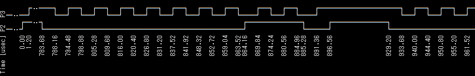

# Logic Analyzer - Text Mode

#### Integration with PulseView

When you press the `Start` button in PulseView, it performs the equivalent of the `la enable` command on the Pico board. You must set the GPIO pins and other sampling options with the `la` command beforehand.

When sampling starts, pico-jxgLABO polls the buffer memory status and sends sampling data to PulseView when available. Pressing the `Stop` button stops sending this data. Even after data transfer is complete, the buffer memory contents remain, so you can display waveform data or perform protocol analysis with the `print` subcommand of the `la` command.

### Waveform Display

You can display the sampled waveform data in text format using the `print` subcommand of the `la` command. Here, we capture I2C interface signals as an example.

First, start capturing with GPIO2 (I2C SDA) and GPIO3 (I2C SCL) as measurement targets.

```text
L:/>la -p 2,3 enable
enabled pio:2 12.5MHz (samplers:1) pins:2,3 events:1/88620 (heap-ratio:0.7)
```

Next, use the `i2c1` command to output I2C protocol signals. Use the `-p` option to specify the SDA and SCL pins. The `scan` subcommand sends Read requests to addresses 0 to 127 and displays the addresses that respond.

```text
L:/>i2c1 -p 2,3 scan
Bus Scan on I2C1
   0  1  2  3  4  5  6  7  8  9  A  B  C  D  E  F
00 -- -- -- -- -- -- -- -- -- -- -- -- -- -- -- --
10 -- -- -- -- -- -- -- -- -- -- -- -- -- -- -- --
20 -- -- -- -- -- -- -- -- -- -- -- -- -- -- -- --
30 -- -- -- -- -- -- -- -- -- -- -- -- -- -- -- --
40 -- -- -- -- -- -- -- -- -- -- -- -- -- -- -- --
50 -- -- -- -- -- -- -- -- -- -- -- -- -- -- -- --
60 -- -- -- -- -- -- -- -- -- -- -- -- -- -- -- --
70 -- -- -- -- -- -- -- -- -- -- -- -- -- -- -- --
```

Now the I2C signal is generated. To check if it was captured, run the `la` command to check the logic analyzer status.

```text
L:/>la
enabled pio:2 12.5MHz (samplers:1) pins:2,3 events:3459/88620 (heap-ratio:0.7)
```

The number of events increases, indicating that the signal was captured. Use the `la print` command to display the captured signal.

```text
L:/>la print
```

The following is a screenshot of the terminal software rotated 90 degrees.


The display resolution (time interval per line) is 1000usec (1msec) by default. In the example above, the edge interval is about 5usec, so you need to set a shorter interval for correct display. Use the `--reso` option to set the display resolution to 4usec and display the waveform.

```text
L:/>la print --reso:4
```



By default, `la print` displays the first 80 events in buffer memory. Use the `--part` option to specify the range of events to display.

- `--part:head`: Displays the first events (default)
- `--part:tail`: Displays the last events
- `--part:all`: Displays all events

To change the number of events displayed for `head` or `tail`, use the `--events:N` option (`N` is the number of events).

With the `--part:all` option, you can display all events. Press `Ctrl-C` to interrupt the display.

```text
L:/>la print --part:all
 Time [usec] P2  P3
             │   │
             :   :
        0.00 └─┐ │
        1.28   │ └─┐
               :   :
      776.00 ┌─┘   │
             │     │
      780.40 │   ┌─┘
             │   │
      786.72 │   └─┐
             │     │
             :
             :
```

You can save the display output to a file using redirection. For example, to save to a file named `i2c.log`:

```text
L:/>la print --part:all > i2c.log
```

Waveform display uses Unicode multibyte characters, but these may not display correctly in some environments. In that case, specify an option such as `--style:ascii2` to display using only ASCII characters.

```text
L:/>la print --style:ascii2 --reso:4
```


The `--style` option allows you to specify the character set and waveform size. The default is `unicode2`.

- `unicode1`, `unicode2`, `unicode3`, `unicode4` ... use Unicode multibyte characters
- `ascii1`, `ascii2`, `ascii3`, `ascii4` ... use ASCII characters

