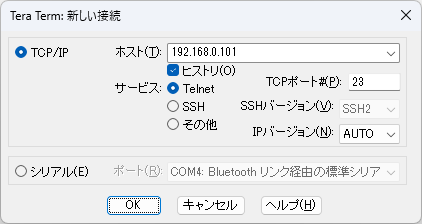

# Telnet Server

## Connecting to a Telnet Server on the Pico Board

Start a Telnet server on the Pico board with the `telnet-server` command:

```text
L:/>telnet-server start
Telnet server started on port 23
```

Try connecting to the Pico board with Tera Term. From the menu, select `File` - `New Connection...` to open the connection dialog:



Select `TCP/IP`, enter the Pico board’s IP address as the host, select `Telnet` as the service, and click OK. A new Tera Term window will open and connect to the board. You’ll be prompted for a password; just press Enter if you haven’t set one yet.

```text
password:
L:/>
```

Now you can run all pico-jxgLABO commands remotely! You can even use [logic analyzer features](https://zenn.dev/ypsit/articles/2025-09-08-labo-la) remotely. For more, see the article below:

▶️ [Pico Board as a Lab! Try Logic Analyzer Features with pico-jxgLABO](https://zenn.dev/ypsit/articles/2025-08-01-labo-intro)

Note: When connected via Telnet, USB serial command input is disabled. Disconnecting Telnet restores USB serial communication.

## Setting a Password

It’s not secure to run a Telnet server on the network without a password, so set one. (Note: Telnet transmits in plain text, so it’s not fully secure, but at least prevents unauthorized logins.)

Set a password with the `password` command:

```text
L:/>password
New password:
Reenter password:
password changed
```

This creates a `.password` file in the root of the `L:` drive, storing a hashed password.

Password entry is only required for Telnet connections, not USB serial.
