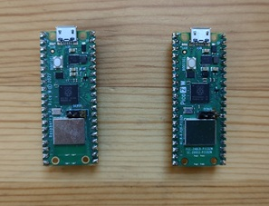
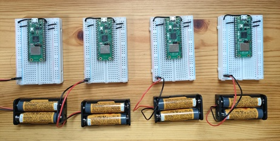

# Wi-Fi Connection

This article explains how to connect a Pico board to a Wi-Fi network using pico-jxgLABO.

Traditionally, connecting a microcontroller to a network requires writing and running a program, often hardcoding the SSID and password for Wi-Fi, which makes distribution and maintenance difficult. In the pico-jxgLABO environment, shell commands are provided for network connection, allowing users to connect to networks interactively via commands.

This article covers the following network operations:

- Network connection
  1. Scan for available Wi-Fi access points
  2. Connect to Wi-Fi with a specified SSID and password
  3. Set a static IP address

## Raspberry Pi Pico and Wi-Fi Functionality

### Pico W and Pico 2 W

Pico W and Pico 2 W are Pico boards equipped with a CYW43439 Wi-Fi chip (CYW43 chip).


*Pico W and Pico 2 W*

Pico W costs about 1,200 yen, Pico 2 W about 1,400 yen—roughly 400 yen more than the non-Wi-Fi models due to the CYW43 chip.

Pico W/Pico 2 W use reserved GPIOs 23, 24, 25, and 29 to control the CYW43 chip. GPIO25, used for the built-in LED on Pico/Pico 2, is now used for CYW43 control, so the built-in LED is connected to the CYW43 chip’s GPIO. To control the LED on Pico W/Pico 2 W, you must communicate with the CYW43 chip, which is tricky. The Pico SDK provides `cyw43_arch_gpio_get()` and `cyw43_arch_gpio_put()` APIs for this purpose.

Controlling the CYW43 chip with limited GPIOs is challenging. For more details, see [this article](https://zenn.dev/nonnoise/articles/0d5b97cb517e31).

PIO (Programmable I/O) is also used for CYW43 control. Pico W has 2 PIO blocks, Pico 2 W has 3, but one block is used for CYW43, so be careful when designing systems that use PIO[^pio-usage].

[^pio-usage]: pico-jxgLABO also uses PIO for logic analyzer functionality.

### Use Cases for Pico’s Network Functionality

Pico W and Pico 2 W’s Wi-Fi is often used for IoT (Internet of Things) applications, such as sending sensor data to the cloud or controlling devices from the cloud. HTTP allows web browser operation, and MQTT enables lightweight messaging.

In this article, we’ll run a Telnet server on the Pico board so you can execute pico-jxgLABO shell commands remotely. With terminal software like Tera Term, you can operate the Pico board without a USB cable.

In the photo below, multiple Pico W and Pico 2 W boards are connected to a Wi-Fi network, each with a fixed IP address.



You can operate each board without physical cable connections, allowing more flexible operation!

## Connecting to a Wi-Fi Network

Connect to the pico-jxgLABO shell on the Pico board via USB serial, and use the `net` shell command for network operations. First, use the `wifi-scan` subcommand to find available access points:

```text
L:/>net wifi-scan
ssid:MyHome-WiFi                      rssi: -68 channel:  8 mac:xx:xx:xx:xx:xx:xx security:5
ssid:A12345678                        rssi: -75 channel: 11 mac:xx:xx:xx:xx:xx:xx security:7
ssid:LivingRoomAP                     rssi: -76 channel:  4 mac:xx:xx:xx:xx:xx:xx security:7
ssid:HUMIN-4512                       rssi: -76 channel:  4 mac:xx:xx:xx:xx:xx:xx security:7
```

Connect to a Wi-Fi router with the `wifi-connect` subcommand, specifying SSID and password:

```text
L:/>net wifi-connect {ssid:'MyHome-WiFi' password:'PASSWORD'}
Connected ssid:'MyHome-WiFi' auth:wpa2 addr:192.168.0.20 netmask:255.255.255.0 gateway:192.168.0.1
```

In this example, DHCP assigns IP address `192.168.0.20`, netmask `255.255.255.0`, and gateway `192.168.0.1`.

:::message
Some Wi-Fi routers may not work well with the Pico board. If your host PC is Windows, you can use the mobile hotspot feature as an access point. This is also safer than using a Wi-Fi router, so give it a try.
:::

To set a static IP address, use the `config` subcommand. The example below sets the IP to `192.168.0.101`:

```text
L:/>net config {addr:192.168.0.101}
Connected ssid:'MyHome-WiFi' auth:wpa2 addr:192.168.0.101 netmask:255.255.255.0 gateway:192.168.0.1
```

You can also specify netmask and gateway, but these must match the values assigned by DHCP when connecting to the access point, so usually you only specify the IP address.

You can combine `wifi-connect` and `config`:

```text
L:/>net wifi-connect {ssid:'MyHome-WiFi' password:'PASSWORD'} config {addr:192.168.0.101}
```

