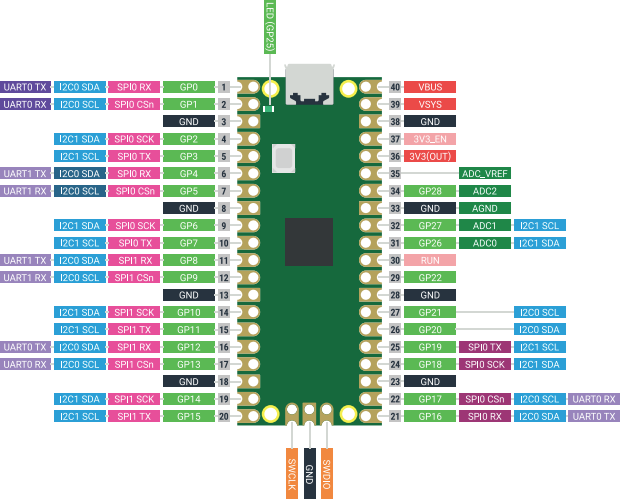
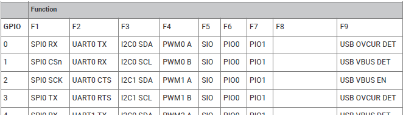
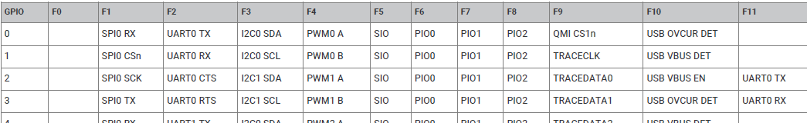
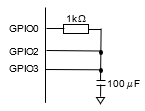

# GPIO Control

This article introduces how to control GPIO using the `gpio` command in pico-jxgLABO.

Although GPIO is often thought of as just a simple on/off input/output function, experimenting with various command operations can deepen your understanding of GPIO control. Try changing settings such as maximum current and hysteresis characteristics to explore the possibilities of the Pico.

## Controlling GPIO with the `gpio` Command

Let's experiment with GPIO using the `gpio` command. Here, Pico 2 is used, but you can do the same with the original Pico.

### Displaying Current GPIO Status

Running `gpio` with no arguments displays the current status of all GPIOs.

```text
L:/>gpio
GPIO0  lo  func:------     dir:in  pull:down drive:4mA slew:slow hyst:on
GPIO1  lo  func:------     dir:in  pull:down drive:4mA slew:slow hyst:on
GPIO2  lo  func:------     dir:in  pull:down drive:4mA slew:slow hyst:on
GPIO3  lo  func:------     dir:in  pull:down drive:4mA slew:slow hyst:on
GPIO4  lo  func:------     dir:in  pull:down drive:4mA slew:slow hyst:on
GPIO5  lo  func:------     dir:in  pull:down drive:4mA slew:slow hyst:on
GPIO6  lo  func:------     dir:in  pull:down drive:4mA slew:slow hyst:on
GPIO7  lo  func:------     dir:in  pull:down drive:4mA slew:slow hyst:on
GPIO8  lo  func:------     dir:in  pull:down drive:4mA slew:slow hyst:on
GPIO9  lo  func:------     dir:in  pull:down drive:4mA slew:slow hyst:on
GPIO10 lo  func:------     dir:in  pull:down drive:4mA slew:slow hyst:on
GPIO11 lo  func:------     dir:in  pull:down drive:4mA slew:slow hyst:on
GPIO12 lo  func:------     dir:in  pull:down drive:4mA slew:slow hyst:on
GPIO13 lo  func:------     dir:in  pull:down drive:4mA slew:slow hyst:on
GPIO14 lo  func:------     dir:in  pull:down drive:4mA slew:slow hyst:on
GPIO15 lo  func:------     dir:in  pull:down drive:4mA slew:slow hyst:on
GPIO16 lo  func:------     dir:in  pull:down drive:4mA slew:slow hyst:on
GPIO17 lo  func:------     dir:in  pull:down drive:4mA slew:slow hyst:on
GPIO18 lo  func:------     dir:in  pull:down drive:4mA slew:slow hyst:on
GPIO19 lo  func:------     dir:in  pull:down drive:4mA slew:slow hyst:on
GPIO20 lo  func:------     dir:in  pull:down drive:4mA slew:slow hyst:on
GPIO21 lo  func:------     dir:in  pull:down drive:4mA slew:slow hyst:on
GPIO22 lo  func:------     dir:in  pull:down drive:4mA slew:slow hyst:on
GPIO23*lo  func:------     dir:in  pull:down drive:4mA slew:slow hyst:on
GPIO24*lo  func:------     dir:in  pull:down drive:4mA slew:slow hyst:on
GPIO25*lo  func:------     dir:in  pull:down drive:4mA slew:slow hyst:on
GPIO26 lo  func:------     dir:in  pull:down drive:4mA slew:slow hyst:on
GPIO27 lo  func:------     dir:in  pull:down drive:4mA slew:slow hyst:on
GPIO28 lo  func:------     dir:in  pull:down drive:4mA slew:slow hyst:on
GPIO29*lo  func:------     dir:in  pull:down drive:4mA slew:slow hyst:on
```

The Pico has 30 GPIOs, numbered 0 to 29. The fields in the status display mean:

- The second field, `lo` or `hi`, shows the logic value of each pin (`lo` = Low/0, `hi` = High/1)
- `func` shows the function assigned to the GPIO. `------` means no function (null function)
- `dir` is the direction: `in` for input, `out` for output
- `pull` is the pull-up/pull-down resistor setting: `down` = pull-down, `up` = pull-up, `none` = high impedance, `both` = both enabled
- `drive` is the drive strength, usually 4mA
- `slew` is slew rate control, usually `slow`
- `hyst` is input hysteresis: `on` = enabled, `off` = disabled

GPIOs marked with `*` (GPIO23, GPIO24, GPIO25, GPIO29) are not connected to external pins and are assigned to special functions:

Pico and Pico 2:
- GPIO23 - OP Controls the on-board SMPS Power Save pin
- GPIO24 - IP VBUS sense - high if VBUS is present, else low
- GPIO25 - OP Connected to user LED
- GPIO29 - IP Used in ADC mode (ADC3) to measure VSYS/3

Pico W and Pico 2 W:
- GPIO23 - OP wireless power on signal
- GPIO24 - OP/IP wireless SPI data/IRQ
- GPIO25 - OP wireless SPI CS - when high also enables GPIO29 ADC pin to read VSYS
- GPIO29 - OP/IP wireless SPI CLK/ADC mode (ADC3) to measure VSYS/3

These pins cannot be controlled by the `gpio` command to avoid affecting board operation. However, GPIO25 (user LED) can be controlled with the `-B` or `--builtin-led` option for convenience.

### Specifying GPIO Pin Numbers

The first argument to the `gpio` command specifies the GPIO pin number(s). You can specify a single pin or a range. Examples:

|Command         |Description                                 |
|---------------|--------------------------------------------|
|`gpio 0`       |Show status of GPIO0                        |
|`gpio 2,3,8,9` |Show status of GPIO2, 3, 8, 9               |
|`gpio 2-15`    |Show status of GPIO2 to GPIO15              |
|`gpio 8-`      |Show status of GPIO8 to GPIO29              |

There are also shortcut commands like `gpio0` to `gpio29` (e.g., `gpio2` is the same as `gpio 2`).

### Digital Input and Output

#### Digital Output

Set a GPIO to output mode and output a digital signal. For example, to turn on the built-in LED (GPIO25) with a high signal:

```text
L:/>gpio 25 -B func:sio dir:out put:1
```

The `func` subcommand sets the function to `sio` (Single-cycle IO). SIO is a special block that the CPU can access in one cycle, and some of its registers are assigned to GPIO I/O. The `dir` subcommand sets output mode, and `put` sets the output value.

The `gpio` command also has `repeat` and `sleep` subcommands for repeating actions and adding delays. For example, to blink the LED:

```text
L:/>gpio 25 -B func:sio dir:out repeat:20 {put:1 sleep:100 put:0 sleep:100}
```

You can also use the `toggle` subcommand to invert the output value and blink the LED more simply:

```text
L:/>gpio 25 -B func:sio dir:out repeat:20 {toggle sleep:100}
```

You can observe GPIO signals with a logic analyzer:

```text
L:/>la enable -p 25
L:/>gpio 25 -B func:sio dir:out repeat:20 {toggle sleep:100}
L:/>la print
 Time [usec] P25 
             │  
             :  
        0.00 └─┐
               :
    99208.00 ┌─┘
             :  
   199199.52 └─┐
               :
   299194.56 ┌─┘
             :  
```

Start capture with `la enable`, operate the GPIO, then display the captured data with `la print`.

If you set the function to something other than SIO, the output value set by `put` is ignored. For example, assigning UART RX to GPIO1 and setting output high:

```text
L:/>gpio 1 func:uart dir:out put:1
GPIO1  lo~ func:UART0 RX   dir:out pull:down drive:4mA slew:slow hyst:on
```

The pin state is `lo~`, indicating the set value is ignored. The `~` means the set value and actual signal differ.

Even with SIO, if the direction is input, the set value is ignored:

```text
L:/>gpio 1 func:sio dir:in put:1
GPIO1  hi  func:SIO        dir:in  pull:down drive:4mA slew:slow hyst:on
```

It may look like the set value is reflected, but this is due to the pin state being high for another reason (e.g., a hardware bug in Pico 2). Setting the value to `0` shows it is ignored:

```text
L:/>gpio 1 func:sio dir:in put:0
GPIO1  hi~ func:SIO        dir:in  pull:down drive:4mA slew:slow hyst:on
```

**Conclusion:** To output digital signals from the CPU, set the function to SIO and the direction to output. Otherwise, the output value does not affect the pin state, so there are no side effects.

#### Digital Input

Set a GPIO to input mode and read digital signals. For example, to set GPIO1 to input and read its level (try connecting it to GND with a jumper wire):

```text
L:/>gpio 1 func:sio dir:in pull:up repeat {get sleep:300}
```

The `dir` subcommand sets input mode. The `pull` subcommand enables the pull-up resistor to fix the signal high when unconnected. `get` reads the GPIO signal level.

On the Pico, you can read the digital signal level from the CPU even if the function is not SIO. For example, you can monitor UART RX on GPIO1:

```text
L:/>gpio 1 func:uart dir:in repeat {get sleep:300}
```

### About Function Settings

The familiar pinout diagram for Pico GPIO function settings:



See the datasheets for more details:

**Pico** - [RP2040 Datasheet](https://datasheets.raspberrypi.com/rp2040/rp2040-datasheet.pdf) 2.19.2 Function select



**Pico 2** - [RP2350 Datasheet](https://datasheets.raspberrypi.com/rp2350/rp2350-datasheet.pdf) 9.4. Function select



Each function is assigned a number from F0 to F31, with F31 being the null function (no assignment).

The `gpio` command in pico-jxgLABO uses the `func` subcommand to set the function. Available function names:

**Pico** - `spi`, `uart`, `i2c`, `pwm`, `sio`, `pio0`, `pio1`, `clock`, `usb`, `xip`, `null`
**Pico 2** - `spi`, `uart`, `uart-aux`, `i2c`, `pwm`, `sio`, `pio0`, `pio1`, `pio2`, `clock`, `usb`, `hstx`, `xip-cs1`, `coresight-trace`, `null`

For example, to set all available GPIOs to PWM function:

```text
L:/>gpio 0- func:pwm
GPIO0  lo  func:PWM0 A     dir:in  pull:down drive:4mA slew:slow hyst:on
GPIO1  lo  func:PWM0 B     dir:in  pull:down drive:4mA slew:slow hyst:on
GPIO2  lo  func:PWM1 A     dir:in  pull:down drive:4mA slew:slow hyst:on
GPIO3  lo  func:PWM1 B     dir:in  pull:down drive:4mA slew:slow hyst:on
GPIO4  lo  func:PWM2 A     dir:in  pull:down drive:4mA slew:slow hyst:on
GPIO5  lo  func:PWM2 B     dir:in  pull:down drive:4mA slew:slow hyst:on
GPIO6  lo  func:PWM3 A     dir:in  pull:down drive:4mA slew:slow hyst:on
GPIO7  lo  func:PWM3 B     dir:in  pull:down drive:4mA slew:slow hyst:on
GPIO8  lo  func:PWM4 A     dir:in  pull:down drive:4mA slew:slow hyst:on
GPIO9  lo  func:PWM4 B     dir:in  pull:down drive:4mA slew:slow hyst:on
GPIO10 lo  func:PWM5 A     dir:in  pull:down drive:4mA slew:slow hyst:on
GPIO11 lo  func:PWM5 B     dir:in  pull:down drive:4mA slew:slow hyst:on
GPIO12 lo  func:PWM6 A     dir:in  pull:down drive:4mA slew:slow hyst:on
GPIO13 lo  func:PWM6 B     dir:in  pull:down drive:4mA slew:slow hyst:on
GPIO14 lo  func:PWM7 A     dir:in  pull:down drive:4mA slew:slow hyst:on
GPIO15 lo  func:PWM7 B     dir:in  pull:down drive:4mA slew:slow hyst:on
GPIO16 lo  func:PWM0 A     dir:in  pull:down drive:4mA slew:slow hyst:on
GPIO17 lo  func:PWM0 B     dir:in  pull:down drive:4mA slew:slow hyst:on
GPIO18 lo  func:PWM1 A     dir:in  pull:down drive:4mA slew:slow hyst:on
GPIO19 lo  func:PWM1 B     dir:in  pull:down drive:4mA slew:slow hyst:on
GPIO20 lo  func:PWM2 A     dir:in  pull:down drive:4mA slew:slow hyst:on
GPIO21 lo  func:PWM2 B     dir:in  pull:down drive:4mA slew:slow hyst:on
GPIO22 lo  func:PWM3 A     dir:in  pull:down drive:4mA slew:slow hyst:on
GPIO23*lo  func:------     dir:in  pull:down drive:4mA slew:slow hyst:on
GPIO24*lo  func:------     dir:in  pull:down drive:4mA slew:slow hyst:on
GPIO25*lo  func:------     dir:in  pull:down drive:4mA slew:slow hyst:on
GPIO26 lo  func:PWM5 A     dir:in  pull:down drive:4mA slew:slow hyst:on
GPIO27 lo  func:PWM5 B     dir:in  pull:down drive:4mA slew:slow hyst:on
GPIO28 lo  func:PWM6 A     dir:in  pull:down drive:4mA slew:slow hyst:on
GPIO29*lo  func:------     dir:in  pull:down drive:4mA slew:slow hyst:on
```

Reviewing all available assignments occasionally may help you find more convenient settings.

### Pull-up and Pull-down

You can set pull-up or pull-down resistors to prevent GPIO pins from floating. This clarifies the signal level when the pin is unconnected.

Use `pull:up` to enable pull-up, `pull:down` for pull-down, and `pull:none` for high impedance.

The pull-up/pull-down resistance on the Pico is about 25kΩ. For I2C, the recommended pull-up is 1kΩ to 10kΩ, so the internal value is quite high. For reliable I2C, use external resistors.

!!! info
     Pico 2 has a bug where pull-down does not work correctly (see [here](https://fabscene.com/new/news/raspberry-pi-rp2350-a4-rp2354-announcement/)).

     For example, running this on Pico 2:

     ```text
     L:/>gpio 1 func:sio dir:in pull:down repeat {get sleep:300}
     ```

     The pin should always be low when unconnected, but it is unstable. Use an external resistor for reliable pull-down on Pico 2 (chip marking "P2350A0A2"). The fixed version ("P2350A0A4") works correctly.

### Drive Strength

Drive strength controls the output current. The default is 4mA, but you can set 2mA, 4mA, 8mA, or 12mA with the `drive` subcommand.

To measure output current, connect an ammeter (be careful!) and run:

```text
L:/>gpio 1 func:sio dir:out pull:none drive:2mA put:1
L:/>gpio 1 func:sio dir:out pull:none drive:4mA put:1
L:/>gpio 1 func:sio dir:out pull:none drive:8mA put:1
L:/>gpio 1 func:sio dir:out pull:none drive:12mA put:1
```

To measure sink current:

```text
L:/>gpio 1 func:sio dir:out pull:none drive:2mA put:0
L:/>gpio 1 func:sio dir:out pull:none drive:4mA put:0
L:/>gpio 1 func:sio dir:out pull:none drive:8mA put:0
L:/>gpio 1 func:sio dir:out pull:none drive:12mA put:0
```

Results for Pico and Pico 2:

Output current:

|`drive` setting|Pico|Pico 2|
|:--:|:--:|:--:|
|2mA|20.2mA|20.3mA|
|4mA|30.0mA|30.0mA|
|8mA|48.0mA|48.7mA|
|12mA|56.5mA|57.1mA|

Sink current:

|`drive` setting|Pico|Pico 2|
|:--:|:--:|:--:|
|2mA|25.6mA|27.6mA|
|4mA|37.5mA|40.6mA|
|8mA|61.2mA|67.1mA|
|12mA|72.2mA|79.0mA|

The set drive strength is only a rough guide; actual current depends on load and circuit characteristics. Higher settings allow more current, which may help with high-load devices.

### Slew Rate

Slew rate controls the rise/fall speed of signals. The default is `slow`, but you can set `slow` or `fast` with the `slew` subcommand. In practice, changing this may not be noticeable.

### Hysteresis

Hysteresis helps filter slow or noisy signals. The default is `on`, but you can set it to `off` with the `hyst` subcommand. Disabling hysteresis may make the input unstable for slowly changing signals.

Experiment circuit:



The time constant is $CR=1000 \cdot 100 \cdot 10^{-6}$ = 100ms. Generate a 1000ms high pulse on GPIO0 and observe with GPIO2 and GPIO3.

First, enable hysteresis on both pins and run (use `pio1` for Pico):

```text
L:/>gpio 2,3 func:pio2 pull::none
L:/>gpio 2 hyst:on
L:/>gpio 3 hyst:on
L:/>la enable --samplers:4 -p 0,*,2,3
L:/>gpio 0 func:sio dir:out put:0 sleep:1000 put:1 sleep:1000 put:0
L:/>la print --reso:300000
```

Result:

```text
 Time [usec] P0      P2  P3  
             │       │   │  
        0.00 └─┐     │   │  
   134383.46   │     └─┐ │  
   134556.04   │       │ └─┐
               │       │   │
               │       │   │
   999803.38 ┌─┘       │   │
  1279721.92 │         │ ┌─┘
  1282086.20 │       ┌─┘ │  
 Time [usec] P0      P2  P3  
```

Next, disable hysteresis on GPIO3:

```text
L:/>gpio 2,3 func:pio2 pull::none
L:/>gpio 2 hyst:on
L:/>gpio 3 hyst:off
L:/>la enable --samplers:4 -p 0,*,2,3
L:/>gpio 0 func:sio dir:out put:0 sleep:1000 put:1 sleep:1000 put:0
L:/>la print --reso:300000
```

Result:

```text
 Time [usec] P0      P2  P3  
             │       │   │  
        0.00 └─┐     │   │  
   124398.68   │     │   └─┐
   133327.28   │     └─┐   │
               │       │   │
               │       │   │
  1000026.48 ┌─┘       │   │
  1224540.98 │         │ ┌─┘
  1275310.10 │       ┌─┘ │  
 Time [usec] P0      P2  P3  
```

## Relation to C/C++ API

The corresponding Pico SDK APIs for each `gpio` subcommand:

| Subcommand     | Pico SDK API |
|----------------|-------------------------------|
| `func`         | `gpio_set_function(uint gpio, gpio_function_t fn)` |
| `dir`          | `gpio_set_dir(uint gpio, bool out)` |
| `put`          | `gpio_put(uint gpio, bool value)` |
| `get`          | `bool gpio_get(uint gpio)` |
| `pull`         | `gpio_set_pulls(uint gpio, bool up, bool down)` |
| `drive`        | `gpio_set_drive_strength(uint gpio, enum gpio_drive_strength drive)` |
| `slew`         | `gpio_set_slew_rate(uint gpio, enum gpio_slew_rate slew)` |
| `hyst`         | `gpio_set_input_hysteresis_enabled(uint gpio, bool enabled)` |

The corresponding [pico-jxglib](https://zenn.dev/ypsitau/articles/2025-01-24-jxglib-intro) APIs:

| Subcommand     | pico-jxglib API |
|----------------|-------------------------------|
| `func`         | `GPIO::set_function(gpio_function_t fn)` |
| `dir`          | `GPIO::set_dir(bool out)` |
| `put`          | `GPIO::put(bool value)` |
| `get`          | `bool GPIO::get()` |
| `pull`         | `GPIO::set_pulls(bool up, bool down)` |
| `drive`        | `GPIO::set_drive_strength(enum gpio_drive_strength drive)` |
| `slew`         | `GPIO::set_slew_rate(enum gpio_slew_rate slew)` |
| `hyst`         | `GPIO::set_input_hysteresis_enabled(bool enabled)` |

## Command Reference

### gpio

```text title="Help of the Command" linenums="1"
Usage: gpio [OPTION]... [PIN [COMMAND]...]
Options:
 -h --help        prints this help
 -Q --quiet       quiet mode, suppresses output of current pin status
 -B --builtin-led use the built-in LED (GPIO 25)
Sub Commands:
 sleep:MSEC           sleep for specified milliseconds
 repeat[:N] {CMD...}  repeat the commands N times (default: infinite)
 put:VALUE            drive the pin (0, 1, lo, hi)
 toggle               toggle pin value
 func:FUNCTION        set pin function (spi, uart, i2c, pwm, sio, pio0, pio1, clock, usb, xip, null)
 dir:DIR              set pin direction (in, out)
 pull:DIR             set pull direction (up, down, both, none)
 drive:STRENGTH       set pin drive strength (2mA, 4mA, 8mA, 12mA)
 slew:SLEW            set slew rate (slow, fast)
 hyst:STATE           set hysteresis state (on, off)
```
